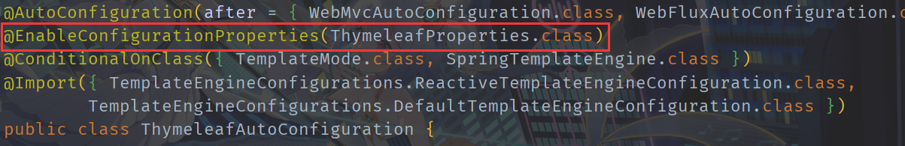
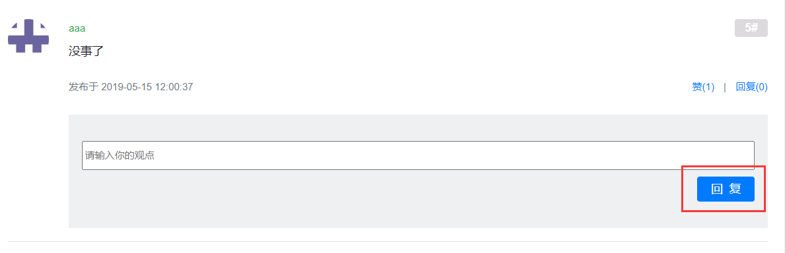
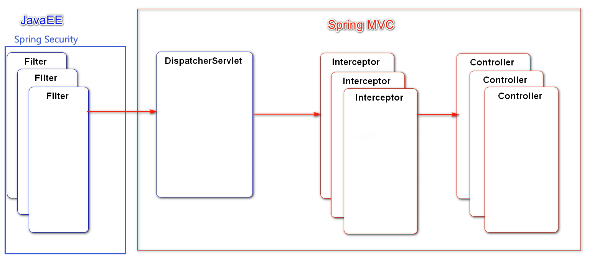
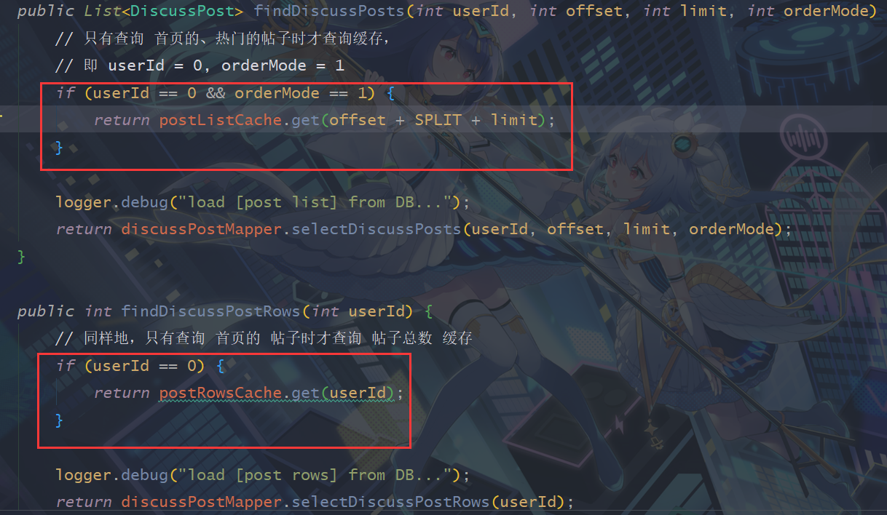

---

**本项目根据牛客网上面的项目 [课程列表_牛客网 (nowcoder.com)](https://www.nowcoder.com/study/live/246) 学习而来，仅供学习交流使用，不付任何法律责任**

---


## XXX社区(讨论区)系统

### part1-基础概念和知识

#### 1.Maven的相关概念

- Maven可以帮助我们构建项目、管理项目下面的jar包；

- Maven仓库指的是存放构件的位置，**所谓构件，就是在创建项目时Maven工具相关的插件和jar包等**；

- 本地仓库：默认是 ~/.m2/repository目录；

- 远程仓库：分为中央仓库、镜像仓库、私服仓库；

- Maven常用命令(**注意：使用以下命令时，都需要 cd 进入到项目的目录里面，也就是 pom.xml 文件所在的目录。**)

  > 1. mvn compile : 将源程序(java文件)编译成为字节码文件，生成一个**target目录**；
  > 2. mvn clean: 将target目录删除，也就是**将编译后的文件删除**；
  > 3. mvn test : 将源程序(java文件)编译并进行测试，也会生成一个target目录(实际上包含了compile命令的功能).

- Maven项目的目录结构(**可以从网站 [mvnrepository.com]() 搜索相关的jar包依赖，在网站 [maven.apache.org]() 查找相关的命令**)：

  


#### 2.项目的构建

- 可以通过**网站 [start.spring.io]() 引入相关依赖**来快速创建一个 Spring Initializr 项目；

- Spring Initializr 项目的目录结构(**和Maven项目相比在模块目录src下多了一个resources目录**)：

  

#### 3.SpringBoot 的核心作用

- 起步依赖：在 **pom.xml 文件**中通过引入各种各样的 **starter** 来导入各种场景，完成初始的所有依赖；
- 自动配置：使用 SpringBoot 创建项目可以不用像 Spring 那样手动配置(需要编写很多配置文件)，配置自动完成；
- 端点监控：SpringBoot 可以对运行的项目进行监视，检测项目的运行状况。


#### 4.Spring 全家桶(**可以在网站 [sping.io]() 中查询相关功能**)

> 1. Spring Framework：主要是SSM框架(还有 Email、Scheduling 等其他功能)，包含 Spring 的核心功能；
> 2. Spring Boot：基于 Spring Framework，使得项目的开发更加的便捷与强大；
> 3. Spring Cloud：基于微服务的开发，将项目拆分为多个小的模块来维护；
> 4. Spring Cloud Data Flow：将不同平台(Android，手表、电视等不同电子设备......)的数据流进行集成，以便于 Spring 对这些数据进行管理。


#### 5.Spring IoC 相关概念(从上到下依次递推，**目的是减轻对象和对象之间的耦合度**)


- 为了实现这种设计思想，需要给予 IoC 容器 **对象(POJOs)**的相关信息 以及 **对象和对象之间的联系信息(相关配置类 Configuration**)：

  


#### 6.Spring 使用的相关基础知识

1. 在测试类中使用**@ContextConfiguration(classes = CommunityApplication.class)**注解模拟项目运行时的场景；

2. 令测试类实现**ApplicationContextAware**接口来在测试类中获取到整个应用程序的Bean工厂；

3. 通过**@PostConstruct**和**@PreDestroy**注解来控制Bean对象在生命周期内的行为；

4. 可以使用**@Scope("prototype")**注解来指定Bean是多例而不是单例的；

   ```java
   @Service
   //通过@Scope("prototype")注解控制Bean对象为多例而非单例
   //此时Bean对象在使用时而不是项目启动时创建
   //@Scope("prototype")
   public class AlphaService {
   
       private final AlphaDao alphaDao;
   
       @Autowired
       public AlphaService(AlphaDao alphaDao) {
           System.out.println("实例化AlphaService...");
           this.alphaDao = alphaDao;
       }
   
       @PostConstruct
       public void init() {
           System.out.println("初始化AlphaService...");
       }
   
       @PreDestroy
       public void destroy() {
           System.out.println("销毁AlphaService...");
       }
   
       public String serviceSelect() {
           return alphaDao.select();
       }
   }
   
   //为了在测试环境中模拟项目运行时的场景，
   //使用@ContextConfiguration注解指定整个应用程序的配置类
   @SpringBootTest
   @ContextConfiguration(classes = CommunityApplication.class)
   //为了获取整个应用程序的Bean工厂，测试类需要实现ApplicationContextAware接口，
   //在测试类中为成员变量的Bean工厂进行赋值
   class CommunityApplicationTests implements ApplicationContextAware {
   
       private ApplicationContext applicationContext;
   
       @Override
       public void setApplicationContext(ApplicationContext applicationContext) throws BeansException {
           this.applicationContext = applicationContext;
       }
   
       @Test
       void testApplicationContext() {
   
           //打印这个Bean工厂的相关信息
           System.out.println(applicationContext);
   
           //获取指定的Bean对象，调用其方法
           AlphaDao alphaDao = applicationContext.getBean(AlphaDao.class);
           System.out.println("AlphaDao 的 select 方法:" + alphaDao.select());
   
           //通过别名获取指定的Bean对象，调用其方法
           alphaDao = (AlphaDao) applicationContext.getBean("alphaHibernate");
           System.out.println("根据别名更换实现类后 AlphaDao 的 select 方法:" + alphaDao.select());
       }
   
       @Test
       void testBeanManagement() {
   
           //Spring不仅可以帮助我们管理Bean对象的创建，
           //还可以帮助我们管理Bean对象的生存周期与行为
           AlphaService alphaService = applicationContext.getBean(AlphaService.class);
           System.out.println(alphaService);
   
           //两次获取的Bean对象是相同的，说明各个Bean对象在应用程序中只被实例化一次，是个单例对象
           alphaService = applicationContext.getBean(AlphaService.class);
           System.out.println(alphaService);
       }
   }
   ```

   

5. dao层中，如果**一个接口有多个实现类**，通过**@Primary**注解指定优先生成的运行时实例对象；

   ```java
   @Repository
   //为了避免 从容器中按照接口类型(AlphaDao)获取Bean对象时出现歧义(此时有两个AlphaDao的实现类)，
   //这里需要使用@Primary注解指定优先使用哪一个实现类作为运行时的Bean对象
   @Primary
   public class AlphaDaoMyBatisImpl implements AlphaDao {
       @Override
       public String select() {
           return "Here is AlphaDaoMyBatisImpl";
       }
   }
   ```

   

6. 使用**@AutoWired**注解时尽量**在构造方法上**使用，避免出现空指针异常，原因在代码中：

   ```java
   /*
   	原因：
   	Java变量的初始化顺序为：
   	静态变量或静态语句块–>实例变量或初始化语句块–>构造方法–>@Autowired，
   	直接在成员变量上使用@Autowired注解，可能在依赖注入之前使用到了这个成员变量(例如下面的成员变量a)。
   */
   
   //下面的用法是错误的，因为对Test进行初始化时成员变量a还没有被依赖注入
   public class Test{
       @Autowired
       private A a;
   
       private final String prefix = a.getExcelPrefix();
   	........
   }
   
   //下面的用法才是正确的，因为@Autowired注解在构造方法上，
   //调用getExcelPrefix()方法时，构造方法的形参a已经被依赖注入
   public class Test{
       private final String prefix;
   
       @Autowired
       public Test(A a) {
           this.prefix= a.getExcelPrefix();
       }
   	........
   }
   ```

   

7. **@Qualifier**注解用于声明Bean的名称，该注解既可以引用Bean的**自定义名称**，也可以引用Bean的**默认名称**；

   **@Bean**注解可以装配任何Bean，**包括第三方的Bean和自己定义的Bean**。

   ```java
   @Configuration
   public class AlphaConfig {
   
       //将日期转换类的一个对象托管到Spring中管理(第三方的Bean)
       @Bean
       public SimpleDateFormat simpleDateFormat() {
           return new SimpleDateFormat("yyyy-MM-dd hh:mm:ss");
       }
       
       //将自己编写的类A的一个对象托管到Spring中管理(自己定义的Bean)
       @Bean
       public A a() {
           return new A();
       }
   }
   ```

   

#### 7.Spring MVC 使用的相关基础知识

1. 模板引擎 thymeleaf 相关

   > - 官网查询使用方法：[**www.thymeleaf.org**](www.thymeleaf.org)
   > - 功能：生成动态的 HTML，倡导自然模板，也就是以 HTML 文件为模板；
   > - 常用语法：标准表达式、判断与循环、模板的布局。


2. Spring Boot 配置文件的原理

   - 通过官网 [**spring.io**]() 可以查询 Spring Boot 的配置文件 application.properties 中常用的配置：

     

     

   - 与之对应的是一个自动装配类 **ThymeleafAutoConfiguration**：

     

     

   - 可以看到这个类使用了**@EnableConfigurationProperties**注解将配置文件类**ThymeleafProperties**和配置文件中的键值对关联起来了：

     

     

     (**配置文件类中的 cache 属性默认为 true，可以在配置文件中将其改为 false**)

     

     

3. Spring MVC 获取请求参数的两种方式：

   - 使用**@RequestParam**注解(支持 **"?param1=value1&param2=value2"** 的传参模式)；

   - 使用**@PathVariable**注解(支持 **Restful 风格** 的传参模式)。

     ```java
     // /students?current=1&limit=20
     @RequestMapping(path = "/students", method = RequestMethod.GET)
     @ResponseBody
     public String getStudents(
         @RequestParam(name = "current", required = false, defaultValue = "1") int current,
         @RequestParam(name = "limit", required = false, defaultValue = "10") int limit) {
     
         System.out.println("current = " + current + " limit = " + limit);
         return "Here are some students...";
     }
     
     // /student/123
     @RequestMapping(path = "/student/{id}", method = RequestMethod.GET)
     @ResponseBody
     public String getStudent(
         @PathVariable(value = "id") int studentId) {
         System.out.println("studentId = " + studentId);
         return "Here is a student...";
     }
     ```

   

4. 在 Spring Boot 项目中访问 static 目录下的**静态资源**时，**不能在路径中加上 "/static"**，否则会报错：

   资源目录(类路径结构，**在配置文件中已经添加了项目总路径 /community**)如下：

   

   在路径中**加上 "/static" 就会出错**：

   

   ​        **这是因为 Spring Boot 项目已经为我们配置好了静态资源路径映射，我们访问静态资源时，系统默认会去 static 目录下寻找该资源，加上 static 之后，系统反而会认为这是一个 GET 请求，找不到请求映射而报错。**

   ​        **除了 static 目录之外，Spring Boot 还为我们配置了其它的3个目录，用来存储静态资源，这些目录可以在 WebProperties 配置文件类中可以看到：**

   


5. **静态资源(static 目录)、模板(templates 目录) 以及 Thymeleaf 解析器的关联**

   - **Thymeleaf 解析器默认会解析模板(templates 目录)下的 HTML 页面 而不会 去解析静态资源(static 目录)下的 HTML 页面**；

     

     

   - 静态资源(static 目录)下的 HTML 页面不需要数据进行渲染，所以 Thymeleaf 解析器也不会去解析，**一般客户端访问时就可以直接返回(比如上面的 student.html)**；

     

   - **模板(templates 目录)下的 HTML 页面需要进行数据渲染**，一般都会被 Thymeleaf 解析器给解析，当处理**请求转发**时，如果已经处理好数据，最后恰好需要返回一个模板(templates 目录)下的 HTML 页面，可以**直接返回一个templates 目录下的字符串，但是不能以 "redirect:" 开头**(否则就是一个重定向处理)：

     

     

   - 如果在处理某个请求时，希望**直接跳到静态资源(static 目录)下的 HTML 页面**，可以使用**请求重定向**来解决，这里的返回值字符串**必须以 "redirect:" 开头(否则就会被 Thymeleaf 解析器进行错误的解析)**：

     


#### 8.MyBatis 使用的相关基础知识

1. MyBatis 环境搭建相关

   > - 在网站 [**www.mybatis.org/spring**](www.mybatis.org/spring) 中查询 MyBatis 和 Spring 整合相关的操作，在网站 **[https://mybatis.org/mybatis-3/](https://mybatis.org/mybatis-3/)** 中查询 MyBatis 的相关配置方法；
   > - 核心组件：
   >   - SqlSessionFactory：用于创建SqISession的工厂 类；
   >   - SqlSession：MyBatis 的核心组件，**用于向数据库执行SQL**；
   >   - 主配置文件：XML 配置文件，可以对 MyBatis 的底层行为做出详细的配置；
   >   - Mapper 接口：**就是 DAO 接口**，在 MyBatis 中习惯性的称之为 Mapper；
   >   - Mapper 映射器：用于编写 SQL，并**将 SQL 和实体类映射的组件**，采用 **XML、注解**均可实现。


2. 项目中整合 MyBatis 时可能遇到的问题

   - 在 application.yaml 配置文件中规定**日志级别**时，需要注意 **SpringBoot 版本**带来的影响：

     - 2.0.1.RELEASE 及这个版本之前的版本如下书写：

       ```yaml
       logging:
         level:
         	debug
       ```

     - 而在 2.0.1.RELEASE 之后的版本需要如下书写(**因为 logging.level 属性从这个版本之后从 String 类型变成了 Map 类型**)：

       ```yaml
       logging:
         level:
           com.whut.community: debug
       ```

       这里的 com.whut.community 是项目的工程路径

   

   - **@Mapper 是 MyBatis 中的注解**，但是 Spring 只认得 @Repository、@Service、@Controller、@Component 这4个注解，所以在**给成员变量进行依赖注入**的时候，需要通过以下两种方式之一来使得编译通过：

     1. 修改 @Autowired 注解中的 required 属性为 false：

        ```java
        @Autowired(required = false)
        private UserMapper userMapper;
        ```

        

     2. 在对应的 @Mapper 上再加上 @Repository 注解：

        ```java
        @Repository
        @Mapper
        public interface UserMapper {
            ...
        }
        ```


---


### part2-社区首页的开发

#### 1.方法中需要使用 @Param 注解的时机

- **动态 SQL，如果在动态 SQL 中使用了参数作为变量，那么需要 @Param 注解，即使只有一个参数**：

  ```java
  @Mapper
  public interface UserMapper {
      List<User> getUserById(@Param("id")Integer id);
  }
  ```

  定义的 SQL 如下：

  ```xml
  <select id="getUserById" resultType="org.javaboy.helloboot.bean.User">
      select * from user
      <if test="id!=null">
          where id = #{id}
      </if>
  </select>
  ```

  

- XML 中的 SQL **使用了 $ 来引用变量**，那么参数中需要 @Param 注解：

  ```java
  @Mapper
  public interface UserMapper {
      List<User> getAllUsers(@Param("order_by")String order_by);
  }
  ```

  对应的 xml 定义如下：

  ```xml
  <select id="getAllUsers" resultType="org.javaboy.helloboot.bean.User">
      select * from user
      <if test="order_by!=null and order_by!=''">
          order by ${order_by} desc
      </if>
  </select>
  ```

  

- 方法参数要取别名，需要 @Param 注解：

  ```java
  @Mapper
  public interface UserMapper {
      User getUserByUsername(@Param("name") String username);
  }
  ```

  对应的 xml 定义如下：

  ```xml
  <select id="getUserByUsername" parameterType="org.javaboy.helloboot.bean.User">
      select * from user where username = #{name};
  </select>
  ```


#### 2.使用 '#' 和使用 '$' 引用变量的区别

1. **传入的参数在SQL中显示不同**

   - \#{} 将传入的参数（数据）在SQL中显示为字符串，会**对自动传入的数据加一个双引号**：

     ```sql
     SELECT id,name FROM student WHERE id =#{id};
     
     //当我们传递的参数id为 "1" 时，上述 SQL 的解析为：
     
     SELECT id,name FROM student WHERE id = "1";
     ```

     

   - ${} 将传入的参数（数据）**直接显示**生成在SQL中：

     ```sql
     SELECT id,name FROM student WHERE id = ${id};
     
     //当我们传递的参数id为 "1" 时，上述 sql 的解析为：
     
     SELECT id,name FROM student WHERE id = 1;
     ```

     

2. **#{} 可以防止 SQL 注入的风险(语句的拼接)；但 ${} 无法防止 SQL 注入**；

3. **${} 方式一般用于传入数据库对象**，例如：表名用参数传递进 SQL；

4. 大多数情况下还是经常使用 #{}，**一般能用 #{} 的就别用 ${}**；但有些情况下必须使用 ${}，例：MyBatis 排序时使用 **ORDER BY 动态参数**时需要注意，得用 ${} 而不是 #{}；

5. **#{} 的参数替换是发生在 DBMS 中，而 ${} 则发生在动态解析过程中**；


#### 3.分页功能的完善

- 前端页面和后端服务器的数据交互是很频繁的，但**对于页面属性的赋值是类似的**，因此有必要抽取出一个 Page 类用来表示页面，从而完善分页功能，而我们只需要知道以下4个属性，即可算出其它的属性(比如**当前页面的偏移量 offset、总页码数 total等**)，从而完成这个交互过程：

  - **前端传递给后端：当前页码 current 和 每一页显示的上限 limit**；
  - **后端传递给前端：数据总数(用于计算总页数) rows 和 查询路径(用于复用分页链接) path**。

  

  以下是对 Page 类的具体实现，包含**对属性赋值前的有效性判断和扩充的方法**：

  ```java
  package com.whut.community.entity;
  
  /**
   * 封装分页相关的信息
   */
  
  public class Page {
  
      //当前页码
      private int current = 1;
  
      //每一页显示的上限
      private int limit = 10;
  
      //limit 的上限值，也就是说每一页不能显示过多数据
      private static final int PAGE_LIMIT = 100;
  
      //数据总数(用于计算总页数)
      private int rows;
  
      //查询路径(用于复用分页链接)
      private String path;
  
      public int getCurrent() {
          return current;
      }
  
      public void setCurrent(int current) {
          //获取总页码
          int maxPage = getTotal();
  
          //当前页码的范围是 [1, maxPage]，这个范围内的赋值才会有效
          if (current >= 1 && current <= maxPage) {
              this.current = current;
          }
      }
  
      public int getLimit() {
          return limit;
      }
  
      public void setLimit(int limit) {
          //设置的每页显示上限在范围 [1, PAGE_LIMIT] 内时才会有效
          if (limit >= 1 && limit <= PAGE_LIMIT) {
              this.limit = limit;
          }
      }
  
      public int getRows() {
          return rows;
      }
  
      public void setRows(int rows) {
          if (rows >= 0) {
              this.rows = rows;
          }
      }
  
      public String getPath() {
          return path;
      }
  
      public void setPath(String path) {
          this.path = path;
      }
  
      /**
       * 获取当前页的起始行
       *
       * @return 当前页的起始行
       */
      public int getOffset() {
          return (current - 1) * limit;
      }
  
      /**
       * 获取总页数
       *
       * @return 总页数
       */
      public int getTotal() {
          int ans = rows / limit;
          return rows % limit == 0 ? ans : ans + 1;
      }
  
      /*
          分页条不会显示所有的页码，
          应该根据当前页码 current 显示 包括 current 在内的前后几个页码，
          比如这里显示 [current - 2, current + 2] 这个范围内的页码，
          其中左边界为 from，右边界为 to
       */
  
      /**
       * 获取左边界 form
       *
       * @return 左边界 form
       */
      public int getFrom() {
          int from = current - 2;
          return Math.max(from, 1);
      }
  
      /**
       * 获取右边界 to
       *
       * @return 右边界 to
       */
      public int getTo() {
          int to = current + 2, maxPage = getTotal();
          return Math.min(to, maxPage);
      }
  }
  ```

  

#### 4.首页请求(/community/index)功能的完善

- 之前处理首页请求**(/community/index)**时，获取帖子集合 discussPostList 的方法中，传入的两个参数 offset 和 limit 是固定写死的，在分页功能完善之后，**这两个参数应该通过封装的 Page 类对象动态地变化**：

  ```java
  @GetMapping("/index")
  public String getIndexPage(Model model, Page page) {
      /*
          前端已经传入了 current 和 limit 属性到 page 中，
          现在只用在后端这里给 rows 属性和 path 属性赋值即可
       */
      //查询所有的数据，所以帖子的 userId 属性传入0
      page.setRows(discussPostService.findDiscussPostRows(0));
      page.setPath("/index");
  
      //修改参数 offset 和 limit 使得查询由静态变成动态的
      List<DiscussPost> discussPostList = discussPostService.findDiscussPosts(0, page.getOffset(), page.getLimit());
  
      ......
  }
  ```


#### 5.SringMVC 处理路径映射时对 Model 类对象和实体类对象的处理

- 上面的方法在调用前，SpringMVC 会自动实例化 Model 和 Page，并**将 page 注入到 model 中**，所以，在 thymeleaf 中**可以直接访问 Page 类对象中的数据，而不用在方法中将 page 对象手动添加到 model 对象里**：

  ```java
  @GetMapping("/index")
  public String getIndexPage(Model model, Page page) {
      
      ......
  
  	/*
  		下面的添加操作是没有必要的
  	*/
      model.addAttribute("page", page);
      
      return "/index";
  }
  ```


#### 6.后端的 HomeController 封装 Page 类对象时遇到的逻辑问题

- 注意到 HomeController 中的 getIndexPage 方法在接收请求时，并**不会接收到 Page 类的 rows 这个属性**(rows属性只能在后端通过 discussPostService 来查询获得)，所以在接收前端发过来的请求后，**该方法封装而成的 page 对象中，rows 属性恒为 0**；

  

- 观察 Page 类对象中对 current 属性处理的逻辑：

  ```java
  public void setCurrent(int current) {
      //获取总页码
      int maxPage = getTotal();
  
      //当前页码的范围是 [1, maxPage]，这个范围内的赋值才会有效
      if (current >= 1 && current <= maxPage) {
          this.current = current;
      }
  }
  ```

  这里需要先获取总页码，调用了方法 getTotal()，而该方法如下：

  ```java
  /**
  * 获取总页数
  *
  * @return 总页数
  */
  public int getTotal() {
      int ans = rows / limit;
      return rows % limit == 0 ? ans : ans + 1;
  }
  ```

  而 rows 属性恒为0，这里就出现了逻辑问题：getTotal() 方法返回的永远都是0，也就是说，在外界调用 setCurrent(int current) 方法时，**下面的逻辑永远被跳过了(current 的值一直都是1)**：

  ```java
  //当前页码的范围是 [1, maxPage]，这个范围内的赋值才会有效
  if (current >= 1 && current <= maxPage) {
      this.current = current;
  }
  ```

  导致的结果就是，之前写的处理 获取首页请求 的方法，**封装的 page 对象中的 current 属性永远是1，即使这个方法已经得到了请求中正确的 current 参数(SpringMVC 在封装 page 对象时会调用其 setCurrent(int current) 方法**)：

  ```java
  @GetMapping("/index")
  public String getIndexPage(Model model, Page page) {
      
      ......
      
      return "/index";
  }
  ```


- 解决方案：先在 getIndexPage 方法中的参数添加 current 这一项，然后在方法内部，**先设置 page 对象的 rows 属性，然后使用形参 current 重新给 page 对象的 current 属性赋值(注意顺序不能颠倒)**：

  ```java
  @GetMapping("/index")
  public String getIndexPage(Model model, Page page, @RequestParam(name = "current", required = false) Integer current) {
      //查询所有的数据，所以帖子的 userId 属性传入0
      page.setRows(discussPostService.findDiscussPostRows(0));
      page.setPath("/index");
      if (current != null) {
          page.setCurrent(current);
      }
  }
  ```


#### 7.日志相关配置及使用方法

- 在某个类中想要通过 logger 对象输出相关信息时，可以在这个类中通过类似于下面代码的方式**获取到 Logger 类(位于 org.slf4j.Logger 包，详细信息可到网站 [https://logback.qos.ch/](https://logback.qos.ch/) 查询)的对象**：

  ```java
  class LoggerTests {
  
      //LoggerFactory 是专门获取 Logger 类对象的工厂类，
      //getLogger 方法需要传入使用 logger 对象的类(比如这里的 LoggerTests)的 Class 对象
      private static final Logger logger = LoggerFactory.getLogger(LoggerTests.class);
  
      ......
  }
  ```

  

- SpringBoot 支持**在配置文件 application.yaml 中配置日志文件的相关属性**(下面是 SpringBoot 2.7.10 版本的配置)：

  ```yaml
  #日志等级配置
  # logger
  logging:
    #指定日志级别
    level:
      com.whut.community: debug
      
    file:
      #指定日志文件的存储路径
      path: e:/whut/community
      #指定日志文件的名称
      name: community.log
  ```

  

- 仅仅使用配置文件 application.yaml 可能还不能满足某些需求，可以创建一个**名为 logback-spring.xml 的配置文件，放在类路径 resources 目录下**便可以被 SpringBoot 识别并配置(下面是该文件中的部分内容)：

  ```xml
  <?xml version="1.0" encoding="UTF-8"?>
  <configuration>
      
      <contextName>community</contextName>
      <property name="LOG_PATH" value="E:/work/data"/>
      <property name="APPDIR" value="community"/>
  
      <!-- error file -->
      <appender name="FILE_ERROR" class="ch.qos.logback.core.rolling.RollingFileAppender">
          <file>${LOG_PATH}/${APPDIR}/log_error.log</file>
          <rollingPolicy class="ch.qos.logback.core.rolling.TimeBasedRollingPolicy">
              <fileNamePattern>${LOG_PATH}/${APPDIR}/error/log-error-%d{yyyy-MM-dd}.%i.log</fileNamePattern>
              <timeBasedFileNamingAndTriggeringPolicy class="ch.qos.logback.core.rolling.SizeAndTimeBasedFNATP">
                  <maxFileSize>5MB</maxFileSize>
              </timeBasedFileNamingAndTriggeringPolicy>
              <maxHistory>30</maxHistory>
          </rollingPolicy>
          <append>true</append>
          <encoder class="ch.qos.logback.classic.encoder.PatternLayoutEncoder">
              <pattern>%d %level [%thread] %logger{10} [%file:%line] %msg%n</pattern>
              <charset>utf-8</charset>
          </encoder>
          <filter class="ch.qos.logback.classic.filter.LevelFilter">
              <level>error</level>
              <onMatch>ACCEPT</onMatch>
              <onMismatch>DENY</onMismatch>
          </filter>
      </appender>
      
      ......
  
      <!-- console -->
      <appender name="STDOUT" class="ch.qos.logback.core.ConsoleAppender">
          <encoder>
              <pattern>%d %level [%thread] %logger{10} [%file:%line] %msg%n</pattern>
              <charset>utf-8</charset>
          </encoder>
          <filter class="ch.qos.logback.classic.filter.ThresholdFilter">
              <level>debug</level>
          </filter>
      </appender>
  
      <logger name="com.whut.community" level="debug"/>
  
      <root level="info">
          <appender-ref ref="FILE_ERROR"/>
          <appender-ref ref="FILE_WARN"/>
          <appender-ref ref="FILE_INFO"/>
          <appender-ref ref="STDOUT"/>
      </root>
      
  </configuration>
  ```


---


### part3-社区登录的开发

#### 1.邮件发送

- 想要在项目中添加发送邮件的模块，需要按照以下几个步骤来设计(下面以新浪邮箱 sina.com 是 host 为例)：

  1. 在第三方邮箱中开启支持**授权码**和**POP3/SMTP服务**：

     

     

  2. 在项目的 **application.yaml 配置文件**中进行以下配置：

     ```yaml
     #邮箱Spring Mail相关的配置
     Spring:
       mail:
         host: smtp.sina.com #host 的域名
         username: cassius207093923@sina.com #host 的用户名
         password: 7d68192e8d8f4290 #host 的第三方登录授权码
         properties:
           mail:
             smtp:
               auth: true #开启支持授权码服务
               starttls: #和 tls 加密相关配置
                 enable: true
                 required: true
         default-encoding: UTF-8 #设置字符集为 UTF-8
         protocol: smtp #设置传输协议为 smtp
     ```

     

  3. 编写**工具类** MailClient，其代码逻辑主要如下：

     ```java
     package com.whut.community.util;
     
     import org.slf4j.Logger;
     import org.slf4j.LoggerFactory;
     import org.springframework.beans.factory.annotation.Autowired;
     import org.springframework.beans.factory.annotation.Value;
     import org.springframework.mail.javamail.JavaMailSender;
     import org.springframework.mail.javamail.MimeMessageHelper;
     import org.springframework.stereotype.Component;
     
     import javax.mail.MessagingException;
     import javax.mail.internet.MimeMessage;
     
     @Component
     public class MailClient {
     
         private static final Logger logger = LoggerFactory.getLogger(MailClient.class);
     
         @Autowired(required = false)
         private JavaMailSender mailSender;
     
         //将发件人的域名从配置文件中注入
         @Value("${spring.mail.username}")
         private String from;
     
         /**
          * 封装的发送邮件的方法
          *
          * @param to      收件人的域名
          * @param subject 邮件的主题
          * @param content 邮件的内容
          */
         public void sendMail(String to, String subject, String content) {
             try {
                 MimeMessage mimeMessage = mailSender.createMimeMessage();
                 
                 //通过 MimeMessageHelper 类对象设置邮件相关内容
                 MimeMessageHelper helper = new MimeMessageHelper(mimeMessage);
                 
                 helper.setFrom(from);
                 helper.setTo(to);
                 helper.setSubject(subject);
                 
                 //设置内容为支持 html 页面，也就是第二个参数为 ture
                 helper.setText(content, true);
                 
                 mailSender.send(helper.getMimeMessage());
             } catch (MessagingException e) {
                 logger.error("邮件发送失败:" + e.getMessage());
             }
     
         }
     }
     ```

     

  4. 对该工具类进行测试，示例如下(这里仅以**发送一个 HTML 页面**为例)：

     ```java
     package com.whut.community;
     
     import com.whut.community.util.MailClient;
     import org.junit.jupiter.api.Test;
     import org.springframework.beans.factory.annotation.Autowired;
     import org.springframework.boot.test.context.SpringBootTest;
     import org.springframework.test.context.ContextConfiguration;
     import org.thymeleaf.TemplateEngine;
     import org.thymeleaf.context.Context;
     
     @SpringBootTest
     @ContextConfiguration(classes = CommunityApplication.class)
     class MailTests {
     
         @Autowired
         private MailClient mailClient;
     
         @Autowired(required = false)
         private TemplateEngine templateEngine;
     
         @Test
         void testSendHTML() {
     
             //添加域内上下文数据
             Context context = new Context();
             context.setVariable("username", "张三");
     
             //使用模板引擎生成邮件内容，默认从 templates 目录下寻找 HTML 页面
             String content = templateEngine.process("/mail/demo", context);
             System.out.println("content = " + content);
     
             //使用工具方法发送邮件到 yun15907187327@163.com
             mailClient.sendMail("yun15907187327@163.com", "TEST_HTML", content);
         }
     }
     ```


#### 2.注册功能的开发

​		注册功能一共有3次请求，**并且3次请求都是发给服务器的**，所以分别将这3次请求开发出来即可。

##### 2.1点击“注册”按钮，跳转到注册页面

- 根据首页头部里的 a 标签的 href 属性在 LoginController 中编写相应的方法即可：

  ```java
  @Controller
  public class LoginController {
  
      @GetMapping("/register")
      public String getRegisterPage(){
          return "/site/register";
      }
  }
  ```


##### 2.2在注册页面中填写信息后，提交注册数据

- 导入 commons lang 相关依赖，**用来处理字符串空值的情况**：

  ```xml
  <!--commons lang 相关依赖，用于处理空值的情况-->
  <dependency>
      <groupId>org.apache.commons</groupId>
      <artifactId>commons-lang3</artifactId>
      <version>3.9</version>
  </dependency>
  ```

  

- 为我们的服务器配置一个域名，由于是在**测试阶段，域名固定为以下值**：

  ```yaml
  # 配置本服务器的域名
  community:
    path:
      domain: http://localhost:8080
  ```

  

- 创建**工具类 CommunityUtil**，其方法功能如下：

  ```java
  package com.whut.community.util;
  
  import org.apache.commons.lang3.StringUtils;
  import org.springframework.util.DigestUtils;
  
  import java.util.UUID;
  
  public class CommunityUtil {
  
      //生成随机字符串
      public static String generateUUID() {
          //去除字符串中的 '-'
          return UUID.randomUUID().toString().replaceAll("-", "");
      }
  
      //MD5 加密
      public static String md5(String key) {
          //字符串为空(字符串对象引用为空、长度为0或者只含有空格)时返回 null
          if (StringUtils.isBlank(key)) {
              return null;
          }
          return DigestUtils.md5DigestAsHex(key.getBytes());
      }
  }
  ```

  使用 DigestUtils 类的这个方法进行加密时，**只能加密而不能解密，并且简单字符串得到的结果是固定的**：

  > hello   ==>   abc123def456

  所以为了防止黑客进行攻击，我们**在原来的字符串后面加上一段随机的字符串(称为“盐”---salt)**：

  > hello + 3e4a8(随机)   ===>   abc123def456hij999


- 在 UserService 中编写方法，新增的主要逻辑如下：

  ```java
  //注册的核心业务处理方法，返回应当携带的各种信息
  public Map<String, Object> register(User user) {
      Map<String, Object> map = new HashMap<>();
  
      //对空值进行处理
      if (user == null) {
          throw new IllegalArgumentException("用户参数不能为空！");
      }
      if (StringUtils.isBlank(user.getUsername())) {
          map.put("usernameMsg", "账号不能为空！");
          return map;
      }
      if (StringUtils.isBlank(user.getPassword())) {
          map.put("passwordMsg", "密码不能为空！");
          return map;
      }
      if (StringUtils.isBlank(user.getEmail())) {
          map.put("emailMsg", "邮箱不能为空！");
          return map;
      }
  
      //验证账号，账号已经存在则添加错误信息并返回
      User tempUser = userMapper.selectByName(user.getUsername());
      if (tempUser != null) {
          map.put("usernameMsg", "该账号已存在！");
          return map;
      }
  
      //验证邮箱，邮箱已经存在则添加错误信息并返回
      tempUser = userMapper.selectByEmail(user.getEmail());
      if (tempUser != null) {
          map.put("emailMsg", "该邮箱已被注册！");
          return map;
      }
  
      //注册用户，这里需要先设置 user 的各个字段
      //1.设置 salt 字段，这里截取随机串的前5位为salt
      user.setSalt(CommunityUtil.generateUUID().substring(0, 5));
  
      //2.对原密码进行加密并重新设置password
      user.setPassword(CommunityUtil.md5(user.getPassword() + user.getSalt()));
  
      //3.类型为 普通用户
      user.setType(0);
  
      //4.状态为 未激活
      user.setStatus(0);
  
      //5.设置激活码
      user.setActivationCode(CommunityUtil.generateUUID());
  
      //6.设置头像链接，这里引用了牛客网的头像链接：https://images.nowcoder.com/head/xxxt.png
      //其中xxx数字的范围是 [0,1000] 共1001个数字
      user.setHeaderUrl(String.format("https://images.nowcoder.com/head/%dt.png", new Random().nextInt(1000)));
  
      //7.设置用户创建时间
      user.setCreateTime(new Date());
  
      //8.往user表中插入该用户数据，
      //插入前该 user 对象没有id，但是插入后就有id了
      userMapper.insertUser(user);
  
      //激活邮件，首先在域内添加数据
      Context context = new Context();
      //1.添加 email 数据
      context.setVariable("email", user.getEmail());
  
      //2.添加 url 数据，这个 url 将由服务器进行处理
      //示例：http://localhost:8080/community/activation/{userId}/{activationCode}
      String url = domain + contextPath + "/activation/" + user.getId() + "/" + user.getActivationCode();
      context.setVariable("url", url);
  
      //然后用模板引擎去渲染，得到发送的内容
      String content = templateEngine.process("/mail/activation.html", context);
      //发送邮件
      mailClient.sendMail(user.getEmail(),"激活账号",content);
  
      //当注册完成时，这个 map 中没有保存任何内容
      return map;
  }
  ```

  

- 在 LoginController 中编写代码，新增的主要逻辑如下(**之后需要修改各个前端页面来获取数据**)：

  ```java
  @PostMapping("/register")
  public String register(Model model, User user) {
  
      Map<String, Object> map = userService.register(user);
  
      //注册完成则跳转到首页，
      //激活成功后(此激活链接由用户在收到的邮件中点击)再跳转到登录页面
      if (map == null || map.isEmpty()) {
          model.addAttribute("msg", "注册成功，我们已经向您的邮箱发送了一封激活邮件，请尽快激活！");
          model.addAttribute("target", "/index");
          return "/site/operate-result";
      } else {//注册失败则添加错误信息并回退到注册页面
          model.addAttribute("usernameMsg", map.get("usernameMsg"));
          model.addAttribute("passwordMsg", map.get("passwordMsg"));
          model.addAttribute("emailMsg", map.get("emailMsg"));
          return "/site/register";
      }
  }
  ```


##### 2.3激活成功后，跳转到登录页面

- 创建 CommunityConstant 接口，现阶段，其中的常量用来表示用户进行激活操作的状态

  ```java
  // 项目中的常量
  public interface CommunityConstant {
  
      // 激活成功
      int ACTIVATION_SUCCESS = 0;
  
      // 重复激活
      int ACTIVATION_REPEAT = 1;
  
      // 激活失败
      int ACTIVATION_FAILURE = 2;
  }
  ```

  

- 在 UserService 中添加相关方法，根据  userId 和 activationCode 来判断账号激活的状态

  ```java
  // 根据用户id和激活码确定激活状态(共3种)
  public int activation(int userId, String activationCode) {
      // 查询用户
      User user = userMapper.selectById(userId);
  
      // 用户已激活
      if (1 == user.getStatus()) {
          return ACTIVATION_REPEAT;
      }
  
      // 激活成功，需要修改并更新用户的状态
      if (activationCode.equals(user.getActivationCode())) {
          userMapper.updateStatus(userId, 1);
          return ACTIVATION_SUCCESS;
      } else { // 激活失败
          return ACTIVATION_FAILURE;
      }
  }
  ```

  

- 在 LoginController 中添加对应的请求处理，新增的主要逻辑如下(**之后需要修改各个前端页面来获取数据**)：

  ```java
  // 处理激活结果，根据激活结果添加不同的信息并跳转到不同的页面
  // http://localhost:8080/community/activation/{userId}/{activationCode}
  @GetMapping("/activation/{userId}/{activationCode}")
  public String activation(Model model, @PathVariable("userId") int userId,
                           @PathVariable("activationCode") String activationCode) {
      // 获取激活结果
      int result = userService.activation(userId, activationCode);
  
      if (ACTIVATION_SUCCESS == result) {
          //激活成功后(此激活链接由用户在收到的邮件中点击)跳转到登录页面
          model.addAttribute("msg", "激活成功，您的账号已经可以正常使用了！");
          model.addAttribute("target", "/login");
      } else if (ACTIVATION_REPEAT == result) {
          // 重复激活或者激活失败则提示相关信息并跳转到首页
          model.addAttribute("msg", "无效操作，该账号已经激活过了！");
          model.addAttribute("target", "/index");
      } else { // 激活失败
          model.addAttribute("msg", "激活失败，您提供的激活码不正确！");
          model.addAttribute("target", "/index");
      }
  
      return "/site/operate-result";
  }
  ```


#### 3. 会话管理

##### 3.1基础概念

- HTTP 的基本性质

  - HTTP 是简单的
  - HTTP 是可扩展的
  - HTTP 是**无状态的，有会话的**

- Cookie

  - 是服务器发送到浏览器，并**保存在浏览器端**的一小块数据(**所以这个数据并不安全，不能存放一些敏感信息**)
  - 浏览器下次访问该服务器时，会自动携带块该数据，将其发送给服务器
  - 使用以下注解，可以在服务端创建一个 Cookie 并添加到响应头中：

  ```java
  @GetMapping("/cookie/set")
  @ResponseBody
  public String setCookie(HttpServletResponse response) {
      // 创建 cookie 对象
      Cookie cookie = new Cookie("code", CommunityUtil.generateUUID());
      // 设置 cookie 的生效路径(包括请求和响应)
      cookie.setPath("/community/alpha");
      // 设置 cookie 的有效时间
      cookie.setMaxAge(60 * 10);
      // 添加到响应头中
      response.addCookie(cookie);
      return "set cookie";
  }
  ```

  - 使用 `@CookieValue`注解，可以直接从请求中获取某个 Cookie 对应的值，注解中的字符串即为 Cookie 的 key：

  ```java
  @GetMapping("/cookie/get")
  @ResponseBody
  public String getCookie(@CookieValue("code") String code) {
      System.out.println("code = " + code);
      return "get cookie";
  }
  ```

- Session

  - 是 JavaEE 的标准，用于**在服务端**记录客户端信息
  - 数据存放在服务端**更加安全**，但是也会增加服务端的内存压力
  - Session 技术是基于 Cookie 的，将敏感数据存放在服务端，对客户端只发送一个存有 sessionId 的 Cookie ，**保证了会话的状态同时还保证了数据的安全性**：

  

  - 使用 Session 时，直接在参数列表中声明 `HttpSession`注解即可，并且**不用手动创建并添加 Cookie**：

  ```java
  @GetMapping("/session/set")
  @ResponseBody
  public String setSession(HttpSession session) {
      // 通过 session 在服务端存储数据即可
      session.setAttribute("id", 111);
      session.setAttribute("name", "session test01");
      return "set session";
  }
  
  @GetMapping("/session/get")
  @ResponseBody
  public String getSession(HttpSession session) {
      System.out.println("id : " + session.getAttribute("id"));
      System.out.println("name : " + session.getAttribute("name"));
      return "get session";
  }
  ```

1. 项目中使用 Cookie 还是Session 技术需要根据具体情况而定，一般而言，**能够使用 Cookie 就使用 Cookie**，因为这样可以减少服务器的压力
2. 在**分布式服务器集群中，Session 技术的使用越来越少了**，因为在 Nginx 服务器(用于负载均衡)的作用下，多台服务器之间 Session 的管理比较复杂：
   - 对某个 sessionId 只分发给特定的某台服务器(粘性处理)：违背了负载均衡的初衷
   - 服务器集群之间共享 Session：性能消耗较大，对多台服务器都有压力
   - 单独使用一台服务器专门管理 Session，其他服务器都从这台服务器中获取 Session：如果这台服务器突然挂掉，其他服务器就不能正常使用 Session 技术了
3. 现在主流的处理方式是**使用 NoSQL 数据库——Redis 来存放 Session**，性能比较好，而且更加安全(不容易挂掉)：


##### 3.2生成验证码

使用 Kaptcha 来生成验证码，步骤如下：

- 导入 jar 包

  ```xml
  <!--Kaptcha 相关依赖，用于生成验证码-->
  <dependency>
      <groupId>com.github.penggle</groupId>
      <artifactId>kaptcha</artifactId>
      <version>2.3.2</version>
  </dependency>
  ```

- 编写 Kaptcha 配置类

  ```java
  @Configuration
  public class KaptchaConfig {
  
      // 创建 Producer 对象，用于生成验证码字符串和图像
      @Bean
      public Producer kaptchaProducer() {
  
          // 创建 Properties 对象，用于 Producer 设置的 Config 类对象
          Properties properties = new Properties();
          // 验证码图片的长宽
          properties.setProperty("kaptcha.image.width", "100");
          properties.setProperty("kaptcha.image.height", "40");
          // 字体大小和颜色
          properties.setProperty("kaptcha.textproducer.font.size", "32");
          properties.setProperty("kaptcha.textproducer.font.color", "0,0,0");
          // 用于生成验证码的字符以及字符个数
          properties.setProperty("kaptcha.textproducer.char.string", "0123456789ABCDEFGHIJKLMNOPQRSTUVWXYZabcdefghijklmnopqrstuvwxyz");
          properties.setProperty("kaptcha.textproducer.char.length", "4");
          // 验证码的模糊处理策略
          properties.setProperty("kaptcha.noise.impl", "com.google.code.kaptcha.impl.NoNoise");
  
          DefaultKaptcha kaptcha = new DefaultKaptcha();
          // 对这个 Producer 类对象进行配置
          Config config = new Config(properties);
          kaptcha.setConfig(config);
          return kaptcha;
      }
  }
  ```

- 生成随机字符、生成图片

  这个请求在登录时发出，也就是在处理 "/community/login" 这个请求时发出，并由以下方法来处理：

  ```java
  // 用于响应生成验证码，由于返回的是一个图片，返回值类型是void
  @GetMapping("/kaptcha")
  public void getKaptcha(HttpServletResponse response, HttpSession session) {
      // 生成验证码和图片
      String text = kaptchaProducer.createText();
      BufferedImage image = kaptchaProducer.createImage(text);
  
      // 将验证码存入 session
      session.setAttribute("kaptcha", text);
  
      // 将图片输出给浏览器
      response.setContentType("image/png");
      try {
          ServletOutputStream os = response.getOutputStream();
          // 将图片写出
          ImageIO.write(image, "png", os);
      } catch (IOException e) {
          logger.error("响应验证码失败: " + e.getMessage());
      }
  }
  ```

可以参考网站 **[https://code.google.com/archive/p/kaptcha]()** 来进行设计


#### 4.登录与退出功能的开发

##### 4.1登录：验证用户在登录页面输入的信息是否正确

- 书写 sql 语句时，可以就在 Mapper 接口中书写(注意**主键生成和动态 sql 的使用方法**)：

  ```java
  @Mapper
  @Repository("loginTicketMapper")
  public interface LoginTicketMapper {
  
      @Insert({
              "insert into login_ticket(user_id, ticket, status, expired) ",
              "values(#{userId}, #{ticket}, #{status}, #{expired}) "
      })
      // 自动生成主键并插入到 id 字段中
      @Options(useGeneratedKeys = true, keyProperty = "id")
      int insertLoginTicket(LoginTicket loginTicket);
  
      @Select({
              "select id, user_id, ticket, status, expired ",
              "from login_ticket ",
              "where ticket = #{ticket} "
      })
      LoginTicket selectByTicket(String ticket);
  
      // 使用 <if> 标签实现动态 sql，但是外层需要写上 <script> b
      @Update({
              "<script>",
              "update login_ticket set status = #{status} ",
              "where ticket = #{ticket} ",
              "<if test=\"ticket!=null\">",
              "and 1 = 1 ",
              "</if>",
              "</script>"
      })
      int updateStatus(String ticket, int status);
  }
  ```


- Service 层的处理逻辑

  ```java
  /*
          登录逻辑：
          1.由于返回的结果可能需要携带很多不同的信息，返回值使用 Map<String, Object>；
          2.需要传入的参数是 username、password 和 expiredSeconds，其中 expiredSeconds 是凭证过期的秒数；
          3.由于用户注册时，插入到数据库中的密码 password 是经过 md5 加密过的，
          这里传入的明文密码也需要通过同样的方式加密后再和查询到的密码比对
       */
  public Map<String, Object> login(String username, String password, int expiredSeconds) {
      Map<String, Object> res = new HashMap<>();
  
      // 1.空值处理
      if (StringUtils.isBlank(username)) {
          res.put("usernameMsg", "用户名不能为空!");
          return res;
      }
      if (StringUtils.isBlank(password)) {
          res.put("passwordMsg", "密码不能为空!");
          return res;
      }
  
      // 2.验证账号是否存在
      User user = userMapper.selectByName(username);
      if (user == null) {
          res.put("usernameMsg", "该账号不存在!");
          return res;
      }
  
      // 3.账号存在，验证是否处于已激活状态
      if (user.getStatus() == 0) {
          res.put("usernameMsg", "该账号未激活!");
          return res;
      }
  
      // 4.账号存在并且已激活，验证密码是否正确
      // 首先对明文密码进行加密，需要原明文密码和salt
      password = CommunityUtil.md5(password + user.getSalt());
      // 密码 不一致 则添加响应信息并返回
      if (!user.getPassword().equals(password)) {
          res.put("passwordMsg", "密码不正确!");
          return res;
      }
  
      // 5.通过全部的验证步骤，生成登录凭证
      LoginTicket loginTicket = new LoginTicket();
      loginTicket.setUserId(user.getId());
      loginTicket.setTicket(CommunityUtil.generateUUID());
      // 有效
      loginTicket.setStatus(0);
      // 结合传入的形参设置到期时间
      loginTicket.setExpired(new Date(System.currentTimeMillis() + expiredSeconds * 1000));
      // 插入到数据库中，这里数据库的功能相当于 Session(后面将使用 Redis 优化)
      loginTicketMapper.insertLoginTicket(loginTicket);
  
      // 将 ticket 添加到结果 map 中去
      res.put("ticket", loginTicket.getTicket());
      // 验证成功时这里的 res 只存储了生成的凭证 ticket 信息
      return res;
  }
  ```


- Controller 层的处理逻辑

  ```java
  // 处理登录逻辑
  @PostMapping("/login")
  public String login(String username, String password, String code, // 填入的3个基本信息
                      boolean rememberMe, // 是否点击了"记住我"
                      Model model, // 用来存放结果数据
                      HttpSession session, // 用来取出之前生成的验证码
                      HttpServletResponse response) { // 用来将凭证存放到 Cookie 中，保证会话状态一致性
  
      // 1.检查验证码
      String kaptcha = (String) session.getAttribute("kaptcha");
      if (StringUtils.isBlank(code) || StringUtils.isBlank(kaptcha) || !code.equalsIgnoreCase(kaptcha)) {
          model.addAttribute("codeMsg", "验证码为空或者不正确!");
          return "/site/login";
      }
  
      // 2.根据是否选择了"记住我"来得到凭证的超时时间
      int expiredSeconds = rememberMe ? REMEMBER_EXPIRED_SECONDS : DEFAULT_EXPIRED_SECONDS;
      // 3.检查账号密码是否正确
      Map<String, Object> map = userService.login(username, password, expiredSeconds);
      if (map.containsKey("ticket")) { // 账号密码正确时会在 map 中生成唯一的凭证 ticket
          // 将这个凭证存放到 Cookie 中，给浏览器保存
          Cookie cookie = new Cookie("ticket", map.get("ticket").toString());
          cookie.setPath(contextPath);
          cookie.setMaxAge(expiredSeconds);
          response.addCookie(cookie);
  
          // 登录成功则跳转到首页，为了防止重复提交表单，这里使用请求重定向
          return "redirect:/index";
      } else {
          // 获取错误信息，放到 model 对象中
          // 这里使用 map 的 get() 方法之后不用使用 toString() 方法，前端页面可以自动转换
          model.addAttribute("usernameMsg", map.get("usernameMsg"));
          model.addAttribute("passwordMsg", map.get("passwordMsg"));
  
          // 登录失败则返回登录页面
          return "/site/login";
      }
  }
  ```


##### 4.2退出：修改登录凭证为失效状态并跳转到首页

- Service 层和 Controller 层各添加一个处理方法即可 

  ```java
  // Service 层
  // 登出功能，根据登录凭证修改状态即可
  public void logout(String ticket) {
      loginTicketMapper.updateStatus(ticket, 1);
  }
  
  // Controller 层
  // 处理登出逻辑
  @GetMapping("/logout")
  public String logout(@CookieValue("ticket") String ticket) {
      userService.logout(ticket);
      // 重定向到登录请求
      return "redirect:/login";
  }
  ```

  一般在用户**登录成功以及主动登出**的时候会使用**请求重定向**，防止用户重复发出请求造成服务器的负担过重


#### 5."忘记密码"功能的开发

##### 5.1点击"忘记密码"的链接，跳转到"忘记密码"页面

- 在 LoginController 中编写对应的跳转方法即可：

  ```java
  // 处理"忘记密码"的请求
  @GetMapping("/forget")
  public String getForgetPage() {
      return "/site/forget";
  }
  ```


##### 5.2输入注册的邮箱，点击"获取验证码"按钮，服务器为该邮箱发送一份验证码

- Service  层添加的逻辑

  ```java
  // 重置密码钱先校验邮箱是否存在，邮箱存在才发送包含验证码的邮件
  public Map<String, Object> verifyEmail(String email) {
      Map<String, Object> res = new HashMap<>();
  
      // 1.空值处理
      if (StringUtils.isBlank(email)) {
          res.put("emailMsg", "邮箱不能为空！");
          return res;
      }
  
      // 2.检查邮箱是否存在
      User user = userMapper.selectByEmail(email);
      if (user == null) {
          res.put("emailMsg", "邮箱尚未注册！");
          return res;
      }
  
      // 3.邮箱存在，生成验证码并发送邮件
      Context context = new Context();
      context.setVariable("email", email);
      // 生成验证码，这里取随机字符的前6位作为答案
      String verifyCode = CommunityUtil.generateUUID().substring(0, 6);
      context.setVariable("verifyCode", verifyCode);
      String content = templateEngine.process("/mail/forget.html", context);
      mailClient.sendMail(email, "重置密码", content);
  
      // 4.发送完成，将验证码和查询得到的用户都添加到结果中
      res.put("verifyCode", verifyCode);
      res.put("user", user);
      return res;
  }
  ```

- Controller 层添加的逻辑

  ```java
  // 处理获取验证码的请求
  @GetMapping("/forget/getCode")
  @ResponseBody
  public String getForgetCode(String email, HttpSession session) {
      Map<String, Object> map = userService.verifyEmail(email);
      if (map.containsKey("user")) { // 查询成功，保存验证码
          // 保存验证码
          session.setAttribute("verifyCode", map.get("verifyCode").toString());
          return CommunityUtil.getJSONString(0);
      } else { // 查询失败，返回错误信息
          return CommunityUtil.getJSONString(1, "邮箱查询失败", map);
      }
  }
  ```

- 之后需要在前端页面中修改对应的链接和跳转函数等信息，比如使用 ajax 请求处理：

  ```html
  <script>
      function getVerifyCode() {
          var email = $("#your-email").val();
          $.ajax({
              url: CONTEXT_PATH+"/forget/getCode?email="+email,
              cache: "false",
              async: "true",
              dataType: "json",
              type: "get",
              success: function(data){
                  if (data.code === 1) { // 处理请求时出现了问题
                      alert(data.msg+"  :  "+data.emailMsg);
                  } else if (data.code === 0) { // 找到了邮箱，验证码发送成功
                      alert("验证码发送成功！");
                  }
              },
              error: function () {
                  alert("验证码发送失败！")
              }
          })
      }
  </script>
  ```


##### 5.3在表单中填写收到的验证码及新密码，点击重置密码，服务器对密码进行修改

和前面登录与退出功能的设计类似，添加 Service 层和 Controller 层的相关逻辑即可：

- Service 层

  ```java
  // 根据邮箱和输入的密码来重置密码
  public Map<String, Object> resetPassword(String email, String password) {
      Map<String, Object> res = new HashMap<>();
  
      // 1. 空值处理
      if (StringUtils.isBlank(email)) {
          res.put("emailMsg", "邮箱不能为空！");
          return res;
      }
      if (StringUtils.isBlank(password)) {
          res.put("passwordMsg", "密码不能为空！");
          return res;
      }
  
      // 2.检查邮箱是否存在
      User user = userMapper.selectByEmail(email);
      if (user == null) {
          res.put("emailMsg", "邮箱尚未注册！");
          return res;
      }
  
      // 3.重置密码，注意要和用户的salt一起加密
      password = CommunityUtil.md5(password + user.getSalt());
      user.setPassword(password);
      userMapper.updatePassword(user.getId(), password);
  
      // 密码修改完成，将用户添加到结果中
      res.put("user", user);
      return res;
  }
  ```

- Controller 层

  ```java
  // 处理重置密码的请求
  @PostMapping("/forget/resetPassword")
  public String resetPassword(String email, String verifyCode, String password,
                              Model model, // 存放数据
                              HttpSession session) { // 获取之前保存的验证码
      // 核对验证码
      String code = (String) session.getAttribute("verifyCode");
      if (StringUtils.isBlank(verifyCode) || StringUtils.isBlank(code) || !code.equalsIgnoreCase(verifyCode)) {
          model.addAttribute("codeMsg", "验证码为空或者错误!");
          return "/site/forget";
      }
  
      // 验证码正确，重置密码
      Map<String, Object> map = userService.resetPassword(email, password);
      if (map.containsKey("user")) { // 重置密码成功，跳转到操作结果页面
          model.addAttribute("msg", "修改密码成功！请重新登录^_^");
          model.addAttribute("target", "/login");
          return "/site/operate-result";
      } else { // 重置密码失败则返回重置密码页面
          model.addAttribute("emailMsg", map.get("emailMsg"));
          model.addAttribute("passwordMsg", map.get("passwordMsg"));
          return "/site/forget";
      }
  }
  ```


#### 6.显示登录信息

- 显示页面头部的用户信息时，可以在 Controller 层中创建对应的请求映射来处理，但是由于请求比较频繁，这样做会严重增加服务器的负担，所以考虑使用 **拦截器(Interceptor)** 来处理这些请求

  

- 拦截器的使用步骤：

  1. 编写拦截器类，**实现 HandlerInterceptor 接口**：

     ```java
     @Component
     public class LoginTicketInterceptor implements HandlerInterceptor {
     
         private final UserService userService;
     
         private final HostHolder hostHolder;
     
         @Autowired
         public LoginTicketInterceptor(UserService userService, HostHolder hostHolder) {
             this.userService = userService;
             this.hostHolder = hostHolder;
         }
     
         @Override
         public boolean preHandle(HttpServletRequest request, HttpServletResponse response, Object handler) throws Exception {
     
             // 查找凭证
             String ticket = CookieUtil.getValue(request, "ticket");
     
             // 不为空时判断凭证是否有效
             if (ticket != null) {
                 LoginTicket loginTicket = userService.findLoginTicket(ticket);
                 /*
                     凭证有效的3个条件：
                     1.不为空；
                     2.状态 status 为0(有效状态)
                     3.没有超时(超时时间晚于当前时间)
                  */
                 if (loginTicket != null
                         && loginTicket.getStatus() == 0
                         && loginTicket.getExpired().after(new Date(System.currentTimeMillis()))) {
                     // 根据凭证中的 user_id 字段找到该用户
                     User user = userService.findUserById(loginTicket.getUserId());
     
                     // 在本次请求中持有用户
                     hostHolder.setUser(user);
                 }
             }
     
             return true;
         }
     
         // 在模板被渲染前向 Model 中存储这个 user 对象
         @Override
         public void postHandle(HttpServletRequest request, HttpServletResponse response, Object handler, ModelAndView modelAndView) throws Exception {
             User user = hostHolder.getUser();
             if (user != null && modelAndView != null) {
                 modelAndView.addObject("loginUser", user);
             }
         }
     
         // 在请求结束之后销毁查询到的这个对象
     
         @Override
         public void afterCompletion(HttpServletRequest request, HttpServletResponse response, Object handler, Exception ex) throws Exception {
             hostHolder.clear();
         }
     }
     ```

     **拦截器的3个方法：preHandle()、postHandle()、afterCompletion() 分别在 调用 Controller 方法前、调用 Controller 方法后且渲染模板前、渲染模板后 这3个时机来调用**

  2. 注意 ThreadLocal 类的使用，**这个类将某个量和单个线程关联起来**，由于服务器会对每个请求都各自创建一个线程来处理，使用 ThreadLocal 类可以很好地将查询到的用户存储在这次请求中：

     ```java
     @Component
     public class HostHolder {
     
         // 使用 ThreadLocal 类来保证多线程下可以存储不同的用户信息
         private ThreadLocal<User> users = new ThreadLocal<>();
     
         public void setUser(User user) {
             users.set(user);
         }
     
         public User getUser() {
             return users.get();
         }
     
         // 用于清理本次请求的存储内容
         public void clear() {
             users.remove();
         }
     }
     ```

  3. 编写配置类，**实现 WebMvcConfigurer 接口**，将该拦截器添加到容器中并配置相关路径：

     ```java
     // MVC 配置类
     @Configuration
     public class WebMvcConfig implements WebMvcConfigurer {
     
         private final LoginTicketInterceptor loginTicketInterceptor;
     
         @Autowired
         public WebMvcConfig(LoginTicketInterceptor loginTicketInterceptor) {
             this.loginTicketInterceptor = loginTicketInterceptor;
         }
     
         // 添加拦截器
         @Override
         public void addInterceptors(InterceptorRegistry registry) {
             registry.addInterceptor(loginTicketInterceptor) // 默认全部拦截
                     .excludePathPatterns("/**/*.css", "/**/*.js", "/**/*.png", "/**/*.jpg", "/**/*.jpeg"); // 静态资源排除
         }
     }
     ```

- 最后修改页面，加入对 loginUser 的判断即可


#### 7.账号设置

##### 7.1账号头像的上传和请求

- 前端设置

  提交的表单 form如下设置是必须的：

  ```html
  <form class="mt-5" method="post" enctype="multipart/form-data" th:action="@{/user/upload}">
      ......
  </form>
  ```

- 使用 MultipartFile 类处理**上传头像图片**的请求

  UserController 中新增处理逻辑如下：

  ```java
  // 上传头像图片
  @PostMapping("/upload")
  public String uploadHeader(MultipartFile headerImage, Model model) {
      // 1.空值处理
      if (headerImage == null) {
          model.addAttribute("error", "您还没有选择图片！");
          return "/site/setting";
      }
  
      // 2.为了避免用户传入的图片名重复，需要随机生成图片名字
      // 2.1截取文件后缀
      String filename = headerImage.getOriginalFilename();
      String suffix = null;
      if (!StringUtils.isBlank(filename)) {
          suffix = filename.substring(filename.lastIndexOf("."));
      }
      if (StringUtils.isBlank(suffix)) { // 文件格式不正确
          model.addAttribute("error", "文件格式不正确！");
          return "/site/setting";
      }
      // 2.1生成随机文件名
      filename = CommunityUtil.generateUUID() + suffix;
  
      // 3.创建文件目录，将图片写入到目录中
      File dest = new File(uploadPath + "/" + filename);
      try {
          headerImage.transferTo(dest);
      } catch (IOException e) {
          logger.error("文件上传失败 : " + e.getMessage());
          throw new RuntimeException("文件上传失败，服务器发生异常！", e);
      }
  
      // 4.更新当前用户的头像路径(web 端访问路径)
      // http://localhost:8080//community/user/header/xxx.png
      User user = hostHolder.getUser();
      String headerUrl = domain + contextPath + "/user/header/" + filename; // 拼接访问路径
      userService.updateHeader(user.getId(), headerUrl);
  
      // 重定向以免发送多次请求
      return "redirect:/index";
  }
  ```

- 使用 HttpServletResponse 的输出流处理**获取头像图片**的请求

  UserController 中新增处理逻辑如下：

  ```java
  // 获取头像图片
  @GetMapping("/header/{fileName}")
  public void getHeaderImage(@PathVariable("fileName") String fileName, HttpServletResponse response) {
      // 1.获取文件后缀
      String suffix = fileName.substring(fileName.lastIndexOf("."));
  
      // 2.构建该文件在服务器中的位置
      String filePath = uploadPath + "/" + fileName;
  
      // 3.获取输出流，构建输入流并写出文件
      response.setContentType("image/" + suffix);
      try (ServletOutputStream os = response.getOutputStream();
           FileInputStream fis = new FileInputStream(filePath)) {
          // 响应图片
          byte[] buffer = new byte[2048];
          int len;
          while ((len = fis.read(buffer)) != -1) {
              os.write(buffer, 0, len);
          }
      } catch (IOException e) {
          logger.error("读取头像失败 : " + e.getMessage());
      }
  }
  ```


##### 7.2修改密码

- UserService 中新增处理逻辑：

  ```java
  // 根据旧密码、新密码、确认密码修改用户的密码
  public Map<String, Object> updatePassword(User user,
                                            String oldPassword,
                                            String newPassword,
                                            String confirmPassword) {
      Map<String, Object> map = new HashMap<>();
  
      // 1.空值处理
      if (StringUtils.isBlank(oldPassword)) {
          map.put("oldPasswordMsg", "原密码为空！");
          return map;
      }
      if (StringUtils.isBlank(newPassword)) {
          map.put("newPasswordMsg", "新密码为空！");
          return map;
      }
      if (StringUtils.isBlank(confirmPassword)) {
          map.put("confirmPasswordMsg", "确认密码为空！");
          return map;
      }
  
      // 2.判断输入的旧密码是否正确(需要先加上salt并经过md5加密)
      oldPassword = CommunityUtil.md5(oldPassword + user.getSalt());
      if (!user.getPassword().equals(oldPassword)) {
          map.put("oldPasswordMsg", "输入的原密码有误！");
          return map;
      }
  
      // 3.直接修改用户的salt和密码即可(新旧密码是否相同以及新密码和确认密码是否相同已经在前端验证过)
      user.setSalt(CommunityUtil.generateUUID().substring(0, 5));
      // 新密码需要加密
      newPassword =  CommunityUtil.md5(newPassword + user.getSalt());
      user.setPassword(newPassword);
      // 将salt和新密码写入到数据库中
      userMapper.updateSalt(user.getId(), user.getSalt());
      userMapper.updatePassword(user.getId(), user.getPassword());
  
      map.put("user", user);
      return map;
  }
  ```

- UserController 中新增处理逻辑：

  ```java
  // 修改密码
  @PostMapping("/updatePassword")
  public String updatePassword(String oldPassword, String newPassword, String confirmPassword,
                               Model model,
                               HttpServletRequest request) { // 用于将本次请求对应的 ticket 改为失效状态
  
      // 从线程中获取该用户
      User user = hostHolder.getUser();
  
      // 获取结果
      Map<String, Object> map = userService.updatePassword(user, oldPassword, newPassword, confirmPassword);
  
      if (map.containsKey("user")) { // 处理成功
  
          // 修改密码后，服务端这边所有和这个用户的凭证应该修改为无效状态
          String ticket = CookieUtil.getValue(request, "ticket");
          userService.logout(ticket);
  
          // 并且服务端中该线程持有的这个用户也应该移除
          hostHolder.clear();
  
          // 添加操作结果的信息
          model.addAttribute("msg", "密码修改成功！^_^");
          model.addAttribute("target", "/login");
  
          // 跳转到 操作成功 界面
          return "/site/operate-result";
      } else { // 处理失败
          model.addAttribute("oldPasswordMsg", map.get("oldPasswordMsg"));
          model.addAttribute("newPasswordMsg", map.get("newPasswordMsg"));
          model.addAttribute("confirmPasswordMsg", map.get("confirmPasswordMsg"));
  
          model.addAttribute("oldPassword", oldPassword);
          model.addAttribute("newPassword", newPassword);
          model.addAttribute("confirmPassword", confirmPassword);
  
          // 返回到原本的页面
          return "/site/setting";
      }
  }
  ```


#### 8.检查登录状态

对于项目中较为敏感的功能，我们需要根据用户的登录状态(包括是否登录以及用户的身份等)来决定是否进行响应，虽然可以使用拦截器 Interceptor 来实现这个功能，但是拦截器需要配置大量的路径，较为麻烦，较常用的方法是使用**自定义注解**来实现这个目标

- 元注解

  - **`@Target`**：指定自定义注解应使用在哪些地方，比如 类上、方法上、变量上 等等；
  - **`@Retention`**：指定自定义注解生效时间，比如 编译时有效、运行时有效 等等；
  - `@Document`：指定 在生成文档时会不会带上自定义注解
  - `@Inherited`：指定某个子类要不要继承父类上面声明的注解

  **自定义注解时必须要使用的元注解有 `@Target` 和 `@Retention`** 

- 读取注解的方法

  - Method.getDeclaredAnnotations()
  - Method.getAnnotation(Class< T > annotationClass)

- 创建自定义注解 `@LoginRequired`注解，在需要登录才能放行的 Controller 层方法上添加这个注解

  ```java
  @Target(ElementType.METHOD)
  @Retention(RetentionPolicy.RUNTIME)
  public @interface LoginRequired {
  }
  ```

  ```java
  @LoginRequired
  @GetMapping("/setting")
  public String getSettingPage() {...}
  
  // 上传头像图片
  @LoginRequired
  @PostMapping("/upload")
  public String uploadHeader(MultipartFile headerImage, Model model) {...}
  
  // 修改密码
  @LoginRequired
  @PostMapping("/updatePassword")
  public String updatePassword(String oldPassword, String newPassword, String confirmPassword, Model model, HttpServletRequest request) {...}
  ```

- 创建拦截器 LoginRequiredInterceptor

  ```java
  @Component
  public class LoginRequiredInterceptor implements HandlerInterceptor {
  
      private HostHolder hostHolder;
  
      @Autowired
      public LoginRequiredInterceptor(HostHolder hostHolder) {
          this.hostHolder = hostHolder;
      }
  
      /*
          在控制器方法处理请求之前，
           判断 handler 是否为控制器方法，
           如果是，判断这个方法上面是否加了 @LoginRequired 注解，
           如果加了这个注解并且 此时 登录状态为空，
           则重定向到登录页面
       */
      @Override
      public boolean preHandle(HttpServletRequest request, HttpServletResponse response, Object handler) throws Exception {
  
          if (handler instanceof HandlerMethod) {
              HandlerMethod handlerMethod = (HandlerMethod) handler;
              Method method = handlerMethod.getMethod();
              LoginRequired loginRequired = method.getAnnotation(LoginRequired.class);
              if (loginRequired != null && hostHolder.getUser() == null) {
                  response.sendRedirect(request.getContextPath() + "/login");
                  return false;
              }
          }
  
          return true;
      }
  }
  ```

- 在 WebMvcConfig 配置类中添加这个拦截器

  ```java
  // 添加拦截器
  @Override
  public void addInterceptors(InterceptorRegistry registry) {
      ......
  
      registry.addInterceptor(loginRequiredInterceptor)
          .excludePathPatterns("/**/*.css", "/**/*.js", "/**/*.png", "/**/*.jpg", "/**/*.jpeg"); // 静态资源排除
  }
  ```


---


### part4-社区核心功能的开发

#### 1.过滤敏感词

使用普通的字符串匹配也可以完成敏感词匹配的功能，但是**使用前缀树可以很好地节约内存，并且可以在每个字符节点上额外地添加字符串之外的属性**，所以这里使用前缀树实现敏感词的匹配。

- 定义前缀树

  前缀树只在工具类 SensitiveFilter 中被使用，所以**定义为内部类**：

  ```java
  @Component
  public class SensitiveFilter {
      ......
      // 成员内部类：前缀树
      private class TrieNode {
          // 是否为敏感词的 标记
          private boolean isKeyWord = false;
  
          // 子节点，key 是子节点的字符，value 是对应的节点结构
          Map<Character, TrieNode> subNodes = new HashMap<>();
  
          boolean isKeyWord() {
              return isKeyWord;
          }
  
          void setKeyWord(boolean keyWord) {
              isKeyWord = keyWord;
          }
  
          // 根据字符和节点添加一个子节点
          void addSubNode(Character ch, TrieNode node) {
              subNodes.put(ch, node);
          }
  
          // 根据字符获取子节点结构
          TrieNode getSubNode(Character ch) {
              return subNodes.get(ch);
          }
      }
      ......
  }
  ```

- 根据敏感词，初始化前缀树

  

  项目在编译之后，会**在 classes 目录下生成所有的资源**(如上图)，通过**类加载器**即可读取该目录下的所有资源，这里读取了 sensitive-words.txt 文件并**使用 @PostConstruct 注解**调用初始化方法：

  ```java
  @PostConstruct
  public void init() {
      // 使用类加载器从 classes 目录中读取到敏感词文件
      try (
          InputStream is = this.getClass().getClassLoader().getResourceAsStream("sensitive-words.txt");
          BufferedReader reader = new BufferedReader(new InputStreamReader(is))
      ) {
          // 每次从 reader 中读取一行并添加到前缀树中
          String keyWord;
          while ((keyWord = reader.readLine()) != null) {
              this.addKeyWord(keyWord);
          }
      } catch (IOException e) {
          logger.error("加载敏感词文件失败 : " + e.getMessage());
      }
  }
  ```

  其中 addKeyWord() 方法功能是将字符串添加到前缀树中：

  ```java
  // 添加敏感词到前缀树中
  private void addKeyWord(String keyWord) {
      TrieNode curNode = this.rootNode;
      int n = keyWord.length();
      for (int i = 0; i < n; i++) {
          char ch = keyWord.charAt(i);
  
          // 尝试在当前节点上获取这个字符对应的子节点
          TrieNode subNode = curNode.getSubNode(ch);
  
          // 如果没有这个子节点，需要初始化
          if (subNode == null) {
              subNode = new TrieNode();
              curNode.addSubNode(ch, subNode);
          }
  
          // 如果是叶节点，这个节点的 isKeyWord 属性标记为 true
          if (i == n - 1) {
              subNode.setKeyWord(true);
          }
  
          // 当前节点移动到子节点上
          curNode = subNode;
      }
  }
  ```

- 编写过滤敏感词的方法

  

  创建3个指针，根据**第3个指针的移动**判定答案 ans 中需要添加的字符，需要注意注释中特殊情况的处理：

  ```java
  /**
   *  过滤敏感词的方法
   * @param text 可能含有敏感词的文本
   * @return 过滤之后的文本
   */
  public String filter(String text) {
      // 空值处理
      if (StringUtils.isBlank(text)) {
          return null;
      }
  
      int n = text.length();
  
      // 创建3个指针以及答案字符串
      TrieNode curNode = this.rootNode; // 指针1
      int begin = 0; // 指针2
      int position = 0; // 指针3
      StringBuilder ans = new StringBuilder(); // 最终答案
  
      while (begin < n) {
          /*
                  为了避免出现以下情况，这里以 begin 的范围作为循环条件并对 position 的位置做出判断：
                  敏感词：fabcd、abc
                  需要检查的text的最后一段：fabc
                  如果只是用 if (position < n) 内的逻辑处理，会漏掉最后一个敏感词
               */
          if (position < n) {
              char ch = text.charAt(position);
  
              // 需要跳过特殊字符
              if (isSpecialSymbol(ch)) {
                  // 当前特殊字符在起点时，指针2移动即可
                  if (curNode == this.rootNode) {
                      ans.append(ch);
                      begin++;
                  }
                  // 无论当前特殊字符在哪个位置，指针3都要向后移动
                  position++;
                  continue;
              }
  
              // 如果不是特殊字符，需要沿着前缀树检查下级节点
              curNode = curNode.getSubNode(ch);
              if (curNode == null) { // 区间[begin, position]内的字符串不构成敏感词
                  // begin 处的字符加入到答案中
                  ans.append(text.charAt(begin));
                  // 检查下一个位置
                  position = ++begin;
                  // curNode 归为根节点
                  curNode = this.rootNode;
              } else if(curNode.isKeyWord()) { // 区间[begin, position]内的字符串构成敏感词
                  // 替换掉敏感词：[begin, position]内的字符串
                  ans.append(REPLACEMENT);
                  // 检查下一位置
                  begin = ++position;
                  // curNode 归为根节点
                  curNode = this.rootNode;
              } else { // 区间[begin, position]内的字符串构成敏感词 的前缀但不构成整个敏感词
                  // 检查下一个字符
                  position++;
              }
          } else {
              ans.append(text.charAt(begin));
              position = ++begin;
              curNode = this.rootNode;
          }
      }
  
      return ans.toString();
  }
  
  /*
      判断是否为特殊字符：
      1.isAsciiAlphanumeric(ch) 方法判断 ch 是否是普通字符
      2.0x2E80~0x9FFF 是东南亚字符范围，超出这个范围认为是特殊字符
   */
  private boolean isSpecialSymbol(Character ch) {
      return !CharUtils.isAsciiAlphanumeric(ch) && (ch < 0x2E80 || ch > 0x9FFF);
  }
  ```


#### 2.发布帖子

- 使用 Ajax 发送异步请求

  - Asynchronous JavaScript and XML
  - 异步的 JavaScript 与 XML，不是一门新技术，只是一个新的术语
  - 使用AJAX，网页能够将增量更新呈现在页面上，而不需要刷新整个页面
  - 虽然 X 代表 XML，但目前 JSON 的使用比 XML 更加普遍
  - 在网站 [https://developer/mozilla.org/zh-CN/docs/Web/Guide/AJAX]() 中来查询相关用法

- 在 mapper 层添加插入帖子 discussPost 的方法，然后在 Service 层添加如下逻辑：

  ```java
  public int addDiscussPost(DiscussPost discussPost) {
      // 1.空值处理
      if (discussPost == null) {
          throw new IllegalArgumentException("参数不能为空！");
      }
  
      // 2.将 HTML 内容进行转义，获取转义后的内容
      String title = HtmlUtils.htmlEscape(discussPost.getTitle());
      String content = HtmlUtils.htmlEscape(discussPost.getContent());
  
      // 3.对标题和内容进行敏感词过滤，将过滤后的结果设置到 discussPost 对象中
      String newTitle = sensitiveFilter.filter(title);
      String newContent = sensitiveFilter.filter(content);
      discussPost.setTitle(newTitle);
      discussPost.setContent(newContent);
  
      // 4.将帖子插入到数据库中
      return discussPostMapper.insertDiscussPost(discussPost);
  }
  ```

  这里**使用到了敏感词过滤的方法 filter()**，对帖子的标题和内容进行过滤

- Controller 层中，创建 DiscussPostController 类，添加如下逻辑：

  ```java
  /*
          由于这里使用的是异步请求，
          对页面的修改结果是局部的，
          所以不能使用 @LoginRequired 注解来要求用户必须登录，
          (这个注解最好用在同步的请求中)
       */
  @PostMapping("/add")
  @ResponseBody
  public String addDiscussPost(String title, String content) {
      // 判断用户是否登录
      User user = hostHolder.getUser();
      if (user == null) {
          return CommunityUtil.getJSONString(403, "未登录或登陆过期，请重新登陆");
      }
  
      // 构建帖子对象并添加到数据库中
      DiscussPost discussPost = new DiscussPost();
      discussPost.setUserId(user.getId());
      discussPost.setTitle(title);
      discussPost.setContent(content);
      discussPost.setCreateTime(new Date());
      discussPost.setCommentCount(0);
      discussPost.setScore(0.0);
  
      // 出现的异常在外部统一处理
      discussPostService.addDiscussPost(discussPost);
  
      return CommunityUtil.getJSONString(0, "发布成功！");
  }
  ```

  这里处理的是异步请求，**所以不能使用 @LoginRequired 注解，否则无法正常跳转页面** 

- 在 index.js 中添加发送异步请求的代码：

  ```javascript
  function publish() {
  	// 弹出框隐藏
  	$("#publishModal").modal("hide");
  
  	// 获取标题和内容
  	let title = $("#recipient-name").val();
  	let content = $("#message-text").val();
  	// 发送异步请求
  	$.ajax({
  		url: CONTEXT_PATH+"/discuss/add",
  		cache: "false",
  		async: "true",
  		data: {
  			"title": title,
  			"content": content
  		},
  		type: "post",
  		success: function(data) {
  			data = $.parseJSON(data);
  			// 在提示框中显示返回信息
  			$("#hintBody").text(data.msg);
  
  			// 提示框显示，2秒后自动隐藏
  			$("#hintModal").modal("show");
  			setTimeout(function(){
  				$("#hintModal").modal("hide");
  				// 成功时重新加载页面
  				if (data.code === 0) {
  					window.location.reload();
  				}
  			}, 2000);
  		}
  	});
  }
  ```


#### 3.帖子详情

- 分别在 DiscussPostMapper、DiscussPostService、DiscussPostController 中添加对应的逻辑：

  ```java
  // DiscussPostMapper 中
  // 根据帖子 id 查询一条帖子
  DiscussPost selectDiscussPostById(int id);
  
  // DiscussPostService 中
  public DiscussPost findDiscussPostById(int id) {
      return discussPostMapper.selectDiscussPostById(id);
  }
  
  // DiscussPostController 中
  @GetMapping("/detail/{discussPostId}")
  public String getDiscussPost(@PathVariable("discussPostId") int discussPostId, Model model) {
  
      // 1.查询帖子本体
      DiscussPost post = discussPostService.findDiscussPostById(discussPostId);
      model.addAttribute("post", post);
  
      // 2.根据帖子的 userId 查询对应的作者
      User user = userService.findUserById(post.getUserId());
      model.addAttribute("user", user);
  
      return "/site/discuss-detail";
  }
  ```

- 在 index.html 中(使用 thymeleaf 语法处理)：
  - 在帖子标题上增加访问详情页面的链接
- 在 discuss-detail.html 中(使用 thymeleaf 语法处理)：
  - 处理静态资源的访问路径
  - 复用 index.html 的 header 区域
  - 显示标题、作者、发布时间、帖子正文等内容


#### 4.事务管理

- 事务的隔离性(Isolation)

  - 常见的并发异常

    - 第一类丢失更新

      某一个事务的**回滚**，导致另外一个事务已更新的数据丢失了

      

    - 脏读

      某一个事务，读取了**另外一个事务未提交的数据** 

      

    - 第二类丢失更新

      某一个事务的**提交**，导致另外一个事务已更新的数据丢失了

      

    - 不可重复读

      某一个事务，对**同一个数据前后读取**的结果不一致(**针对于某一条数据**)

      

    - 幻读

      某一个事务，对**同一个表前后查询到的行数**不一致(**针对于多条数据**)

      

    

  - 常见的隔离级别

    - Read Uncommitted：读取未提交的数据
    - Read Committed：读取已提交的数据
    - Repeatable Read：可重复读
    - Serializable：串行化

    (Y 表示存在相应的问题，N 表示没有相应的问题)

    

  

- 事务隔离性的实现

  - 悲观锁(**数据库中使用**)
    - **共享锁(S锁) ** 
      事务A对某数据加了共享锁后，其他事务**只能对该数据加共享锁，但不能加排他锁** 
    - **排他锁(X锁) ** 
      事务A对某数据加了排他锁后，其他事务对该数据**既不能加共享锁，也不能加排他锁** 
  - 乐观锁(需要自定义)
    - 版本号、时间戳等
      在更新数据前，检查版本号是否发生变化。若变化则取消本次更新，否则就更新数据(版本号+1)


- Spring 事务管理

  - **声明式事务(较为常用)** 
    通过 XML 配置，声明某方法的事务特征
    通过注解，声明某方法的事务特征

    - 使用 **@Transactional 注解**来指明事务的操作：

    ```java
    @Transactional(isolation = Isolation.READ_COMMITTED, propagation = Propagation.REQUIRED)
    ```

    - **注解的 propagation 属性指的是事务的传播机制**，当前事务方法 A (**外部事务**)调用另外一个事务方法 B 时，事务 B 的 propagation 属性一般有以下几种值：

      1. REQUIRED

         > 支持当前事务(外部事务)，**如果不存在则创建新事务**
         >

      2. REQUIRES_NEW

         > 创建一个 新事务，**并且暂停当前事务(外部事务)**

      3. NESTED

         > 如果当前存在事务(外部事务)，**则嵌套在该事务中执行(独立的提交和回滚)**，否则和 REQUIRED 一样

  - 编程式事务

    - 通过 TransactionTemplate 管理事务，并通过它执行数据库的操作
    - TransactionTemplate 组件是 Spring 自动创建并装配到容器中的，使用时直接注入即可

    ```java
    @Autowired
    private TransactionTemplate transactionTemplate;
    
    // TransactionTemplate 组件的使用方法如下
    public object save2() {
        // 设置事务的隔离级别
        transactionTemplate.setIsolationLevel(TransactionDefinition.ISOLATION_READ_COMMITTED);
        
        // 设置事务的传播行为
       transactionTemplate.setPropagationBehavior(TransactionDefinition.PROPAGATION_REQUIRED);
        return transactionTemplate.execute(new TransactionCallback<Obiect>() {
            @Override
            public Object doInTransaction(TransactionStatus status) {
                // 在这里添加业务逻辑代码...
                return null;
            }
        });
    }
    ```


#### 5.显示评论

- 评论表 comment 的设计

  评论表 comment 的各个字段如下：

  

  - id：主键
  - user_id：评论对应的用户 id
  - **entity_type：评论类型(1 - 对帖子的评论；2 - 对评论的评论；......)** 
  - **entity_id：对应这个评论类型的主键 id** 
  - **target_id：当这个评论是对评论的评论(即回复)时，针对回复对象的主键 id** 
  - content：评论内容
  - status：评论状态，0 - 有效；1 - 无效......
  - create_time：评论创建时间

- 对 mapper 层、service层和 controller 层进行设计，其中 controller 层的逻辑如下：

  ```java
  @GetMapping("/detail/{discussPostId}")
  public String getDiscussPost(@PathVariable("discussPostId") int discussPostId, Model model,
                               Page page, @RequestParam(name = "current", required = false) Integer current) {
  
      // 1.查询帖子本体
      DiscussPost post = discussPostService.findDiscussPostById(discussPostId);
      model.addAttribute("post", post);
  
      // 2.根据帖子的 userId 查询对应的作者
      User user = userService.findUserById(post.getUserId());
      model.addAttribute("user", user);
  
      // 3.评论的分页信息
      page.setLimit(5);
      page.setPath("/discuss/detail/" + discussPostId);
      // 这里可以调用 commentService 中的方法来查询对应的评论数量，
      // 但是帖子本体 post 中有 commentCount 这一属性，可以直接使用
      page.setRows(post.getCommentCount());
      // ※Page 类的设计，需要先设置rows属性再设置current属性※
      if (current != null) {
          page.setCurrent(current);
      }
  
      // 4.根据帖子本体 post 的属性 和 分页信息
      // 查询所有 **针对帖子的** 评论
      List<Comment> commentList = commentService.findCommentsByEntity(
          ENTITY_TYPE_POST, post.getId(), page.getOffset(), page.getLimit());
      // 根据此 List 集合，查询 评论 的 VO 对象(即视图对象)集合
      List<Map<String, Object>> commentVoList = new ArrayList<>();
      if (commentList != null) {
          for (Comment comment : commentList) {
              // 创建这个评论的 VO 对象
              Map<String, Object> commentVo = new HashMap<>();
  
              // =============================================
              // 对于每个 **针对帖子的** 评论，
              // 4.0除了评论自身之外，
              commentVo.put("comment", comment);
  
              // 还要存储：
              // 4.1这个评论对应的用户
              commentVo.put("user", userService.findUserById(comment.getUserId()));
  
              // 4.2**针对评论的** 评论，即 回复 构成的集合 replyVoList
              // 所有回复不用分页查询，所以偏移量 offset 从0开始，直接查询所有数据
              List<Comment> replyList = commentService.findCommentsByEntity(
                  ENTITY_TYPE_COMMENT, comment.getId(), 0, Integer.MAX_VALUE);
              // 对于所有的回复，也需要做 和评论类似的操作，即查询 回复 的 VO 对象(即视图对象)集合
              List<Map<String, Object>> replyVoList = new ArrayList<>();
              if (replyList != null) {
                  for (Comment reply : replyList) {
                      // 创建这个回复对象
                      Map<String, Object> replyVo = new HashMap<>();
  
                      // ======================
                      // 需要存储的内容有：
                      // 4.2.1回复本身
                      replyVo.put("reply", reply);
  
                      // 4.2.2回复的作者
                      replyVo.put("user", userService.findUserById(reply.getUserId()));
  
                      // 4.2.3回复的目标用户，
                      // targetId 为0表示没有回复的目标用户
                      int targetId = reply.getTargetId();
                      User targetUser = targetId == 0 ? null : userService.findUserById(targetId);
                      replyVo.put("targetUser", targetUser);
                      // ======================
  
                      // 将此回复 replyVo 添加到 回复集合 replyVoList 中
                      replyVoList.add(replyVo);
                  }
              }
              // 添加 回复集合 replyVoList
              commentVo.put("replies", replyVoList);
  
              // 4.3添加这个评论包含的 回复 数量
              int replyCount = commentService.findCommentCountByEntity(ENTITY_TYPE_COMMENT, comment.getId());
              commentVo.put("replyCount", replyCount);
              // =============================================
  
              // 将此评论 commentVo 添加到 评论集合 commentVoList 中
              commentVoList.add(commentVo);
          }
      }
      // 5.将评论集合 commentVoList 添加到 model 中
      model.addAttribute("comments", commentVoList);
  
      return "/site/discuss-detail";
  }
  ```

  需要注意的是，对于每个帖子，**除了要显示每个评论的数据之外，还要显示每个评论的所有回复**，而对于每个回复，其处理逻辑又和每个评论是类似的，所以代码中 4.0~4.3 和 4.2.1~4.2.3 的处理过程几乎相同，**只是查询的方法传参不同**，前者查询**针对帖子的评论**：

  ```java
  List<Comment> commentList = commentService.findCommentsByEntity(
          ENTITY_TYPE_POST, post.getId(), page.getOffset(), page.getLimit());
  ```

  后者查询**针对评论的回复**：

  ```java
  List<Comment> replyList = commentService.findCommentsByEntity(
                  ENTITY_TYPE_COMMENT, comment.getId(), 0, Integer.MAX_VALUE);
  ```


#### 6.添加评论

- 更新 DiscussPostMapper 和 DiscussPostService 的逻辑，**新增 updateCommentCount()** 方法：

  ```java
  // 根据帖子的 id 和 评论数量 更新该帖子的评论数量
  public int updateCommentCount(int id, int commentCount) {
      return discussPostMapper.updateCommentCount(id, commentCount);
  }
  ```

- 更新 CommentMapper 和 CommentService 的逻辑

  - CommentMapper 中新增 **插入一条评论** 的方法：

    ```java
    // 在对应的 mapper 文件中编写 sql 语句
    int insertComment(Comment comment);
    ```

  - CommentService 中也新增 **插入一条评论** 的方法，新增一条评论时，如果该评论是**针对帖子**的，需要更新该帖子的评论数量，这里涉及**对数据库进行两次不同操作**，所以使用了**事务管理**：

    ```java
    @Transactional(isolation = Isolation.READ_COMMITTED, propagation = Propagation.REQUIRED)
    public int addComment(Comment comment) {
    
        if (comment == null) {
            throw new IllegalArgumentException("参数不能为空！");
        }
    
        // 对评论的内容进行 HTML 转义 和 敏感词过滤
        comment.setContent(HtmlUtils.htmlEscape(comment.getContent()));
        comment.setContent(sensitiveFilter.filter(comment.getContent()));
        // 将该评论插入到数据库中，如果操作成功则 rows 为1
        int rows = commentMapper.insertComment(comment);
    
        // 如果这个评论是 针对帖子 而 不是针对评论 的，
        // 那么应该使用 discussPostService 更新该帖子的评论数量
        if (ENTITY_TYPE_POST == comment.getEntityType()) {
            // 获取该帖子的 id
            int discussPostId = comment.getEntityId();
            // 获取该帖子的评论数量
            int commentCount = commentMapper.selectCountByEntity(ENTITY_TYPE_POST, discussPostId);
            // 更新该帖子的评论数量
            discussPostService.updateCommentCount(discussPostId, commentCount);
        }
    
        return rows;
    }
    ```

- 创建 CommentController，统一处理 Comment 的控制层逻辑；**添加 addComment() 方法**：

  ```java
  /*
          注入的 Comment 类对象会接收前端页面传入的 3个 或 4个 属性：
          针对帖子 的评论 或者 没有目标用户的回复 (此时 targetId 为默认值0)：
          1.entityType：由隐藏域传入；
          2.entityId：由隐藏域传入；
          3.content：post请求传入的评论内容
  
          另外，如果是 针对评论的评论(即回复) 且 该回复还有目标用户，还会有：
          4.targetId：由隐藏域传入；
       */
  @LoginRequired
  @PostMapping("/add/{discussPostId}")
  public String addComment(@PathVariable("discussPostId") int discussPostId,
                           Comment comment) {
      // hostHolder.getUser() 可能为空，异常会统一处理
      comment.setUserId(hostHolder.getUser().getId());
      // 默认评论为有效状态
      comment.setStatus(0);
      // 设置评论的创建时间
      comment.setCreateTime(new Date());
  
      // 添加评论
      commentService.addComment(comment);
  
      return "redirect:/discuss/detail/" + discussPostId;
  }
  ```

- 上面 addComment() 方法接受的 3 种评论(回复)如下：

  1. **针对帖子**的评论，在一个帖子页面的末端：

     

     对应的前端代码如下：

     ```html
     <form class="replyform" method="post" th:action="@{|/comment/add/${post.id}|}">
         <p class="mt-3">
             <a name="replyform"></a>
             <!-- 使用隐藏域向后端传入 评论 Comment 的 entityType 和 entityId 属性 -->
             <input type="hidden" name="entityType" value="1">
             <input type="hidden" name="entityId" th:value="${post.id}">
             <!-- 评论 Comment 的 content 属性 -->
             <textarea placeholder="在这里畅所欲言你的看法吧!" name="content"></textarea>
         </p>
         <p class="text-right">
             <button type="submit" class="btn btn-primary btn-sm">&nbsp;&nbsp;回&nbsp;&nbsp;帖&nbsp;&nbsp;</button>
         </p>
     </form>
     ```

  2. 针对评论的评论，即回复，但是该回复**没有目标用户**，在帖子的中间部分：

     

     对应的前端代码如下，注意 **entityType 和 entityId 属性的 改变**：

     ```html
     <!-- 普通回复，没有目标用户，所以没有 targetId -->
     <form method="post" th:action="@{|/comment/add/${post.id}|}">
         <div>
             <!-- 使用隐藏域向后端传入 回复 Comment 的 entityType 和 entityId 属性 -->
             <input type="hidden" name="entityType" value="2">
             <input type="hidden" name="entityId" th:value="${commentVo.comment.id}">
             <!-- 回复 Comment 的 content 属性 -->
             <input type="text" class="input-size" name="content" placeholder="请输入你的观点"/>
         </div>
         <div class="text-right mt-2">
             <button type="submit" class="btn btn-primary btn-sm">&nbsp;&nbsp;回&nbsp;&nbsp;复&nbsp;&nbsp;</button>
         </div>
     </form>
     ```

  3. **有目标用户**的回复

     

     对应的前端代码如下，entityType 和 entityId 属性和上面的普通回复一样，但是**增加了 targetId 属性**：

     ```html
     <!-- 针对性回复，有目标用户，所以含有 targetId -->
     <form method="post" th:action="@{|/comment/add/${post.id}|}">
         <div>
             <!-- 使用隐藏域向后端传入 针对性回复 Comment 的 entityType 和 entityId 属性 -->
             <input type="hidden" name="entityType" value="2">
             <input type="hidden" name="entityId" th:value="${commentVo.comment.id}">
             <!-- 除此之外，还需要传入 针对性回复 Comment 的 targetId 属性 -->
             <input type="hidden" name="targetId" th:value="${replyVo.user.id}">
             <!-- 针对性回复 Comment 的 content 属性 -->
             <input type="text" class="input-size" name="content" th:placeholder="|回复${replyVo.user.username}|"/>
         </div>
         <div class="text-right mt-2">
             <button type="submit" class="btn btn-primary btn-sm">&nbsp;&nbsp;回&nbsp;&nbsp;复&nbsp;&nbsp;</button>
         </div>
     </form>
     ```


#### 7.私信列表

- 私信列表

  进行会话的分页展示，**每个会话只显示一条最新的私信** 

  创建 Message 的3层逻辑，其中 MessageController 的业务逻辑如下：

  ```java
  @GetMapping("/letter/list")
  public String getLetterList(Model model, Page page,
                              @RequestParam(name = "current", required = false) Integer current) {
  
      // user 可能为空，异常统一处理
      User user = hostHolder.getUser();
  
      // 1.填入分页信息
      page.setLimit(5);
      page.setPath("/letter/list");
      page.setRows(messageService.findConversationCount(user.getId()));
      if (current != null) {
          page.setCurrent(current);
      }
  
      // 2.查询会话列表
      List<Message> conversationList = messageService.findConversations(
          user.getId(), page.getOffset(), page.getLimit());
      // 根据会话列表封装为 conversationVo 对象集合
      List<Map<String, Object>> conversationVoList = new ArrayList<>();
      if (conversationList != null) {
          for (Message conversation : conversationList) {
              // 创建每个 conversationVo 对象
              Map<String, Object> conversationVo = new HashMap<>();
  
              // 2.1添加 conversation 对象
              conversationVo.put("conversation", conversation);
  
              // 2.2添加未读消息数量
              conversationVo.put("unreadCount",
                                 messageService.findLetterUnreadCount(user.getId(), conversation.getConversationId()));
  
              // 2.3添加每个会话的私信总数量
              conversationVo.put("letterCount", messageService.findLetterCount(conversation.getConversationId()));
  
              // 2.4添加与本用户对话的那个用户，
              // 可能是消息的发送者，也可能是消息的接收者
              int targetId = user.getId() == conversation.getFromId() ? conversation.getToId() : conversation.getFromId();
              conversationVo.put("targetUser", userService.findUserById(targetId));
  
              // 将每个 conversationVo 对象添加到集合中
              conversationVoList.add(conversationVo);
          }
      }
      // 将 会话对象集合 conversationVoList 存入到 model 中
      model.addAttribute("conversations", conversationVoList);
  
      // 3.查询并添加本用户的所有未读消息数量
      int letterUnreadCount = messageService.findLetterUnreadCount(user.getId(), null);
      model.addAttribute("letterUnreadCount", letterUnreadCount);
  
      return "/site/letter";
  }
  ```


- 私信详情

  点击某一个会话之后，进行**这个会话中所有私信**的分页展示，由于**用户可能点击“返回”按钮**，在路径中也添加了这个会话当前所在页码的信息，也就是 **conversationCurrentPage 变量**，MessageController 的业务逻辑如下：：

  ```java
  // conversationCurrentPage 是当前会话所在的页码
  @GetMapping("/letter/detail/{conversationId}/{conversationCurrentPage}")
  public String getLetterDetail(@PathVariable("conversationId") String conversationId,
                                @PathVariable("conversationCurrentPage") Integer conversationCurrentPage,
                                Model model, Page page,
                                @RequestParam(name = "current", required = false) Integer current) {
  
      // 1.填入分页信息
      page.setLimit(5);
      page.setPath("/letter/detail/" + conversationId + "/" + conversationCurrentPage);
      page.setRows(messageService.findLetterCount(conversationId));
      if (current != null) {
          page.setCurrent(current);
      }
  
      // 2.存入当前会话所在的页码，方便从详情页跳回到这个页面
      model.addAttribute("conversationCurrentPage", conversationCurrentPage);
  
      // 3.查询当前会话的所有私信构成的私信列表
      List<Message> letterList = messageService.findLetters(conversationId, page.getOffset(), page.getLimit());
      // 将其转换为 VO 对象集合
      List<Map<String, Object>> letters = new ArrayList<>();
      if (letterList != null) {
          for (Message letter : letterList) {
              // 创建一个 letterVo 对象
              Map<String, Object> letterVo = new HashMap<>();
  
              // 2.1添加私信本身
              letterVo.put("letter", letter);
  
              // 2.2添加发送私信的人
              letterVo.put("fromUser", userService.findUserById(letter.getFromId()));
  
              letters.add(letterVo);
          }
      }
      model.addAttribute("letters", letters);
  
      // 4.查询并添加当前会话中的 私信目标
      model.addAttribute("targetUser", getLetterTarget(conversationId));
  
      return "/site/letter-detail";
  }
  
  /**
       * 根据 会话 id 查询发送私信的目标用户
       *
       * @param conversationId 会话id
       * @return 目标用户
       */
  private User getLetterTarget(String conversationId) {
  
      // 1.将会话id拆分
      String[] twoId = conversationId.split("_");
  
      // 2.将两个id转换为整形
      int id0 = Integer.parseInt(twoId[0]);
      int id1 = Integer.parseInt(twoId[1]);
  
      // 3.将对应用户返回
      return hostHolder.getUser().getId() == id0 ?
          userService.findUserById(id1) :
      userService.findUserById(id0);
  }
  ```


- 在私信详情列表中，点击 “×”，将对应的私信消息状态改为 2，即“已删除”状态

  - MessageController 中新增：

    ```java
    @GetMapping("/delete/{letterId}")
    @ResponseBody
    public String deleteLetter(@PathVariable("letterId") Integer letterId) {
    
        // 根据消息 letter 的 id 将其状态改为2("已删除"状态)
        int res = messageService.updateOneMessageStatus(letterId, 2);
        if (res > 0) {
            return CommunityUtil.getJSONString(0);
        } else { // 更改失败
            return CommunityUtil.getJSONString(1);
        }
    }
    ```

  - letter-detail.html 中修改，包含 “×” 的按钮修改为：

    ```html
    <button type="button" class="ml-2 mb-1"
            th:onclick="'javascript:deleteMessage('+${letterVo.letter.id}+');'">
        &times;
    </button>
    ```

    新增 javascript 代码：

    ```javascript
    <script>
        // 在私信详情页中将对应的私信删除(也就是将其状态改为2)
        function deleteMessage(letterId) {
    
        // 对删除操作进行确认
        let res = confirm("确定要删除这条消息吗？");
    
        if (res === true) {
            // 发送异步请求
            $.ajax({
                url: CONTEXT_PATH+"/letter/delete/"+letterId,
                cache: "false",
                async: "true",
                type: "get",
                success: function(data) {
                    data = $.parseJSON(data);
    
                    // 发送成功
                    if (data.code === 0) {
                        alert("删除成功！");
                        window.location.reload();
                    } else {
                        alert("删除失败... ");
                    }
                }
            });
        }
    }
    </script>
    ```


#### 8.发送私信

- 发送私信
  采用**异步的方式**发送私信，发送成功后刷新私信列表，在 Message 3层中添加对应的方法，其中 MessageController 中添加的逻辑如下，接收异步的请求需要返回 JSON 字符串：

  ```java
  @PostMapping("/letter/send")
  @ResponseBody
  public String sendLetter(String toName, String content) {
      // 1.根据用户名查询这个目标用户
      User targetUser = userService.findUserByName(toName);
      if (targetUser == null) {
          return CommunityUtil.getJSONString(1, "目标用户不存在！");
      }
  
      // 2.构造需要插入的 Message 对象
      Message message = new Message();
      Integer fromId = hostHolder.getUser().getId();
      Integer toId = targetUser.getId();
      message.setFromId(fromId);
      message.setToId(toId);
      // 会话id，小的id在前，大的id在后
      if (fromId.compareTo(toId) < 0) {
          message.setConversationId(fromId + "_" + toId);
      } else {
          message.setConversationId(toId + "_" + fromId);
      }
      message.setContent(content);
      message.setCreateTime(new Date());
  
      // 3.将 message 对象插入到数据库中
      messageService.addMessage(message);
  
      return CommunityUtil.getJSONString(0);
  }
  ```

  

- 设置已读
  访问私信详情时，将显示的私信设置为已读状态，只需要在 MessageController 的 **getLetterDetail()** 添加如下处理逻辑：

  ```java
  ......
      
  // 3.查询当前会话的所有私信构成的私信列表
  List<Message> letterList = messageService.findLetters(conversationId, page.getOffset(), page.getLimit());
  
  // 4.将所有未读消息转换为已读
  List<Integer> ids = getUnreadLetterIds(letterList);
  if (!ids.isEmpty()) {
      messageService.readMessages(ids);
  }
  
  // 将私信列表转换为 VO 对象集合
  List<Map<String, Object>> letters = new ArrayList<>();
  
  ......
  ```

  其中，**getUnreadLetterIds() 方法**如下：

  ```java
  /**
       * 获取未读私信的id
       *
       * @param letterList 私信列表
       * @return 未读私信的id
       */
  private List<Integer> getUnreadLetterIds(List<Message> letterList) {
      List<Integer> ids = new ArrayList<>();
  
      // 获取当前用户的id
      Integer curUserId = hostHolder.getUser().getId();
      if (letterList != null) {
          for (Message message : letterList) {
              // 当且仅当 当前用户是接收者 并且 消息的状态是未读时才添加到答案中
              if (curUserId == message.getToId() && message.getStatus() == 0) {
                  ids.add(message.getId());
              }
          }
      }
  
      return ids;
  }
  ```


#### 9.统一处理异常

- @ControllerAdvice
  用于**修饰类，表示该类是 Controller 的全局配置类**，在此类中，可以对 Controller 进行如下三种全局配置：
  异常处理方案、绑定数据方案、绑定参数方案，这三种全局配置分别会用到以下3个注解：
  1. **@ExceptionHandler(异常处理方案)**
     用于**修饰方法**，该方法会在 Controller 出现异常后被调用，用于处理捕获到的异常
  2. @ModelAttribute(绑定**数据**方案)
     用于**修饰方法**，**对于 Controller 中所有处理请求的方法**，该方法会在 Controller 中的方法执行前被调用，用于**为 Controller 方法中的 Model 对象统一绑定参数** 
  3. @DataBinder(绑定**参数**方案)
     用于**修饰方法**，该方法会在 **Controller 方法执行前**被调用，用于绑定参数的转换器，Spring 中有很多内置的参数转换器，用于将请求传过来的参数转化为方法中的参数对象，使用本注解可以**将自定义参数转换器和某些参数绑定** 


- 对项目中所有 Controller 的异常进行统一处理

  创建 ExceptionAdvice 类，使用 @ControllerAdvice 和 @ExceptionHandler 来实现即可：

  ```java
  /*
      对全局 Controller 的异常进行处理，
      只扫描标明了 @Controller 注解的 类，
      也就是 Controller 层的各个 controller 组件
   */
  @ControllerAdvice(annotations = Controller.class)
  public class ExceptionAdvice {
  
      // 用于记录异常日志
      private static final Logger logger = LoggerFactory.getLogger(ExceptionAdvice.class);
  
      // 服务端的所有异常都在这里处理，所以注解中是异常的总父类 Exception
      @ExceptionHandler({Exception.class})
      public void handleException(Exception exception, HttpServletRequest request, HttpServletResponse response) throws IOException {
          // 1.记录异常的概况信息
          logger.error("服务器发生异常: " + exception.getMessage());
  
          // 2.将 异常栈 的所有信息都记录下来
          for (StackTraceElement stackTraceElement : exception.getStackTrace()) {
              logger.error(stackTraceElement.toString());
          }
  
          // 3.判断这次出现异常的 请求机制 是 同步的(想要页面) 还是 异步的(想要得到JSON数据)
          String requestMechanism = request.getHeader("x-requested-with");
          if ("XMLHttpRequest".equals(requestMechanism)) { // 是 异步的，返回异常对应的JSON字符串
              // 设置返回内容为 plain 普通对象，
              // 也可以是 application/json，表明返回类型是JSON字符串
              response.setContentType("application/plain;charset=utf-8");
              PrintWriter writer = response.getWriter();
              writer.write(CommunityUtil.getJSONString(1, "服务器发生异常..."));
          } else { // 是同步的，发出 /error 请求，返回500页面
              response.sendRedirect(request.getContextPath() + "/error");
          }
      }
  }
  ```


#### 10.统一记录日志

需求，**在之前已开发模块的基础上**，现在想要在 Service 层添加一个记录日志的功能

- 方法1(有弊端)：在每个 Service 组件中耦合记录日志的代码：

  

   **这样会使得 Service 层的 业务需求代码 和 记录日志的 系统需求代码过于耦合，功能发生了交叉，不利于以后代码的维护和拓展** 

- 方法2：**使用 AOP 思想**分别开发不同的需求模块：

  

  帖子模块、评论模块、消息模块都是 **业务组件**，而权限检查、**记录日志**、事务管理都是 **系统组件**，直观上来看，使用 AOP 思想好像是在之前的多个组件(**业务组件**)上“横向切了一刀”，**从而增加了新的功能(系统组件)** 

- AOP 相关术语

  

- AOP 的实现方法

  - AspectJ
    - AspectJ 是语言级的实现，它扩展了 Java 语言，定义了 AOP 语法
    - Aspect 在**编译期**织入代码，它有一个专门的编译器，用来生成遵守 Java 字节码规范的 .class 文件
  - **Spring AOP**(性价比最高)
    - Spring AOP 使用纯 Java实现，它不需要专门的编译过程，也不需要特殊的类装载器
    - Spring AOP 在**运行时**通过代理的方式织入代码，**只支持方法类型的连接点(JoinPoint)** 
    - Spring 支持对 AspectJ 的集成

- Spring AOP 的两种代理实现方式：

  1. JDK 动态代理(**需要被代理类有父接口**)

     Java 提供的动态代理技术，可以在运行时创建接口的代理实例，Spring AOP默认采用此种方式，在**接口的代理**实例中织入代码

  2. CGLib 动态代理(**被代理类不能被 final 修饰**)
     采用底层的字节码技术，在运行时**创建子类代理实例**，当目标对象**不存在接口**时，Spring AOP 会采用此种方式，在子类实例中织入代码

- 统一记录 Service 层方法被调用时的日志

   创建 ServiceLogAspect 类，设计如下：

   ```java
   @Component
   @Aspect
   public class ServiceLogAspect {
   
       private static final Logger logger = LoggerFactory.getLogger(ServiceLogAspect.class);
   
       // 声明切点
       @Pointcut("execution(* com.whut.community.service.*.*(..))")
       public void pointcut() {
       }
   
       // 设计通知，即增强方法，
       @Before("pointcut()")
       public void beforeService(JoinPoint joinPoint) {
           // 日志记录格式：
           // 用户[192.168.10.11],在[2022-10-12],访问了[com.whut.community.service.xxx()].
           // 1.获取当前请求的所有参数
           ServletRequestAttributes attributes =
               (ServletRequestAttributes) RequestContextHolder.getRequestAttributes();
           // 2.获取当前请求对象
           HttpServletRequest request = attributes.getRequest();
           // 3.获取ip地址
           String ip = request.getRemoteUser();
           // 4.取得当前时间
           String nowTime =
               new SimpleDateFormat("yyyy-MM-dd HH:mm:ss").format(new Date());
           // 5.获取客户端调用的方法，即连接点 joinPoint，这里是"包名."+"方法名"
           String targetMethod = joinPoint.getSignature().getDeclaringTypeName()
               + "."
               + joinPoint.getSignature().getName();
           // 6.记录日志
           logger.info(String.format("用户[%s],在[%s],访问了[%s].", ip, nowTime, targetMethod));
       }
   
   }
   ```


---


### part5-使用Redis实现高性能存储

#### 1.Redis 相关的基础概念

- Redis 是一款基于键值对的 NoSQL 数据库，Redis 的 key 统一为 string 类型，它的 value 支持多种数据结构：
   **字符串(strings)、哈希(hashes)、 列表(lists)、 集合(sets)、 有序集合(sorted sets)**等

- Redis 将所有的数据都存**放在内存中**，所以它的读写性能十分惊人，同时，Redis 还可以将内存中的数据**以快照或日志的形式保存到硬盘上**，以保证数据的**安全性** 

  > --->**快照形式存储(RDB)**：
  >
  > 将内存中的数据原原本本地传入到硬盘上
  >
  > **优点**：存储在内存中的数据**本来体积就很小**，有什么就存什么，从硬盘上**恢复这些数据也很快** 
  >
  > **缺点**：因为是一下子将内存中的数据存到硬盘上，所以**相对而言会比较耗时，而且会产生阻塞**，如果这个时候还在处理其他业务，会**对这些业务产生性能上的影响**
  >
  > 总体而言，**RDB 形式不适合实时去做，适合几个小时做一次**这种情况
  >
  > 
  >
  > --->**日志形式存储(AOF)**：
  >
  > 每执行一个 Redis 命令，将这个命令以日志的形式存储起来
  >
  > **优点**：由于存储的是命令，也就是“一句话”，AOF 存储的速度十分的快，所以**支持实时存储** 
  >
  > **缺点**：由于存储命令时是以追加的形式存储的，所以**比较占用硬盘的空间**，而且恢复时是通过执行各个命令来恢复的，所以**恢复的速度比较慢** 

- Redis 典型的应用场景包括：**缓存**、排行榜、计数器、社交网络、**消息队列**等

  可以访问下面两个网站查询 Redis 相关的说明和使用：

  - [Redis 官网](https://redis.io) 
  - [微软发布的 Redis (windows版)](https://github.com/microsoftarchive/redis) 

- Redis 常用命令

  > 1. Redis 内置了16个数据库，标号从0~15，默认在第0号数据库中，选择数据库：
  >
  >    `select 1`
  >
  > 2. 不想要某个数据库中的数据，刷新：
  >
  >    `flushdb`
  >
  > 3. 查询当前数据库中所有的 key：
  >
  >    `keys *`
  >
  > 4. 查询**以特定字符开头**的所有 key：
  >
  >    `keys test*`
  >
  > 5. 查询某个 key 对应的数据类型：
  >
  >    `type test:user`
  >
  > 6. 查询某个 key 是否存在(**非0表示存在**)：
  >
  >    `exists test:user`
  >
  > 7. 删除某个 key 对应的数据(**非0表示删除成功**)：
  >
  >    `del test:user`
  >
  > 8. 设置某个 key 的过期时间(**以秒为单位**)：
  >
  >    `expire test:students 10`
  >
  > 
  >
  > **strings 字符串类型**：
  >
  > 1. Redis 中提倡使用 “:” 代替 “_” 来连接单词，添加数据：
  >
  >    `set test:count 1`
  >
  > 2. 取出数据：
  >
  >    `get test:count`
  >
  > 3.  将 **key 对应的 value** 自增或者自减：
  >
  >    `incr test:count`
  >
  >    `decr test:count`
  >
  > 
  >
  > **hashed 哈希类型**：
  >
  > 1. 添加数据：
  >
  >    `hset test:user id 1`
  >    `hset test:user username zhangsan`
  >
  > 2. 取出数据：
  >
  >    `hget test:user id`
  >
  >    `hget test:user username`
  >
  > 
  >
  > **lists 列表类型(可以看成为双端队列，数据有序且可以重复)**：
  >
  > 1. **左侧添加**数据：
  >
  >    `lpush test:ids 101 102 103`
  >
  > 2. 查看列表长度(**没有 `rlen` 命令**)：
  >
  >    `llen test:ids`
  >
  > 3. 查看特定索引处的数据(**没有 `rindex` 命令**)：
  >
  >    `lindex test:ids 0`
  >
  >    `lindex test:ids 2`
  >
  > 4. 查看特定索引范围内的数据(**没有 `rrange` 命令**)
  >
  >    (**第2个索引为-1查询全部数据；第一个索引为-1，当第2个索引 >= 最大下标 或者 为 -1 时返回最大下标对应的数据，其他情况返回 空**)：
  >
  >    `lrange test:ids 0 2`
  >
  > 5. **右侧弹出**数据：
  >
  >    `rpop test:ids`
  >
  > 
  >
  > **sets 集合类型(数据无序且不能重复)**： 
  >
  > 1. 添加数据：
  >
  >    `sadd test:teachers aaa bbb ccc`
  >
  > 2. 统计元素数量：
  >
  >    `scard test:teachers`
  >
  > 3. 从集合中**随机地弹出**一个元素：
  >
  >    `spop test:teachers`
  >
  > 4. 查看集合中的所有元素：
  >
  >    `smembers test:teachers`
  >
  > 
  >
  > **sorted sets 有序集合(元素按照给定的分数排序，默认从小到大)**：
  >
  > 1. 添加数据：
  >
  >    `zadd test:students 10 aaa 20 bbb 30 ccc 40 ddd 50 eee`
  >
  > 2. 统计元素数量：
  >
  >    `zcard test:students`
  >
  > 3. 查询某个成员对应的分数：
  >
  >    `zscore test:students ccc`
  >
  > 4. 查询某个成员的排名(**排名从0开始编号**)：
  >
  >    `zrank test:students ddd`
  >
  > 5. 按排名查询某个范围内的成员：
  >
  >    `zrange test:students 0 2`


#### 2.Spring 整合 Redis

其实 Spring Boot 已经帮我们配置好了 RedisTemplate 类对象，但是**它把这个对象操作的 key 类型设置为了 Object**，范围太大反而不好使用了，所以我们**需要自己配置 RedisTemplate 类对象，指定其 key 类型为 String** 

- 引入依赖

  ```xml
  <dependency>
      <groupId>org.springframework.boot</groupId>
      <artifactId>spring-boot-starter-data-redis</artifactId>
  </dependency>
  ```

- 配置 Redis

  - 配置数据库参数：

    ```yaml
    spring:
    	redis:
    		database: 11
        	host: localhost
        	port: 6379
    ```

  - 编写配置类，构造 RedisTemplate 的 Bean 对象：

    ```java
    @Configuration
    public class RedisConfig {
    
        @Bean
        public RedisTemplate<String, Object> redisTemplate(RedisConnectionFactory factory) {
            RedisTemplate<String, Object> template = new RedisTemplate<>();
    
            // 1.添加Redis数据库连接工厂
            template.setConnectionFactory(factory);
    
            // 2.设置 key 的序列化方式
            template.setKeySerializer(RedisSerializer.string());
    
            // 3.设置非 hash 的 value 的序列化方式
            template.setValueSerializer(RedisSerializer.json());
    
            // 4.设置 hash 的 key 的序列化方式
            template.setHashKeySerializer(RedisSerializer.string());
    
            // 5.设置 hash 的 value 的序列化方式
            template.setHashValueSerializer(RedisSerializer.json());
    
            // 6.使配置生效
            template.afterPropertiesSet();
    
            return template;
        }
    }
    ```

- 访问 Redis

  下面的 5 个方法分别对应上述 5 中数据类型的操作：

  - strings 字符串：redisTemplate.opsForValue()

    ```java
    @Test
    void testStrings() {
        String redisKey = "test:count";
        ValueOperations<String, Object> valueOperations = redisTemplate.opsForValue();
        valueOperations.set(redisKey, 1);
        System.out.println(valueOperations.get(redisKey));
        System.out.println(valueOperations.increment(redisKey));
        System.out.println(valueOperations.decrement(redisKey));
    }
    ```

  - hashed 哈希：redisTemplate.opsForHash()

    ```java
    @Test
    void testHashes() {
        String redisKey = "test:user";
        HashOperations<String, Object, Object> hashOperations = redisTemplate.opsForHash();
        hashOperations.put(redisKey, "id", 1);
        hashOperations.put(redisKey, "username", "Tom");
        System.out.println(hashOperations.get(redisKey, "id"));
        System.out.println(hashOperations.get(redisKey, "username"));
    }
    ```

    

  - lists 列表：redisTemplate.opsForList()

    ```java
    @Test
    void testLists() {
        String redisKey = "test:ids";
        ListOperations<String, Object> listOperations = redisTemplate.opsForList();
        listOperations.leftPush(redisKey, "101");
        listOperations.leftPush(redisKey, "102");
        listOperations.leftPush(redisKey, "103");
        System.out.println(listOperations.size(redisKey));
        System.out.println(listOperations.index(redisKey, 1));
        System.out.println(listOperations.range(redisKey, 0, 1));
        System.out.println(listOperations.leftPop(redisKey));
        System.out.println(listOperations.leftPop(redisKey));
        System.out.println(listOperations.size(redisKey));
    }
    ```

  - sets 集合：redisTemplate.opsForSet()

    ```java
    @Test
    void testSets() {
        String redisKey = "test:teachers";
        SetOperations<String, Object> setOperations = redisTemplate.opsForSet();
        setOperations.add(redisKey, "Green", "Blue", "Pink", "Yellow");
        System.out.println(setOperations.size(redisKey));
        System.out.println(setOperations.pop(redisKey));
        System.out.println(setOperations.members(redisKey));
    }
    ```

  - sorted sets 有序集合：redisTemplate.opsForZSet()

    ```java
    @Test
    void testSortedSets() {
        String redisKey = "test:students";
        ZSetOperations<String, Object> zSetOperations = redisTemplate.opsForZSet();
        zSetOperations.add(redisKey, "aaa", 100);
        zSetOperations.add(redisKey, "bbb", 110);
        zSetOperations.add(redisKey, "ccc", 120);
        zSetOperations.add(redisKey, "ddd", 130);
        zSetOperations.add(redisKey, "eee", 140);
        System.out.println(zSetOperations.zCard(redisKey));
        System.out.println(zSetOperations.score(redisKey, "ddd"));
        System.out.println(zSetOperations.rank(redisKey, "aaa"));
        System.out.println(zSetOperations.reverseRank(redisKey, "aaa"));
        System.out.println(zSetOperations.range(redisKey, 0, 2));
        System.out.println(zSetOperations.reverseRange(redisKey, 0, 2));
    }
    ```

  - 全局操作：

    ```java
    @Test
    void testKeys() {
        redisTemplate.delete("test:user");
        System.out.println(redisTemplate.hasKey("test:user"));
        redisTemplate.expire("test:students", 10, TimeUnit.SECONDS);
    }
    ```

  除此之外，多次访问同一个 key，可以使用绑定的方式指定 key：

  ```java
  @Test
  void testBindKey() {
      String redisKey = "test:count";
      BoundValueOperations<String, Object> boundValueOperations = redisTemplate.boundValueOps(redisKey);
      // 接下来的操作不用指定 key，都是针对 "test:count" 执行的
      boundValueOperations.increment(); // 2
      boundValueOperations.increment(); // 3
      boundValueOperations.increment(); // 4
      System.out.println(boundValueOperations.get()); // 4
      boundValueOperations.decrement(); // 3
      boundValueOperations.decrement(); // 2
      System.out.println(boundValueOperations.get()); // 2
  }
  ```

- Redis 与 事务

  - Redis 不是关系型数据库，所以它**不能完全支持**事务的 “ACID” 4个特性，但是 Redis 的事务管理比较简单：在 Redis 中，启动事务之后，程序执行一条 Redis 命令，Redis 会**将这条命令放到一个队列中**去，再执行一条命令，会再放到队列中去，**直到我们将事务提交之后，Redis 才会将队列中的所有命令一起提交执行**，所以在事务中进行数据库的查询，该查询不会有结果，**不应该在 Redis 的事务中进行查询操作，最好在事务开始前或者结束后再进行查询** 

  - Spring 对 Redis 的事务也提供了 声明式 和 编程式 两种实现(声明式也确实更简单)，但由于 Redis 数据库不能完全支持事务的 “ACID” 4个特性，所以在进行 Redis 事务操作时，**一般使用 编程式 实现，精确到方法内某几行代码而不是整个方法体(声明式事务 只能精确到整个方法体)**：

    ```java
    // 编程式事务
    @Test
    void testTransactional() {
        // 在 execute() 方法中进行事务的操作
        Object res = redisTemplate.execute(new SessionCallback<Object>() {
            @Override
            public Object execute(RedisOperations operations) throws DataAccessException {
                String redisKey = "test:tx";
                // 1.开启 Redis 事务
                operations.multi();
    
                // 2.取出对某类型数据的操作 并 对 Redis 数据库 执行事务操作
                SetOperations<String, Object> setOperations = operations.opsForSet();
                setOperations.add(redisKey, "aaa");
                setOperations.add(redisKey, "bbb");
                setOperations.add(redisKey, "ccc");
                // 下面的查询不会有结果
                System.out.println(setOperations.members(redisKey));
    
                // 3.提交 Redis 事务
                return operations.exec();
            }
        });
        System.out.println("res = " + res);
    }
    ```


#### 3.点赞

- 设计 RedisKeyUtil 工具类，用来根据实体类型和实体 id 构造出 Redis 数据库中的 key：

  ```java
  public class RedisKeyUtil {
  
      // Redis 中，key 的分隔符
      private static final String SPLIT = ":";
  
      // 实体类型(帖子或评论)，“赞”的前缀
      private static final String PREFIX_ENTITY_LIKE = "like:entity";
  
      // 获取某个实体的赞在 Redis 中对应的 key，格式为：
      // like:entity:entityType:entityId -> set(userId)
      // 这里的 userId 是点赞者的 id，方便以后查询点赞的人
      public static String getEntityLikeKey(int entityType, int entityId) {
          return PREFIX_ENTITY_LIKE + SPLIT + entityType + SPLIT + entityId;
      }
  }
  ```

- 在 Service 层创建 LikeService，注入 RedisTemplate，设计相关逻辑：

  ```java
  @Service
  public class LikeService {
  
      private RedisTemplate<String, Object> redisTemplate;
  
      // 从容器中注入 redisTemplate(已在 RedisConfig 配置类中添加)，
      // 相当于之前的 xxxMapper，之后对数据库的操作都由 redisTemplate 来完成
      @Autowired
      public LikeService(RedisTemplate<String, Object> redisTemplate) {
          this.redisTemplate = redisTemplate;
      }
  
      /**
       * 点赞功能的业务实现
       *
       * @param userId     点赞者的id
       * @param entityType 被点赞的实体类型(帖子或者评论)
       * @param entityId   被点赞的实体id
       */
      public void like(int userId, int entityType, int entityId) {
          // 1.获取数据的 key
          String entityLikeKey = RedisKeyUtil.getEntityLikeKey(entityType, entityId);
  
          // 2.获取 Redis 对 Set 类型的操作对象，判断 userId 是否在对应的集合中
          SetOperations<String, Object> setOperations = redisTemplate.opsForSet();
          Boolean isHasLiked = setOperations.isMember(entityLikeKey, userId); // 是否已经点赞
  
          // 3.根据是否已点赞进行不同操作
          if (isHasLiked != null) {
              if (isHasLiked) { // 已点赞，取消点赞
                  setOperations.remove(entityLikeKey, userId);
              } else { // 未点赞，进行点赞
                  setOperations.add(entityLikeKey, userId);
              }
          }
      }
  
      /**
       * 查询某个实体被点赞的数量
       *
       * @param entityType 实体类型
       * @param entityId   实体id
       * @return 被点赞的数量
       */
      public long findEntityLikeCount(int entityType, int entityId) {
          // 1.获取数据的 key
          String entityLikeKey = RedisKeyUtil.getEntityLikeKey(entityType, entityId);
  
          // 2.获取 Redis 对 Set 类型的操作对象，计算并返回集合的大小即可
          Long likeCount = redisTemplate.opsForSet().size(entityLikeKey);
          return likeCount != null ? likeCount : 0L; // 操作失败时返回0
      }
  
      /**
       * 查询某用户对某个实体的点赞状态
       *
       * @param userId     某用户的id
       * @param entityType 实体类型
       * @param entityId   实体id
       * @return 1-该用户对该实体点了赞；0-该用户对该实体没有点赞
       */
      public int findEntityLikeStatus(int userId, int entityType, int entityId) {
          // 1.获取数据的 key
          String entityLikeKey = RedisKeyUtil.getEntityLikeKey(entityType, entityId);
  
          // 2.获取 Redis 对 Set 类型的操作对象，判断该用户是否在集合中
          Boolean isLiked = redisTemplate.opsForSet().isMember(entityLikeKey, userId);
          if (isLiked != null) {
              return isLiked ? 1 : 0;
          } else { // 操作失败，判断为没有对该实体点赞
              return 0;
          }
      }
  }
  ```

- 在 Controller 层添加 LikeController，接收 **Post 请求**，**查询点赞数和点赞状态**后返回给页面：

  ```java
  @Controller
  public class LikeController {
  
      private LikeService likeService;
  
      private HostHolder hostHolder;
  
      @Autowired
      public LikeController(LikeService likeService,
                            HostHolder hostHolder) {
          this.likeService = likeService;
          this.hostHolder = hostHolder;
      }
  
      @PostMapping("/like")
      @ResponseBody
      @LoginRequired
      public String like(int entityType, int entityId) {
  
          // 1.获取当前用户
          User user = hostHolder.getUser();
  
          // 2.进行点赞操作，
          // 对 user 是否为空的判断处理之后会统一进行
          likeService.like(user.getId(), entityType, entityId);
  
          // 3.根据点赞的数量和状态更新页面的值
          long likeCount = likeService.findEntityLikeCount(entityType, entityId);
          int likeStatus = likeService.findEntityLikeStatus(user.getId(), entityType, entityId);
          // 返回的结果
          Map<String, Object> map = new HashMap<>();
          map.put("likeCount", likeCount);
          map.put("likeStatus", likeStatus);
  
          return CommunityUtil.getJSONString(0, null, map);
      }
  }
  ```

- 修改 discuss-detail.html，其中**对帖子的点赞**部分修改如下(**对评论和回复的点赞也是类似的**)：

  ```html
  <li class="d-inline ml-2">
      <a href="javascript:;" th:onclick="|like(this,1,${post.id});|" class="text-primary">
          <b th:text="${likeStatus==1?'已赞':'赞'}">赞</b> <i th:text="${likeCount}">11</i>
      </a>
  </li>
  ```

  其中 like() 函数放在 discuss-detail.js 中：

  ```javascript
  function like(btn, entityType, entityId) {
      // 发送异步请求
      $.ajax({
          url: CONTEXT_PATH+"/like",
          cache: "false",
          async: "true",
          data: {
              "entityType": entityType,
              "entityId": entityId
          },
          type: "post",
          success: function(data) {
              // 转化为 JSON 对象
              data = $.parseJSON(data);
              // 请求成功
              if (data.code === 0) {
                  // 得到对应的 a 标签对象
                  $(btn).children("b").text(data.likeStatus==1?'已赞':'赞');
                  $(btn).children("i").text(data.likeCount);
              } else { // 请求失败
                  alert("点赞/取消点赞失败...");
              }
          }
      });
  }
  ```


#### 4.我收到的赞

- 重构点赞功能

  1. 增加 RedisKeyUtil 工具类中的方法，**根据 entityUserId 获取其在 Redis 数据库中的 key**：

  ```java
  // 某个用户获得的赞赞 Redis 中对应的 key，格式为：
  // like:user:userId
  public static String getUserLikeKey(int userId) {
      return PREFIX_USER_LIKE + SPLIT + userId;
  }
  ```

  2. 重构 LikeService 类中的 like() 方法，**新增 entityUserId 参数，表示该实体对应的用户 id**，涉及到事务操作，设计如下：

  ```java
  /**
       * 点赞功能的业务实现
       *
       * @param userId       点赞者的id
       * @param entityType   被点赞的实体类型(帖子或者评论)
       * @param entityId     被点赞的实体id
       * @param entityUserId 被点赞实体(帖子或者评论)对应的用户id
       */
  public void like(int userId, int entityType, int entityId, int entityUserId) {
      // 由于会对 Redis 数据库进行多次操作，这里使用事务操作
      redisTemplate.execute(new SessionCallback<Object>() {
          @Override
          public Object execute(RedisOperations operations) throws DataAccessException {
  
              // 1.获取实体数据和实体数据对应user的 key
              String entityLikeKey = RedisKeyUtil.getEntityLikeKey(entityType, entityId);
              String userLikeKey = RedisKeyUtil.getUserLikeKey(entityUserId);
  
              // 2.获取操作对象
              SetOperations<String, Object> setOperations = operations.opsForSet();
              ValueOperations<String, Object> valueOperations = operations.opsForValue();
  
              // 3.在事务开启前，获取 Redis 对 Set 类型的操作对象，判断 userId 是否在对应的集合中
              Boolean isHasLiked = setOperations.isMember(entityLikeKey, userId); // 是否已经点赞
  
              // 开启事务
              operations.multi();
              // 4.根据是否已点赞进行不同操作
              if (isHasLiked != null) {
                  if (isHasLiked) { // 已点赞，取消点赞
                      setOperations.remove(entityLikeKey, userId);
                      valueOperations.decrement(userLikeKey);
                  } else { // 未点赞，进行点赞
                      setOperations.add(entityLikeKey, userId);
                      valueOperations.increment(userLikeKey);
                  }
              }
              // 提交事务
              return operations.exec();
          }
      });
  }
  ```

  3. 修改 LikeController 中的 like() 方法，增加 entityUserId 参数即可：

  ```java
  @PostMapping("/like")
  @ResponseBody
  @LoginRequired
  public String like(int entityType, int entityId, int entityUserId) {
  	......
  
      // 2.进行点赞操作，
      // 对 user 是否为空的判断处理之后会统一进行
      likeService.like(user.getId(), entityType, entityId, entityUserId);
  	
      ......
  }
  ```

  

- 开发个人主页

  1. 在 UserController 中新增 getProfilePage() 方法，返回 userId 对应的个人主页：

  ```java
  // 返回个人主页的页面
  @GetMapping("/profile/{userId}")
  public String getProfilePage(@PathVariable("userId") Integer userId, Model model) {
      // 1.查询该用户
      User user = userService.findUserById(userId);
      if (user == null) {
          throw new IllegalArgumentException("该用户不存在！");
      }
  
      // 2.添加用户对象和点赞数量
      model.addAttribute("user", user);
      int likeCount = likeService.findUserLikeCount(user.getId());
      model.addAttribute("likeCount",likeCount);
  
      return "/site/profile";
  }
  ```

  2. 修改各个页面中有关 “个人主页” 的链接，将链接改为如下形式即可：

  ```html
  <a th:href="@{|/user/profile/${discussPost.user.id}|}">
      
  </a>
  ```


#### 5.关注、取消关注

- 需求
  - 开发关注、取消关注功能
  - 统计用户的关注数、粉丝数
- 关键
  - 若 A 关注了 B，则 A 是 B 的 Follower (粉丝)，B 是 A 的 Followee (目标)
  - **关注的目标可以是用户、帖子、题目**等，在实现时将这些目标**抽象为实体** 

- 在 RedisKeyUtil 工具类中设计 **获取关注目标** 和 **获取粉丝** 在 Redis 中的 key，**key 所对应的数据类型为 zset**，方便之后对 关注列表 和 粉丝列表 进行排序：

  ```java
  // 某个用户所关注的 目标 在 Redis 中对应的 key，格式为：
  // followee:userId:entityType -> zset(entityId, nowTime)
  /*
          userId: 粉丝用户的 id
          entityType: 关注目标的实体类型(用户、帖子或者评论)
          entityId: 关注目标的实体id
          nowTime: 当前时间
       */
  public static String getFolloweeKey(int userId, int entityType) {
      return PREFIX_FOLLOWEE + SPLIT + userId + SPLIT + entityType;
  }
  
  // 某个实体的 粉丝 在 Redis 中对应的 key，格式为：
  // follower:entityType:entityId -> zset(userId, nowTime)
  // 各字段含义与上同
  public static String getFollowerKey(int entityType, int entityId) {
      return PREFIX_FOLLOWER + SPLIT + entityType + SPLIT + entityId;
  }
  ```

- 在 Service 层创建 FollowService 类，添加 **关注、取关、查询某类关注目标数量、查询粉丝数量、某个用户是否关注了某个实体** 5个逻辑：

  ```java
  /**
       * **关注** 功能
       *
       * @param userId     粉丝用户的id
       * @param entityType 关注实体的类型
       * @param entityId   关注实体的id
       */
  public void follow(int userId, int entityType, int entityId) {
      /*
              关注功能涉及两方面的操作：
              1.粉丝的关注目标增加；
              2.被关注目标的粉丝增加
              所以这里要使用 Redis 的事务操作
           */
      redisTemplate.execute(new SessionCallback<Object>() {
          @Override
          public Object execute(RedisOperations operations) throws DataAccessException {
  
              // 1.构造关注双方的 key
              String followeeKey = RedisKeyUtil.getFolloweeKey(userId, entityType);
              String followerKey = RedisKeyUtil.getFollowerKey(entityType, entityId);
  
              // 2.获取对 ZSet 的操作
              ZSetOperations<String, Object> zSetOperations = operations.opsForZSet();
  
              // 启动事务
              operations.multi();
              // 3.进行事务中的操作
              zSetOperations.add(followeeKey, entityId, System.currentTimeMillis()); // 粉丝角度，增加到关注目标的集合
              zSetOperations.add(followerKey, userId, System.currentTimeMillis()); // 目标角度，增加到粉丝的集合
              return operations.exec();
          }
      });
  }
  
  /**
       * **取关** 功能，
       * 和关注功能的操作相反
       *
       * @param userId     粉丝用户的id
       * @param entityType 关注实体的类型
       * @param entityId   关注实体的id
       */
  public void unFollow(int userId, int entityType, int entityId) {
      redisTemplate.execute(new SessionCallback<Object>() {
          @Override
          public Object execute(RedisOperations operations) throws DataAccessException {
  
              // 1.构造关注双方的 key
              String followeeKey = RedisKeyUtil.getFolloweeKey(userId, entityType);
              String followerKey = RedisKeyUtil.getFollowerKey(entityType, entityId);
  
              // 2.获取对 ZSet 的操作
              ZSetOperations<String, Object> zSetOperations = operations.opsForZSet();
  
              // 启动事务
              operations.multi();
              // 3.进行事务中的操作
              zSetOperations.remove(followeeKey, entityId); // 粉丝角度，从关注目标的集合中移除
              zSetOperations.remove(followerKey, userId); // 目标角度，从粉丝的集合中移除
              return operations.exec();
          }
      });
  }
  
  // 查询某个用户所关注某类实体的数量
  public long findFolloweeCount(int userId, int entityType) {
      // 1.获取在 Redis 中的 key
      String followeeKey = RedisKeyUtil.getFolloweeKey(userId, entityType);
  
      // 2.查询这类实体的关注数量
      Long followeeCount = redisTemplate.opsForZSet().zCard(followeeKey);
      return followeeCount == null ? 0L : followeeCount;
  }
  
  // 查询某个实体的粉丝数量
  public long findFollowerCount(int entityType, int entityId) {
      // 1.获取在 Redis 中的 key
      String followerKey = RedisKeyUtil.getFollowerKey(entityType, entityId);
  
      // 2.查询这个实体的粉丝数量
      Long followerCount = redisTemplate.opsForZSet().zCard(followerKey);
      return followerCount == null ? 0L : followerCount;
  }
  
  // 查询当前用户是否关注了该实体
  public boolean hasFollowed(int userId,int entityType, int entityId) {
      // 1.获取 该用户的某类关注集合 在 Redis 中的 key
      String followeeKey = RedisKeyUtil.getFolloweeKey(userId, entityType);
  
      // 2.判断该用户的 关注集合 中是否含有这个实体
      Double score = redisTemplate.opsForZSet().score(followeeKey, entityId);
      return score != null; // 分数不为空表明 这类关注集合 中有这个实体
  }
  ```

- 在 Controller 层创建 FollowController，添加**关注和取关**的逻辑：

  ```java
  // 关注
  @PostMapping("/follow")
  public String follow(int entityType, int entityId) {
      // 1.获取当前用户
      User user = hostHolder.getUser();
  
      // 2.执行关注逻辑
      followService.follow(user.getId(), entityType, entityId);
  
      return CommunityUtil.getJSONString(0, "已关注！");
  }
  
  // 取关
  @PostMapping("/unFollow")
  public String unFollow(int entityType, int entityId) {
      // 1.获取当前用户
      User user = hostHolder.getUser();
  
      // 2.执行取关逻辑
      followService.unFollow(user.getId(), entityType, entityId);
  
      return CommunityUtil.getJSONString(0, "已取消关注！");
  }
  ```

- 重构 UserController 中的 getProfilePage() 方法，还需要**在 Model 中添加 用户对象的 关注数量、粉丝数量、当前用户是否关注了这个用户** 这3个变量：

  ```java
  // 返回个人主页的页面
  @GetMapping("/profile/{userId}")
  public String getProfilePage(@PathVariable("userId") Integer userId, Model model) {
      ......
  
      // 3.添加用户对象的 关注数量、粉丝数量、当前用户是否关注了这个用户
      // 关注数量
      long followeeCount = followService.findFolloweeCount(userId, ENTITY_TYPE_USER);
      model.addAttribute("followeeCount",followeeCount);
      // 粉丝数量
      long followerCount = followService.findFollowerCount(ENTITY_TYPE_USER, userId);
      model.addAttribute("followerCount",followerCount);
      // 当前用户是否关注了这个用户
      boolean hasFollowed = false;
      User curUser = hostHolder.getUser(); // 当前用户
      if (curUser != null) {
          hasFollowed = followService.hasFollowed(curUser.getId(), ENTITY_TYPE_USER, userId);
      }
      model.addAttribute("hasFollowed",hasFollowed);
  
      ......
  }
  ```

- 修改前端部分，包括 profile.html 和 profile.js：

  ```html
  <h5 class="mt-0 text-warning">
      <span th:utext="${user.username}">nowcoder</span>
      <!--用户的 id-->
      <input type="hidden" id="entityId" th:value="${user.id}">
      <!--用户不能关注自己，访问自己首页时这个按钮不显示-->
      <button type="button" th:class="|btn ${hasFollowed?'btn-secondary':'btn-info'} btn-sm float-right mr-5 follow-btn|"
              th:text="${hasFollowed?'已关注':'关注TA'}" th:if="${loginUser!=null&&loginUser.id!=user.id}">关注TA</button>
  </h5>
  <div class="text-muted mt-3">
      <span>注册于 <i class="text-muted" th:text="${#dates.format(user.createTime,'yyyy-MM-dd HH:mm:ss')}">2015-06-12 15:20:12</i></span>
  </div>
  <div class="text-muted mt-3 mb-5">
      <span>关注了 <a class="text-primary" href="followee.html" th:text="${followeeCount}">5</a> 人</span>
      <span class="ml-4">关注者 <a class="text-primary" href="follower.html" th:text="${followerCount}">123</a> 人</span>
      <span class="ml-4">获得了 <i class="text-danger" th:text="${likeCount}">87</i> 个赞</span>
  </div>
  ```

  ```javascript
  function follow() {
      var btn = this;
      if($(btn).hasClass("btn-info")) {
          // 关注TA
          // 发送异步请求
          $.ajax({
              url: CONTEXT_PATH+"/follow",
              cache: "false",
              async: "true",
              data: {
                  // 实体类型 - 用户
                  "entityType": 3,
                  // 用户 id 从隐藏域中找到
                  "entityId": $("#entityId").val()
              },
              type: "post",
              success: function (data) {
                  data = $.parseJSON(data);
                  if (data.code === 0) {
                      // 成功则刷新页面
                      window.location.reload();
                  } else {
                      // 失败则给出提示
                      alert("关注失败...");
                  }
              }
          });
          //$(btn).text("已关注").removeClass("btn-info").addClass("btn-secondary");
      } else {
          // 取消关注
          $.ajax({
              url: CONTEXT_PATH+"/unFollow",
              cache: "false",
              async: "true",
              data: {
                  // 实体类型 - 用户
                  "entityType": 3,
                  // 用户 id 从隐藏域中找到
                  "entityId": $("#entityId").val()
              },
              type: "post",
              success: function (data) {
                  data = $.parseJSON(data);
                  if (data.code === 0) {
                      // 成功则刷新页面
                      window.location.reload();
                  } else {
                      // 失败则给出提示
                      alert("取消关注失败...");
                  }
              }
          });
          //$(btn).text("关注TA").removeClass("btn-secondary").addClass("btn-info");
      }
  }
  ```


#### 6.关注列表、粉丝列表

- 业务层

  - 查询某个用户关注的人，支持分页
  - 查询某个用户的粉丝，支持分页

- 在 FollowService 中添加上述两个方法(**查询某个用户关注的人和粉丝**)：

  ```java
  // 查询某个用户关注的人(实体类型为 ENTITY_TYPE_USER == 3)，
  // 包括 User 本体 和 关注的时间 两项，粉丝也是如此
  public List<Map<String, Object>> findFolloweeList(int userId, int offset, int limit) {
      // 1.获取该用户关注的人在 Redis 中对应的 key
      String followeeKey = RedisKeyUtil.getFolloweeKey(userId, ENTITY_TYPE_USER);
  
      // 2.在 Redis 中将所有的 关注者 id 查出来(按照关注的时间倒序)
      ZSetOperations<String, Object> zSetOperations = redisTemplate.opsForZSet();
      // 所有关注者的id，这里的 Set 是 Redis 实现的有序集合子类，不是无序集合
      Set<Object> followeeIdSet = zSetOperations.reverseRange(followeeKey, offset, offset + limit - 1);
      if (followeeIdSet == null) {
          return null;
      }
  
      // 3.构造并返回 VO 对象集合
      List<Map<String, Object>> followeeVoList = new ArrayList<>();
      for (Object followeeId : followeeIdSet) {
          // 创建一个 关注者 的VO对象
          Map<String, Object> followeeVo = new HashMap<>();
  
          // 3.1添加这个关注者
          User followee = userService.findUserById((Integer) followeeId);
          followeeVo.put("followee", followee);
  
          // 3.2添加关注者被 userId 这个用户关注的时间
          Double score = zSetOperations.score(followeeKey, followeeId);
          Date followedTime = score != null ? new Date(score.longValue()) : new Date(); // score 为空时添加的是当前时间
          followeeVo.put("followedTime", followedTime);
  
          // 添加这个 VO 对象
          followeeVoList.add(followeeVo);
      }
      return followeeVoList;
  }
  
  // 查询某个用户的粉丝
  public List<Map<String, Object>> findFollowerList(int userId, int offset, int limit) {
      // 1.获取该用户关注的人在 Redis 中对应的 key
      String followerKey = RedisKeyUtil.getFollowerKey(ENTITY_TYPE_USER, userId);
  
      // 2.在 Redis 中将所有的 粉丝 id 查出来(按照关注的时间倒序)
      ZSetOperations<String, Object> zSetOperations = redisTemplate.opsForZSet();
      Set<Object> followerIdSet = zSetOperations.reverseRange(followerKey, offset, offset + limit - 1);
      if (followerIdSet == null) {
          return null;
      }
  
      // 3.构造并返回 VO 对象集合
      List<Map<String, Object>> followerVoList = new ArrayList<>();
      for (Object followerId : followerIdSet) {
          // 创建一个 粉丝 的VO对象
          Map<String, Object> followerVo = new HashMap<>();
  
          // 3.1添加这个粉丝
          User follower = userService.findUserById((Integer) followerId);
          followerVo.put("follower", follower);
  
          // 3.2添加粉丝关注 userId 这个用户的时间
          Double score = zSetOperations.score(followerKey, followerId);
          Date followedTime = score != null ? new Date(score.longValue()) : new Date(); // score 为空时添加的是当前时间
          followerVo.put("followedTime", followedTime);
  
          // 添加这个 VO 对象
          followerVoList.add(followerVo);
      }
  
      return followerVoList;
  }
  ```

- 表现层

  - 处理"查询关注的人"、“查询粉丝”请求
  - 编写"查询关注的人"、“查询粉丝”模板

- 在 FollowController 添加对应的处理方法：

  ```java
  /**
       * 展示关注列表：
       * 行为：点击某个用户的关注列表(包括自己)，
       * 点击的用户为 目标用户，
       * 发起点击行为的用户为 当前用户，
       * 关注列表中的用户为 目标用户的关注者
       *
       * @param userId  目标用户的id
       * @param page    分页对象
       * @param model   Model对象
       * @param current 当前页码(默认为1)
       * @return 渲染为关注列表的页面
       */
  @GetMapping("/followeeList/{userId}")
  public String getFolloweeList(@PathVariable("userId") Integer userId,
                                Page page, Model model,
                                @RequestParam(name = "current", required = false) Integer current) {
      // 1.查询目标用户
      User targetUser = userService.findUserById(userId);
      if (targetUser == null) {
          throw new RuntimeException("该用户不存在！");
      }
  
      // 2.添加用户数据
      model.addAttribute("targetUser", targetUser);
  
      // 3.设置并添加分页数据
      page.setLimit(5);
      page.setPath("/followeeList/" + userId);
      page.setRows((int) followService.findFolloweeCount(userId, ENTITY_TYPE_USER));
      if (current != null) {
          page.setCurrent(current);
      }
  
      // 4.查询并添加所有的关注者数据
      List<Map<String, Object>> followeeVoList =
          followService.findFolloweeList(userId, page.getOffset(), page.getLimit());
      // 需要补充每个 关注者 和 当前用户 的关系(当前用户 是否关注了列表中的 关注者)
      if (followeeVoList != null) {
          for (Map<String, Object> followeeVo : followeeVoList) {
              User followee = (User) followeeVo.get("followee");
              followeeVo.put("hasFollowed", hasFollowed(followee.getId()));
          }
      }
      model.addAttribute("followeeVoList", followeeVoList);
  
      return "/site/followee";
  }
  
  /**
       * 展示粉丝列表：
       * 行为：点击某个用户的粉丝列表(包括自己)，
       * 点击的用户为 目标用户，
       * 发起点击行为的用户为 当前用户，
       * 粉丝列表中的用户为 目标用户的粉丝
       *
       * @param userId  目标用户的id
       * @param page    分页对象
       * @param model   Model对象
       * @param current 当前页码(默认为1)
       * @return 渲染为粉丝列表的页面
       */
  @GetMapping("/followerList/{userId}")
  public String getFollowerList(@PathVariable("userId") Integer userId,
                                Page page, Model model,
                                @RequestParam(name = "current", required = false) Integer current) {
      // 1.查询目标用户
      User targetUser = userService.findUserById(userId);
      if (targetUser == null) {
          throw new RuntimeException("该用户不存在！");
      }
  
      // 2.添加用户数据
      model.addAttribute("targetUser", targetUser);
  
      // 3.设置并添加分页数据
      page.setLimit(5);
      page.setPath("/followerList/" + userId);
      page.setRows((int) followService.findFollowerCount(ENTITY_TYPE_USER, userId));
      if (current != null) {
          page.setCurrent(current);
      }
  
      // 4.查询并添加所有的粉丝数据
      List<Map<String, Object>> followerVoList =
          followService.findFollowerList(userId, page.getOffset(), page.getLimit());
      // 需要补充每个 粉丝 和 当前用户 的关系(当前用户 是否关注了列表中的 粉丝)
      if (followerVoList != null) {
          for (Map<String, Object> followerVo : followerVoList) {
              User follower = (User) followerVo.get("follower");
              followerVo.put("hasFollowed", hasFollowed(follower.getId()));
          }
      }
      model.addAttribute("followerVoList", followerVoList);
  
      return "/site/follower";
  }
  
  /**
       * 判断 当前用户 是否关注了列表中的 关注者或者粉丝
       *
       * @param followeeId 关注者id
       * @return 是否关注了这个关注者
       */
  private boolean hasFollowed(int followeeId) {
      // 1.获取当前用户
      User curUser = hostHolder.getUser();
      if (curUser == null) {
          return false;
      }
  
      // 2.调用方法返回结果
      return followService.hasFollowed(curUser.getId(), ENTITY_TYPE_USER, followeeId);
  }
  ```

- 修改前端页面，下面以“粉丝页面” - follower.html为例：

  ```html
  <div class="position-relative">
      <!-- 选项 -->
      <ul class="nav nav-tabs mb-3">
          <li class="nav-item">
              <a class="nav-link position-relative" th:href="@{|/followerList/${targetUser.id}|}">
                  <i class="text-info" th:utext="${targetUser.username}">Nowcoder</i> 关注的人
              </a>
          </li>
          <li class="nav-item">
              <a class="nav-link position-relative active" th:href="@{|/followerList/${targetUser.id}|}">
                  关注 <i class="text-info" th:utext="${targetUser.username}">Nowcoder</i> 的人
              </a>
          </li>
      </ul>
      <a th:href="@{|/user/profile/${targetUser.id}|}" class="text-muted position-absolute rt-0">返回个人主页&gt;</a>
  </div>
  
  <!-- 粉丝列表 -->
  <ul class="list-unstyled">
      <li class="media pb-3 pt-3 mb-3 border-bottom position-relative" th:each="followerVo:${followerVoList}">
          <a th:href="@{|/user/profile/${followerVo.follower.id}|}">
              
          </a>
          <div class="media-body">
              <h6 class="mt-0 mb-3">
                  <span class="text-success" th:utext="${followerVo.follower.username}">落基山脉下的闲人</span>
                  <span class="float-right text-muted font-size-12">
                      关注于 <i th:text="${#dates.format(followerVo.followedTime,'yyyy-MM-dd HH:mm:ss')}">2019-04-28 14:13:25</i>
                  </span>
              </h6>
              <div>
                  <!--用户的 id-->
                  <input type="hidden" id="entityId" th:value="${followerVo.follower.id}">
                  <!--用户不能关注自己，访问自己首页时这个按钮不显示-->
                  <button type="button" th:class="|btn ${followerVo.hasFollowed?'btn-secondary':'btn-info'} btn-sm float-right follow-btn|"
                          th:text="${followerVo.hasFollowed?'已关注':'关注TA'}" th:if="${loginUser!=null&&loginUser.id!=followerVo.follower.id}">关注TA</button>
              </div>
          </div>
      </li>
  </ul>
  ```


#### 7.我的帖子和我的评论

- 使用之前开发过的组件，在 Controller 层的 UserController 中添加如下两个方法即可(注意方法中**需要对查询出来的帖子或者评论再进行联合查询**，比如还需要查询**帖子获得的赞数量**或者**评论对应的那个帖子对象**)：

  ```java
  // 返回“我的帖子”页面，支持分页功能
  @GetMapping("/myPost/{userId}")
  public String getMyPostPage(@PathVariable("userId") Integer userId,
                              Model model, Page page,
                              @RequestParam(name = "current", required = false) Integer current) {
      // 1.查询该用户
      User user = userService.findUserById(userId);
      if (user == null) {
          throw new IllegalArgumentException("该用户不存在！");
      }
  
      // 2.查询并添加该用户的帖子数量
      int discussPostCount = discussPostService.findDiscussPostRows(userId);
      model.addAttribute("discussPostCount", discussPostCount);
  
      // 3.填入分页信息
      page.setLimit(5);
      page.setPath("/user/myPost/" + userId);
      page.setRows(discussPostCount);
      if (current != null) {
          page.setCurrent(current);
      }
  
      // 4.查询并添加该用户发布的帖子集合
      List<DiscussPost> discussPosts =
          discussPostService.findDiscussPosts(userId, page.getOffset(), page.getLimit());
      // 需要查询每个帖子收到的赞的数量，将帖子集合转化为 VO 对象集合
      List<Map<String, Object>> discussPostVoList = new ArrayList<>();
      if (discussPosts != null) {
          for (DiscussPost discussPost : discussPosts) {
              // 创建每个帖子的 VO 对象
              Map<String, Object> discussPostVo = new HashMap<>();
  
              // 4.1添加帖子对象本身
              discussPostVo.put("discussPost", discussPost);
  
              // 4.2添加帖子的获赞数量
              discussPostVo.put("discussPostLikeCount", likeService.findEntityLikeCount(ENTITY_TYPE_POST, discussPost.getId()));
  
              // 添加这个 VO对象
              discussPostVoList.add(discussPostVo);
          }
      }
      model.addAttribute("discussPostVoList", discussPostVoList);
  
      return "/site/my-post";
  }
  
  // 返回“我的回复”页面，支持分页功能
  @GetMapping("/myComment/{userId}")
  public String getMyCommentPage(@PathVariable("userId") Integer userId,
                                 Model model, Page page,
                                 @RequestParam(name = "current", required = false) Integer current) {
      // 1.查询该用户
      User user = userService.findUserById(userId);
      if (user == null) {
          throw new IllegalArgumentException("该用户不存在！");
      }
  
      // 2.查询并添加该用户的评论数量
      int commentCount = commentService.findCommentCountByUserId(userId);
      model.addAttribute("commentCount", commentCount);
  
      // 3.填入分页信息
      page.setLimit(5);
      page.setPath("/user/myComment/" + userId);
      page.setRows(commentCount);
      if (current != null) {
          page.setCurrent(current);
      }
  
      // 4.查询并添加该用户发布的评论集合
      List<Comment> commentList =
          commentService.findCommentsByUserId(userId, page.getOffset(), page.getLimit());
      // 需要查询每个帖子对应的评论标题，将评论集合转换为VO对象集合
      List<Map<String, Object>> commentVoList = new ArrayList<>();
      if (commentList != null) {
          for (Comment comment : commentList) {
              // 创建一个 评论 VO 对象
              Map<String, Object> commentVo = new HashMap<>();
  
              // 4.1添加评论对象本身
              commentVo.put("comment", comment);
  
              // 4.2添加帖子对象，帖子的id 就是 评论的entityId
              commentVo.put("discussPost", discussPostService.findDiscussPostById(comment.getEntityId()));
  
              // 添加这个 VO 对象
              commentVoList.add(commentVo);
          }
      }
      model.addAttribute("commentVoList",commentVoList);
  
      return "/site/my-reply";
  }
  ```

- 修改前端页面，比如 my-post.html 修改如下(my-reply.html 也是类似的)：

  ```html
  <!-- 选项 -->
  <div class="position-relative">
      <ul class="nav nav-tabs">
          <li class="nav-item">
              <a class="nav-link" th:href="@{|/user/profile/${loginUser.id}|}">个人信息</a>
          </li>
          <li class="nav-item">
              <a class="nav-link active" th:href="@{|/user/myPost/${loginUser.id}|}">我的帖子</a>
          </li>
          <li class="nav-item">
              <a class="nav-link" th:href="@{|/user/myComment/${loginUser.id}|}">我的回复</a>
          </li>
      </ul>
      <a th:href="@{|/user/profile/${loginUser.id}|}" class="text-muted position-absolute rt-0">返回个人主页&gt;</a>
  </div>
  
  <!-- 我的帖子 -->
  <h6><b class="square"></b> 发布的帖子(<i th:text="${discussPostCount}">93</i>)</h6>
  <ul class="list-unstyled mt-4 pl-3 pr-3">
      <li class="border-bottom pb-3 mt-4" th:each="discussPostVo:${discussPostVoList}">
          <div class="font-size-16 text-info">
              <a th:href="@{|/discuss/detail/${discussPostVo.discussPost.id}|}" class="text-info" th:utext="${discussPostVo.discussPost.title}">备战春招，面试刷题跟他复习，一个月全搞定！</a>
          </div>
          <div class="mt-1 font-size-14" th:utext="${discussPostVo.discussPost.content}">
              金三银四的金三已经到了，你还沉浸在过年的喜悦中吗？
          </div>
          <div class="text-right font-size-12 text-muted">
              赞 <i class="mr-3" th:text="${discussPostVo.discussPostLikeCount}">11</i> 发布于 <b th:text="${#dates.format(discussPostVo.discussPost.createTime,'yyyy-MM-dd HH:mm:ss')}">2019-04-15 10:10:10</b>
          </div>
      </li>
  </ul>
  ```


#### 8.登录模块的优化

- 使用 Redis 存储**验证码** 

  - 验证码需要**频繁的访问与刷新**，对性能要求较高
  - 验证码**不需永久保存**，通常在**很短的时间后就会失效** 
  - 分布式部署时，存在 **Session 共享的问题** 

  1. LoginController 中的 **getKaptcha() 方法**，修改验证码的文本存入到 Redis 中：

     ```java
     // 用于响应生成验证码，由于返回的是一个图片，返回值类型是void
     @GetMapping("/kaptcha")
     public void getKaptcha(HttpServletResponse response/*, HttpSession session*/) {
         ......
     
         // 重构：使用 Redis 存储验证码
         // 1.生成验证码的归属，即 owner，将其通过 Session 传给客户端
         String kaptchaOwner = CommunityUtil.generateUUID();
         Cookie cookie = new Cookie("kaptchaOwner", kaptchaOwner);
         cookie.setMaxAge(120); // 设置时限为120秒
         cookie.setPath(contextPath); // 全路径有效
         response.addCookie(cookie);
         // 2.将验证码文本存入 Redis，时限也设置为 120 秒
         String kaptchaKey = RedisKeyUtil.getKaptchaKey(kaptchaOwner);
         redisTemplate.opsForValue().set(kaptchaKey, kaptcha, 120, TimeUnit.SECONDS);
     
         ......
     }
     ```

  2. LoginController 中的 **login() 方法**，取出验证码的文本时，从 Redis 中取出：

     ```java
     // 处理登录逻辑
     @PostMapping("/login")
     public String login(String username, String password, String code, // 填入的3个基本信息
                         boolean rememberMe, // 是否点击了"记住我"
                         Model model, // 用来存放结果数据
                         /*HttpSession session, // 用来取出之前生成的验证码*/
                         HttpServletResponse response, // 用来将凭证存放到 Cookie 中，保证会话状态一致性
                         @CookieValue(value = "kaptchaOwner", required = false) String kaptchaOwner) { // 重构，用来取出验证码的归属，即 owner
     
         ......
     
         // 重构：检查验证码
         String kaptcha = null;
         // 1.1验证码的归属 未失效 时才尝试从 Redis 中取出验证码文本
         if (StringUtils.isNotBlank(kaptchaOwner)) {
             String kaptchaKey = RedisKeyUtil.getKaptchaKey(kaptchaOwner);
             kaptcha = (String) redisTemplate.opsForValue().get(kaptchaKey);
         }
         // 1.2判断验证码是否成功取出，以及验证码输入是否正确
         if (StringUtils.isBlank(code) || StringUtils.isBlank(kaptcha) || !code.equalsIgnoreCase(kaptcha)) {
             model.addAttribute("codeMsg", "验证码已超过120秒失效为空 或者 不正确!");
             return "/site/login";
         }
     
         ......
     }
     ```

  

- 使用 Redis 存储**登录凭证** 

  - 处理每次请求时，都要查询用户的登录凭证，访问的频率非常高 

  1. UserService 中的 **login()** 方法，登录成功后，将构造的 LoginTicket 类对象存入到 Redis 中：

     ```java
     public Map<String, Object> login(String username, String password, long expiredSeconds) {
         ......
     
         // 重构：将登录凭证存入到 Redis 中
         String ticketKey = RedisKeyUtil.getTicketKey(loginTicket.getTicket());
         redisTemplate.opsForValue().set(ticketKey, loginTicket); // loginTicket 对象将会被 Redis 自动序列化为 JSON 字符串
     
         ......
     }
     ```

  2. UserService 中的 **logout()** 方法，登出的时候，将 LoginTicket 类对象从 Redis 中取出，修改其状态为 1 后再存入到 Redis 中即可(后续可能还要开发类似于 **“查询用户的最后一次登录的时间”** 这样的功能)：

     ```java
     public void logout(String ticket) {
         //loginTicketMapper.updateStatus(ticket, 1);
         String ticketKey = RedisKeyUtil.getTicketKey(ticket);
         LoginTicket loginTicket = (LoginTicket) redisTemplate.opsForValue().get(ticket);
         if (loginTicket != null) {
             loginTicket.setStatus(1); // 无效
         }
         redisTemplate.opsForValue().set(ticketKey, loginTicket);
     }
     ```

  3. UserService 中的 **findLoginTicket()** 方法，根据 ticket 查找用户的 LoginTicket 类对象时，从 Redis 中查找即可：

     ```java
     public LoginTicket findLoginTicket(String ticket) {
         //return loginTicketMapper.selectByTicket(ticket);
         String ticketKey = RedisKeyUtil.getTicketKey(ticket);
         return (LoginTicket) redisTemplate.opsForValue().get(ticketKey);
     }
     ```

  

- 使用 Redis **缓存用户信息** 

  - 处理每次请求时，都要根据凭证查询**用户信息**，访问的频率非常高

  将 Redis 当作缓存来使用，分为以下3步：

  1. **优先从缓存中取值**(内部方法)：

     ```java
     private User getCacheUser(int userId) {
         String userKey = RedisKeyUtil.getUserKey(userId);
         return (User) redisTemplate.opsForValue().get(userKey);
     }
     ```

  2. **取不到时初始化缓存数据**(内部方法)：

     ```java
     private User initCacheUser(int userId) {
         User user = userMapper.selectById(userId);
         String userKey = RedisKeyUtil.getUserKey(userId);
         // 将查询到的 user 对象存入到 Redis，设定有效时间为3600秒
         redisTemplate.opsForValue().set(userKey, user, 3600, TimeUnit.SECONDS);
         return user;
     }
     ```

  3. **数据变更时清除缓存数据**(内部方法)：

     ```java
     private void clearCacheUser(int userId) {
         String userKey = RedisKeyUtil.getUserKey(userId);
         redisTemplate.delete(userKey);
     }
     ```

  之后重构 **UserService** 中的各个方法，涉及到**用户信息改变的地方都需要清除用户信息的缓存**：

  1. **findUserById()** 方法：

     ```java
     public User findUserById(int id) {
         //return userMapper.selectById(id);
         // 重构：查询用户时，按照以下方法：
         // 从缓存中查询该用户，为空则需要初始化缓存
         User user = getCacheUser(id);
         if (user == null) {
             user = initCacheUser(id);
         }
         return user;
     }
     ```

  2. **activation()** 方法：

     ```java
     public int activation(int userId, String activationCode) {
         ......
     
         // 激活成功，需要修改并更新用户的状态
         if (activationCode.equals(user.getActivationCode())) {
             userMapper.updateStatus(userId, 1);
             // 重构：修改用户信息时清除该用户的缓存
             clearCacheUser(userId);
             return ACTIVATION_SUCCESS;
         } else { // 激活失败
             return ACTIVATION_FAILURE;
         }
     }
     ```

  3. **updateHeader()** 方法：

     ```java
     public int updateHeader(int userId, String headerUrl) {
         int res = userMapper.updateHeader(userId, headerUrl);
         if (res > 0) {
             clearCacheUser(userId);
         }
         return res;
     }
     ```


---


### part6-使用 Kafka 构建TB级异步消息系统

#### 1.阻塞队列相关知识


- BlockingQueue
  - 解决**线程通信**的问题
  - 阻塞方法：**put(向队列中添加一个数据)、take(从队列中取走一个数据)** 

- 生产者消费者模式
  - 生产者：产生数据的线程
  - 消费者：使用数据的线程

- 实现类
  - ArrayBlockingQueue

     **基于数组**的有界阻塞队列，**需要指定容量** 

  - LinkedBlockingQueue

    基于链表的 optionally-bounded (**默认无界**)阻塞队列，**可以指定容量**构造有界队列，如果不指定则默认为 Integer.MAX_VALUE

  - PriorityBlockingQueue、SynchronousQueue、DelayQueue等

    - PriorityBlockingQueue：**支持优先级的无界**阻塞队列。默认情况下元素采用**自然顺序排序**，也可以通过构造函数**指定 Comparator** 
    - SynchronousQueue：**不存储元素**的阻塞队列，**每一个 put 操作必须等待一个 take 操作**，反之亦然
    - DelayQueue：使用优先级队列(PriorityBlockingQueue)实现的**延迟无界**阻塞队列。**队列中的元素必须实现 Delayed 接口，在延迟期满时才可从队列中取走** 

- 几个实现类的主要区别在于其容量**是否有界**，以及**内部存储结构的不同**，有数组结构和链表结构，以及**是否支持优先级等**。选择哪一种 Queue 需要根据实际应用场景和需求进行判断


#### 2.Kafka 相关基础知识

- Kafka 简介

  - Kafka 是一个**分布式的**流媒体平台
  - 应用：**消息系统**、日志收集、用户行为追踪、流式处理

- Kafka 特点

  -  **高吞吐量**：支持 TB 级别的数据量
  - 消息持久化：存到硬盘这种介质里，由于是对硬盘的**顺序读写**，速度非常快(**甚至快于对内存的随机读写**)
  - 高可靠性：分布式存储，可以做集群部署，一台服务器挂了还有其他的服务器
  - 高扩展性：服务器集群中可以随时添加一台新的服务器，比较方便

- Kafka术语

  - Broker、Zookeeper

    - Broker：即 Kafka 中的服务器，**一个 Broker 就是一台服务器** 
    - Zookeeper：**管理服务器集群的对象**，用于管理服务器集群中的各个服务器

  - Topic、Partition、 Offset

    Kafka **不是采用**“**点对点**(即只有1个生产者和1个消费者)”，**而是采用“发布 - 订阅”的方式来管理消息队列**，生产者可以生产很多消息到**存储的位置**，**消费者可以同时、也可以分别取出**这个位置中的消息，也就是说，多个消费者取出的消息**可能是同一个**，而不像**“点对点”方式中**，多个消费者从阻塞队列里取出的**每个消息都各不相同** 

    - Topic：存放消息的**位置** 
    - Partition：对 Topic 的**分区**(见下图)，每个分区中，消息都是**以追加的形式**添加到 Topic 中的某个分区的
    - Offet：某个消息在某个分区中存放的**索引**(序列)

    

  - Leader Replica、Follower Replica

    - Leader Replica：主副本，是服务器的备份，**但可以响应消费者的取出消息的请求** 
    - Follower Replica：从副本，**不能响应**消费者的请求(只当作备份用)，当主副本挂掉之后，会从多个从副本中**选择一个作为新的主副本** 

可以在网站 [Kafka 官网](http://kafka.apache.org) 中查询 Kafka 的相关信息，在网站 [Kafka 命令手册](https://kafka.apache.org/quickstart) 查询相关的**使用命令** 


- Kafka 的**配置与使用** 

  1. config 目录下 **zookeeper.properties 文件**的配置：

     > 设置 Kafka **数据的存储位置**：
     >
     > **dataDir**=E:/work/data/zookeeper

  2. config 目录下 **server.properties 文件**的配置：

     > 设置 Kafka **日志文件的存储位置**：
     >
     > **log.dirs**=E:/work/data/kafka-logs

  3. **启动 zookeeper**，即运行 bin/windows 目录下的命令：

     > 进入到 Kafka 的安装目录：
     >
     > `cd E:\IDEA\Kafka\kafka_2.12-2.1.1`
     >
     > 
     >
     > 启动 zookeeper (**需指定以 config\zookeeper.properties 这个配置文件启动**)：
     >
     > `bin\windows\zookeeper-server-start.bat config\zookeeper.properties`

  4. **启动 Kafka**，**另启一个命令行窗口**：

     > 进入到 Kafka 的安装目录：
     >
     > `cd E:\IDEA\Kafka\kafka_2.12-2.1.1`
     >
     > 
     >
     > 启动 Kafka (**需指定以 config\server.properties 这个配置文件启动**)：
     >
     > `bin\windows\kafka-server-start.bat config\server.properties`

  5. **使用 Kafka**，步骤如下：

     > 1. 进入到 windows 命令的目录下：
     >
     >    `cd E:\IDEA\Kafka\kafka_2.12-2.1.1\bin\windows`
     >
     >    
     >
     > 2. **创建一个主题 Topic**，有两层含义：
     >
     >    2.1 一个主题 Topic 代表了**消息存储的位置**；
     >
     >    2.2 一个主题 Topic 代表了**消息的一个分类**；
     >
     >    `kafka-topics.bat --create --zookeeper localhost:2181 --replication-factor 1 --partitions 1 --topic test`
     >
     >    各选项的含义如下：
     >
     >    - --create：创建主题 Topic 的命令
     >    - **--zookeeper localhost:2181**：用来表示在哪个服务器创建 Topic，**2.2版本以下的 Kafka** 才使用这个，**2.2版本及以上的 Kafka 使用的选项是：--bootstrap-server localhost:9092** 
     >    - --replication-factor：副本数量
     >    - --partitions：本 Topic 的分区数量
     >    - --topic：用来指定 Topic 的名字
     >
     >    
     >
     > 3. 查看某个服务器上的所有主题：
     >
     >    `kafka-topics.bat --list --zookeeper localhost:2181`
     >
     >    各选项的含义如下：
     >
     >    - --list：列举主题 Topic 的命令
     >    - --zookeeper localhost:2181：和上面的一样，这里的选项**只适用于2.2版本以下的 Kafka** 

  6. 向**某些服务器的某些 Topic** 发送消息：

     > **接着第5步**，使用如下命令：
     >
     > `kafka-console-producer.bat --broker-list localhost:9092 --topic test`
     >
     > 接着输入需要发送的消息即可，各选项的含义如下：
     >
     > - kafka-console-producer.bat：发送消息的命令
     > - --broker-list：列举出多个服务器的 ip(服务器名称)
     > - --topic：列举出多个服务器的多个 Topic 的名称

  7. 从**某些服务器的某些 Topic** 取出消息：

     > **重新开启一个命令行窗口**，cd 到 windows 目录，然后使用如下命令：
     >
     > `kafka-console-consumer.bat --bootstrap-server localhost:9092 --topic test --from-beginning`
     >
     > **这里一定要使用 --bootstrap-server 而不是 --zookeeper**，各选项的含义如下：
     >
     > - kafka-console-consumer.bat：取出消息的命令
     > - --bootstrap-server：指定多个服务器的 ip(服务器名称)
     > - --topic：指定多个服务器的多个 Topic 的名称
     > - --from-beginning：取出消息的方式，这个方式表示从头开始取

  总结：

  1. 和 **Topic 命令相关**，指定服务器时使用的选项是 `--zookeeper localhost:2181`，和 **消息 相关**，指定服务器时使用的选项是`--bootstrap-server localhost:9092`  
  2. 生产者生产消息是主动的，而消费者取出消息是被动的(需要实时监听消息队列中的变化)


- **注意事项**：
  - 现象：在 windows 的命令行里启动 Kafka 之后，当关闭命令行窗口时，就会强制关闭 Kafka。这种关闭方式为暴力关闭，很可能会导致 Kafka 无法完成对日志文件的解锁。届时，再次启动 Kafka 的时候，就会提示日志文件被锁，无法成功启动
  - 方案：**将 Kafka 的日志文件全部删除，再次启动即可** 
  - 建议：**不要暴力关闭 Kafka，建议通过在命令行执行 `kafka-server-stop` 命令来关闭它** 
  - 其他：将来在 Linux 上部署 Kafka 之后，**采用后台运行的方式**，就会避免这样的问题


#### 3.Spring 整合 Kafka

- 引入依赖

  ```xml
  <dependency>
      <groupId>org.springframework.kafka</groupId>
      <artifactId>spring-kafka</artifactId>
  </dependency>
  ```

- 配置 Kafka

  配置 server、consumer：

  ```yaml
  spring:
      # Kafka 相关配置
      kafka:
      	# 服务器ip
      	bootstrap-servers: localhost:9092
      	consumer:
      		# 消费者的组 id，可以在 consumer.properties 文件中查看到
              group-id: community-consumer-group 
              # 消费者凭借 偏移量offset 查找分区中的消息，这个 offset 是否自动提交
              enable-auto-commit: true 
              # 自动提交的时间间隔，单位是 毫秒
              auto-commit-interval: 3000 
  ```

  

- 访问 Kafka

  - 生产者：kafkaTemplate.send (topic，data) 

  - 消费者：

    ```java
    @KafkaListener(topics = {"test"})
    public void handleMessage(ConsumerRecord record) {}
    ```

  - 测试代码如下(**运行代码前需要开启 zookeeper 服务器集群管理对象 和 Kafka 服务**)：

    ```java
    @SpringBootTest
    @ContextConfiguration(classes = CommunityApplication.class)
    class KafkaTests {
    
        @Autowired
        private KafkaProducer kafkaProducer;
    
        @Autowired
        private KafkaConsumer kafkaConsumer;
    
        @Test
        void testKafka() {
            kafkaProducer.sendMessage("test","你好");
            kafkaProducer.sendMessage("test","在吗");
    
            try {
                Thread.sleep(1000 * 10);
            } catch (InterruptedException e) {
                e.printStackTrace();
            }
        }
    }
    
    @Component
    class KafkaProducer {
    
        @Autowired
        private KafkaTemplate kafkaTemplate;
    
        public void sendMessage(String topic, String content) {
            kafkaTemplate.send(topic, content);
        }
    }
    
    @Component
    class KafkaConsumer {
    
        @KafkaListener(topics = "test")
        public void handleMessage(ConsumerRecord record) {
            System.out.println(record.value());
        }
    
    }
    ```


#### 4.发送系统通知


从技术上来看，使用的是 Kafka 消息队列，但是**从业务上来讲，整个模型是事件驱动模型**，将 评论、点赞、关注 看成3种事件，**3种事件对应3个不同的主题 Topic**，则处理事件模型的步骤如下：

- 处理事件

  - 封装事件对象 Event(set() 方法支持链式编程)：

    ```java
    @ToString
    @NoArgsConstructor
    @EqualsAndHashCode
    // 事件模型(评论、点赞或者关注)
    public class Event {
    
        // 事件的话题 topic
        private String topic;
    
        // 事件的发起者 useId
        private int userId;
    
        // 事件发生的实体对象(发生在帖子、评论还是用户上面)
        private int entityType;
        private int entityId;
        // 实体对象 所依附的 用户id
        private int entityUserId;
    
        // 存储其他数据，使得 Event 类具有一定的拓展性
        private Map<String, Object> data = new HashMap<>();
    
        public String getTopic() {
            return topic;
        }
    
        // 使set方法支持链式编程
        public Event setTopic(String topic) {
            this.topic = topic;
            return this;
        }
    
        public int getUserId() {
            return userId;
        }
    
        public Event setUserId(int userId) {
            this.userId = userId;
            return this;
        }
    
        public int getEntityType() {
            return entityType;
        }
    
        public Event setEntityType(int entityType) {
            this.entityType = entityType;
            return this;
        }
    
        public int getEntityId() {
            return entityId;
        }
    
        public Event setEntityId(int entityId) {
            this.entityId = entityId;
            return this;
        }
    
        public int getEntityUserId() {
            return entityUserId;
        }
    
        public Event setEntityUserId(int entityUserId) {
            this.entityUserId = entityUserId;
            return this;
        }
    
        public Map<String, Object> getData() {
            return data;
        }
    
        // 将 键值对 存入到当前对象的 data 属性
        public Event setData(String key, Object value) {
            this.data.put(key, value);
            return this;
        }
    }
    ```

  - 开发事件的生产者

    ```java
    @Component
    public class EventProducer {
    
        private KafkaTemplate<String, Object> kafkaTemplate;
    
        @Autowired
        public EventProducer(KafkaTemplate<String, Object> kafkaTemplate) {
            this.kafkaTemplate = kafkaTemplate;
        }
    
        // 处理事件(发送消息)
        public void fireEvent(Event event) {
            kafkaTemplate.send(event.getTopic(), JSONObject.toJSONString(event));
        }
    }
    ```

  - 开发事件的消费者

    ```java
    @Component
    public class EventConsumer implements CommunityConstant {
    
        private static final Logger logger = LoggerFactory.getLogger(EventConsumer.class);
    
        private MessageService messageService;
    
        @Autowired
        public EventConsumer(MessageService messageService) {
            this.messageService = messageService;
        }
    
        // 一个方法处理多个主题
        @KafkaListener(topics = {TOPIC_COMMENT, TOPIC_LIKE, TOPIC_FOLLOW})
        public void handleCommentMessage(ConsumerRecord record) {
            // 1.空值处理
            if (record == null || record.value() == null) {
                logger.error("消息的内容为空！");
                return;
            }
    
            // 2.将消息(JSON 格式的字符串)转化为一个 Event 对象
            Event event = JSONObject.parseObject(record.value().toString(), Event.class);
            if (event == null) {
                logger.error("消息的格式错误！");
                return;
            }
    
            // 3.发送站内通知(构造一个 Message 对象)
            Message message = new Message();
            message.setFromId(SYSTEM_USER_ID); // from_id
            message.setToId(event.getEntityUserId()); // to_id
            message.setConversationId(event.getTopic()); // conversation_id
            // 消息的状态不用设置，默认为0有效状态 // status
            message.setCreateTime(new Date()); // create_time
            // 设置消息的内容 content，
            // 这里将内容设置为事件发生的实体对象(发生在帖子、评论或者用户上面)，
            // 将这个实体对象转化为JSON字符串即可，方便查询各种数据
            Map<String, Object> content = new HashMap<>();
            content.put("userId", event.getUserId()); // 事件触发者 id
            content.put("entityType", event.getEntityType()); // 实体类型
            content.put("entityId", event.getEntityId()); // 实体 id
            // 其他数据
            Map<String, Object> data = event.getData();
            if (!data.isEmpty()) {
                for (String key : data.keySet()) {
                    content.put(key, data.get(key));
                }
            }
            message.setContent(JSONObject.toJSONString(content)); // content
    
            // 4.将这个 Message 对象添加到 MySQL 数据库
            messageService.addMessage(message);
        }
    }
    ```


- 触发事件

  - 评论后，发布通知

    在 CommentController 的 **addComment() 方法**返回之前，**添加“发布消息”的逻辑**：

    ```java
    @PostMapping("/add/{discussPostId}")
    public String addComment(@PathVariable("discussPostId") int discussPostId,
                             Comment comment) {
        // hostHolder.getUser() 可能为空，异常会统一处理
        User user = hostHolder.getUser();
        comment.setUserId(user.getId());
        // 默认评论为有效状态
        comment.setStatus(0);
        // 设置评论的创建时间
        comment.setCreateTime(new Date());
    
        // 添加评论
        commentService.addComment(comment);
    
        // 添加评论后，触发评论事件，
        // 创建一个 Event 对象，由事件的生产者 eventProducer 存入到消息队列
        Event event = new Event();
        event.setUserId(user.getId())
            .setTopic(TOPIC_COMMENT)
            .setEntityType(comment.getEntityType())
            .setEntityId(comment.getEntityId())
            .setData("postId", discussPostId); // 额外数据，帖子 id
    
        // 还需要设置 Event 的 entityUserId 属性，
        // 此 comment 可能是针对帖子的，也可能是针对评论的，
        // 需要根据 comment 的 EntityType 属性来判断
        if (comment.getEntityType() == ENTITY_TYPE_POST) {
            // 获取 comment 针对的帖子对象
            DiscussPost targetDiscussPost = discussPostService.findDiscussPostById(comment.getEntityId());
            // 存入帖子对象所依附的用户id
            event.setEntityUserId(targetDiscussPost.getUserId());
        } else if (comment.getEntityType() == ENTITY_TYPE_COMMENT) {
            // 获取 comment 针对的评论对象
            Comment targetComment = commentService.findCommentById(comment.getEntityId());
            // 存入评论对象所依附的用户id
            event.setEntityUserId(targetComment.getUserId());
        }
        // 发布消息
        eventProducer.fireEvent(event);
    
        return "redirect:/discuss/detail/" + discussPostId;
    }
    ```

  - 点赞后(**不包含取消点赞**)，发布通知

    在 LikeController的 **like() 方法**返回之前，**添加“发布消息”的逻辑**：

    ```java
    @PostMapping("/like")
    @ResponseBody
    public String like(int entityType, int entityId, int entityUserId, int postId) {
    
        // 1.获取当前用户
        User user = hostHolder.getUser();
    
        // 2.进行点赞操作，
        // 对 user 是否为空的判断处理之后会统一进行
        likeService.like(user.getId(), entityType, entityId, entityUserId);
    
        // 3.根据点赞的数量和状态更新页面的值
        long likeCount = likeService.findEntityLikeCount(entityType, entityId);
        int likeStatus = likeService.findEntityLikeStatus(user.getId(), entityType, entityId);
        // 返回的结果
        Map<String, Object> map = new HashMap<>();
        map.put("likeCount", likeCount);
        map.put("likeStatus", likeStatus);
    
        // 点赞后，触发点赞事件，注意取消点赞时不会触发取消点赞的事件，
        // 创建一个 Event 对象，由事件的生产者 eventProducer 存入到消息队列
        if (likeStatus == 1) {
            Event event = new Event();
            event.setUserId(user.getId())
                .setTopic(TOPIC_LIKE)
                .setEntityType(entityType)
                .setEntityId(entityId)
                .setEntityUserId(entityUserId)
                .setData("postId", postId);
    
            // 发布消息
            eventProducer.fireEvent(event);
        }
    
        return CommunityUtil.getJSONString(0, null, map);
    }
    ```

  - 关注后(**不包含取关**)，发布通知

    在 FollowController的 **follow() 方法**返回之前，**添加“发布消息”的逻辑**：

    ```java
    @PostMapping("/follow")
    @ResponseBody
    public String follow(int entityType, int entityId) {
        // 1.获取当前用户
        User user = hostHolder.getUser();
    
        // 2.执行关注逻辑
        followService.follow(user.getId(), entityType, entityId);
    
        // 关注后，触发关注事件，注意取关时不会触发取关事件
        // 创建一个 Event 对象，由事件的生产者 eventProducer 存入到消息队列
        Event event = new Event();
        event.setUserId(user.getId())
            .setTopic(TOPIC_FOLLOW)
            .setEntityType(entityType)
            .setEntityId(entityId)
            .setEntityUserId(entityId); // 关注的是人，实体id 就是 实体所依附的用户id
    
        // 发布消息
        eventProducer.fireEvent(event);
    
        return CommunityUtil.getJSONString(0, "已关注！");
    }
    ```


#### 5.显示系统通知

- 通知列表

  显示评论、点赞、关注三种类型的通知

  1. 在 mapper 层中添加相关的查询代码之后，在 Serviece 层中添加以下逻辑：查询**某个用户某个 topic 下**的相关信息：

     ```java
     // 查询某个topic下最新的通知
     public Message findLatestNotice(int userId, String topic) {
         return messageMapper.selectLatestNotice(userId, topic);
     }
     
     // 查询某个topic下通知的数量
     public int findNoticeCount(int userId, String topic) {
         return messageMapper.selectNoticeCount(userId, topic);
     }
     
     // 查询某个topic下未读消息的数量，topic为空时查询所有的未读通知的数量
     public int findNoticeUnreadCount(int userId, String topic) {
         return messageMapper.selectNoticeUnreadCount(userId, topic);
     }
     ```

  2. 在 MessageController 中添加如下逻辑(这里**不需要分页查询**，因为3类通知，**每种通知只用显示最新的一条**来表示这个会话)：

     ```java
     @GetMapping("/notice/list")
     public String getNoticeList(Model model) {
         // 1.获取当前用户
         User user = hostHolder.getUser();
     
         // 2.查询评论类通知
         Message message = messageService.findLatestNotice(user.getId(), TOPIC_COMMENT);
         // 转化为 对应的VO对象
         Map<String, Object> messageVo = new HashMap<>();
         if (message != null) {
             // 2.1添加 message 对象本身
             messageVo.put("message", message);
     
             // 2.2将 message的content字段中的值取出来(注意需要对html字符进行反转义)，
             String content = HtmlUtils.htmlUnescape(message.getContent());
             // 转化为一个 HashMap(在 EventConsumer 中是将 HashMap 转化为 JSONString 的)
             HashMap data = JSONObject.parseObject(content, HashMap.class);
     
             // 2.3根据 data 中的数据将各个对象存储到 messageVo 对象中
             if (data != null) {
                 messageVo.put("user", userService.findUserById((Integer) data.get("userId")));
                 messageVo.put("entityType", data.get("entityType"));
                 messageVo.put("entityId", data.get("entityId"));
                 messageVo.put("postId", data.get("postId"));
             }
     
             // 2.4查询这一类通知的 总数量 和 未读通知数量
             int noticeCount = messageService.findNoticeCount(user.getId(), TOPIC_COMMENT);
             messageVo.put("noticeCount", noticeCount);
             int noticeUnreadCount = messageService.findNoticeUnreadCount(user.getId(), TOPIC_COMMENT);
             messageVo.put("noticeUnreadCount", noticeUnreadCount);
         }
         model.addAttribute("commentNotice", messageVo);
     
         // 3.查询点赞类通知
         message = messageService.findLatestNotice(user.getId(), TOPIC_LIKE);
         // 转化为 对应的VO对象
         messageVo = new HashMap<>();
         if (message != null) {
             // 3.1添加 message 对象本身
             messageVo.put("message", message);
     
             // 3.2将 message的content字段中的值取出来(注意需要对html字符进行反转义)，
             String content = HtmlUtils.htmlUnescape(message.getContent());
             // 转化为一个 HashMap(在 EventConsumer 中是将 HashMap 转化为 JSONString 的)
             HashMap data = JSONObject.parseObject(content, HashMap.class);
     
             // 3.3根据 data 中的数据将各个对象存储到 messageVo 对象中
             if (data != null) {
                 messageVo.put("user", userService.findUserById((Integer) data.get("userId")));
                 messageVo.put("entityType", data.get("entityType"));
                 messageVo.put("entityId", data.get("entityId"));
                 messageVo.put("postId", data.get("postId"));
             }
     
             // 3.4查询这一类通知的 总数量 和 未读通知数量
             int noticeCount = messageService.findNoticeCount(user.getId(), TOPIC_LIKE);
             messageVo.put("noticeCount", noticeCount);
             int noticeUnreadCount = messageService.findNoticeUnreadCount(user.getId(), TOPIC_LIKE);
             messageVo.put("noticeUnreadCount", noticeUnreadCount);
         }
         model.addAttribute("likeNotice", messageVo);
     
         // 4.查询关注类通知
         message = messageService.findLatestNotice(user.getId(), TOPIC_FOLLOW);
         // 转化为 对应的VO对象
         messageVo = new HashMap<>();
         if (message != null) {
             // 4.1添加 message 对象本身
             messageVo.put("message", message);
     
             // 4.2将 message的content字段中的值取出来(注意需要对html字符进行反转义)，
             String content = HtmlUtils.htmlUnescape(message.getContent());
             // 转化为一个 HashMap(在 EventConsumer 中是将 HashMap 转化为 JSONString 的)
             HashMap data = JSONObject.parseObject(content, HashMap.class);
     
             // 4.3根据 data 中的数据将各个对象存储到 messageVo 对象中
             if (data != null) {
                 messageVo.put("user", userService.findUserById((Integer) data.get("userId")));
                 messageVo.put("entityType", data.get("entityType"));
                 messageVo.put("entityId", data.get("entityId"));
             }
     
             // 4.4查询这一类通知的 总数量 和 未读通知数量
             int noticeCount = messageService.findNoticeCount(user.getId(), TOPIC_FOLLOW);
             messageVo.put("noticeCount", noticeCount);
             int noticeUnreadCount = messageService.findNoticeUnreadCount(user.getId(), TOPIC_FOLLOW);
             messageVo.put("noticeUnreadCount", noticeUnreadCount);
         }
         model.addAttribute("followNotice", messageVo);
     
         // 5.查询并添加本用户的所有未读消息数量
         int letterUnreadCount = messageService.findLetterUnreadCount(user.getId(), null);
         model.addAttribute("letterUnreadCount", letterUnreadCount);
     
         // 6.查询所有未读通知的数量
         int noticeUnreadCount = messageService.findNoticeUnreadCount(user.getId(), null);
         model.addAttribute("noticeUnreadCount", noticeUnreadCount);
     
         return "/site/notice";
     }
     ```

  3. 修改前端代码，主要是修改 **notice.html** 中的代码：

     ```html
     <!-- 评论类通知 -->
     <li class="media pb-3 pt-3 mb-3 border-bottom position-relative" th:if="${commentNotice.message!=null}">
         <!-- 未读数量 -->
         <span class="badge badge-danger" th:text="${commentNotice.noticeUnreadCount!=0?commentNotice.noticeUnreadCount:''}">3</span>
         
         <div class="media-body">
             <h6 class="mt-0 mb-3">
                 <span>评论</span>
                 <span class="float-right text-muted font-size-12"
                       th:text="${#dates.format(commentNotice.message.createTime,'yyyy-MM-dd HH:mm:ss')}">2019-04-28 14:13:25</span>
             </h6>
             <div>
                 <a th:href="@{/notice/detail/comment}">
                     用户 <i th:utext="${commentNotice.user.username}">nowcoder</i>
                     评论了你的<b th:text="${commentNotice.entityType==1?'帖子':'回复'}">帖子</b> ...
                 </a>
                 <ul class="d-inline font-size-12 float-right">
                     <li class="d-inline ml-2"><span class="text-primary">共 <i th:text="${commentNotice.noticeCount}">3</i> 条会话</span></li>
                 </ul>
             </div>
         </div>
     </li>
     ```

- 通知详情

  分页显示某一类主题所包含的通知

  1. 在 mapper 层中添加相关的查询代码之后，在 Serviece 层中添加以下逻辑：查询**某个主题包含的通知列表（支持分页查询）**：

     ```java
     public List<Message> findNotices(int userId, String topic, int offset, int limit) {
         return messageMapper.selectNotices(userId, topic, offset, limit);
     }
     ```

  2. 在 MessageController 中添加如下逻辑(**和“显示私信详情”是类似的**，需要显示每条消息的数据，另外，对于其中的每条数据，**可以链接到对应的帖子页面(评论类通知或者点赞类通知)或者个人主页(关注类通知)**)：

     ```java
     @GetMapping("/notice/detail/{topic}")
     public String getNoticeDetail(@PathVariable("topic") String topic,
                                   Page page, Model model,
                                   @RequestParam(name = "current", required = false) Integer current) {
         // 1.获取当前用户
         User user = hostHolder.getUser();
     
         // 2.设置分页数据
         page.setLimit(5);
         page.setPath("/notice/detail/" + topic);
         page.setRows(messageService.findNoticeCount(user.getId(), topic));
         if (current != null) {
             page.setCurrent(current);
         }
     
         // 3.查询某个话题下的通知列表，将其转化为 VO 对象列表
         List<Message> noticeList =
             messageService.findNotices(user.getId(), topic, page.getOffset(), page.getLimit());
         List<Map<String, Object>> noticeVoList = new ArrayList<>();
         if (noticeList != null) {
             for (Message notice : noticeList) {
                 Map<String, Object> noticeVo = new HashMap<>();
     
                 // 3.1添加通知本身
                 noticeVo.put("notice", notice);
     
                 // 3.2获取通知的内容，转化为data对象后再添加
                 String content = HtmlUtils.htmlUnescape(notice.getContent());
                 // 转化为一个 HashMap(在 EventConsumer 中是将 HashMap 转化为 JSONString 的)
                 HashMap data = JSONObject.parseObject(content, HashMap.class);
     
                 // 3.3根据 data 中的数据将各个对象存储到 messageVo 对象中
                 if (data != null) {
                     noticeVo.put("user", userService.findUserById((Integer) data.get("userId")));
                     noticeVo.put("entityType", data.get("entityType"));
                     noticeVo.put("entityId", data.get("entityId"));
                     // 评论类 和 点赞类 通知还应该包含postId
                     noticeVo.put("postId", data.get("postId"));
                 }
     
                 // 3.4查询消息的来源者(就是系统用户)
                 noticeVo.put("fromUser", userService.findUserById(notice.getFromId()));
     
                 noticeVoList.add(noticeVo);
             }
         }
         model.addAttribute("noticeVoList", noticeVoList);
     
         // 4.设置部分消息已读
         List<Integer> unreadIds = getUnreadLetterIds(noticeList);
         if (!unreadIds.isEmpty()) {
             messageService.readMessages(unreadIds);
         }
     
         return "/site/notice-detail";
     }
     ```

  3. 修改前端代码，主要是修改 **notice-detail.html** 中的代码：

     ```html
     <li class="media pb-3 pt-3 mb-2" th:each="noticeVo:${noticeVoList}">
         
         <div class="toast show d-lg-block" role="alert" aria-live="assertive" aria-atomic="true">
             <div class="toast-header">
                 <strong class="mr-auto" th:utext="${noticeVo.fromUser.username}">落基山脉下的闲人</strong>
                 <small th:text="${#dates.format(noticeVo.notice.createTime,'yyyy-MM-dd HH:mm:ss')}">2019-04-25 15:49:32</small>
                 <button type="button" class="ml-2 mb-1 close" data-dismiss="toast" aria-label="Close">
                     <span aria-hidden="true">&times;</span>
                 </button>
             </div>
             <div class="toast-body">
                 <!-- 评论类 -->
                 <span th:if="${topic.equals('comment')}">
                     用户
                     <i th:utext="${noticeVo.user.username}">nowcoder</i>
                     评论了你的<b th:text="${noticeVo.entityType==1?'帖子':'回复'}">帖子</b>,
                     <a class="text-primary" th:href="@{|/discuss/detail/${noticeVo.postId}|}">点击查看</a> !
                 </span>
                 <!-- 点赞类 -->
                 <span th:if="${topic.equals('like')}">
                     用户
                     <i th:utext="${noticeVo.user.username}">nowcoder</i>
                     点赞了你的<b th:text="${noticeVo.entityType==1?'帖子':'回复'}">帖子</b>,
                     <a class="text-primary" th:href="@{|/discuss/detail/${noticeVo.postId}|}">点击查看</a> !
                 </span>
                 <!-- 关注类 -->
                 <span th:if="${topic.equals('follow')}">
                     用户
                     <i th:utext="${noticeVo.user.username}">nowcoder</i>
                     关注了你...
                     <a class="text-primary" th:href="@{|/user/profile/${noticeVo.user.id}|}">点击查看</a> !
                 </span>
             </div>
         </div>
     </li>
     ```

- 未读消息

  在页面头部显示所有的未读消息数量。虽然**查询私信或者通知的未读数量**可以通过 **MessageService** 中的方法得到，但是请求比较频繁，所以这部分数据**由拦截器来完成(添加并配置拦截器 MessageInterceptor)**：
  
  ```java
  @Component
  public class MessageInterceptor implements HandlerInterceptor {
  
      private HostHolder hostHolder;
  
      private MessageService messageService;
  
      @Autowired
      public MessageInterceptor(HostHolder hostHolder, MessageService messageService) {
          this.hostHolder = hostHolder;
          this.messageService = messageService;
      }
  
      /*
          在某次请求 controller 方法调用之后、渲染模板之前，
          将该用户的所有未读消息数量(包括 私信 和 通知)添加到 modelAndView 中即可
       */
      @Override
      public void postHandle(HttpServletRequest request, HttpServletResponse response, Object handler, ModelAndView modelAndView) throws Exception {
          User user = hostHolder.getUser();
          if (user != null && modelAndView != null) {
              int letterUnreadCount = messageService.findLetterUnreadCount(user.getId(), null);
              int noticeUnreadCount = messageService.findNoticeUnreadCount(user.getId(), null);
              int allUnreadCount = letterUnreadCount + noticeUnreadCount;
              modelAndView.addObject("allUnreadCount", allUnreadCount);
          }
      }
  }
  ```


---


### part7-使用 Elasticsearch 分布式搜索引擎

#### 1.Elasticsearch 相关基础概念

- Elasticsearch 简介

  - 一个**分布式的、Restful风格**的搜索引擎

  - 支持对**各种类型**的数据的检索

  - 搜索**速度快**，可以提供**实时的**搜索服务

    搜索数据的处理步骤：

    1. 数据**提交**给服务端(搜索引擎)
    2. 搜索引擎对数据进行**分词** 
    3. 搜索引擎按照索引对分词后的数据进行**查找匹配** 

  - 便于水平扩展(**因为是集群部署**)，**每秒**可以处理 **PB 级**海量数据

- Elasticsearch术语(**和 MySQL 数据库对应**)

  - 索引 <---> 数据库 database

  - 类型 <---> 表 table

  - **文档 <---> 行、元组，通常结构是 JSON** 

  - **字段 <---> JSON 中的每个属性**，也就是数据库中的字段、列

    **注：ES 7.0 开始，“类型”这一概念被废弃，“索引”就相当于 MySQL 数据库中的表 table** 

  - 集群：一台或者多台 ES 服务器

  - 节点：集群中的每一台服务器

  - 分片：**对索引(一张表)的进一步划分**，提高了并发能力

  - 副本：对分片的备份，**一个分片可以有多个副本** 

    可以查询 [ES 官网](https://www.elastic.co) 查看 ES 搜索引擎的相关术语以及使用

- 安装 ES 的步骤

  1. 去  [ES 官网](https://www.elastic.co) 下载相应版本的 ES，config 目录下的几个配置文件需要修改：

     ```yaml
     # elasticsearch.yml
     cluster.name: nowcoder
     path.data: E:\work\data\elasticsearch-6.4.3\data
     path.logs: E:\work\data\elasticsearch-6.4.3\logs
     ```

     为了降低 ES 运行时申请的内存，jvm.options 文件中进行以下修改：

     > -Xms256m
     > -Xmx512m

  2. ES 默认只支持英文的分词，对于中文的分词不支持，需要去 [ES 中文分词工具](https://github.com/medcl/elasticsearch-analysis-ik/releases) 下载对应版本的中文分词工具：

     

     **注：解压缩该文件时，需要将其解压缩到 ES 安装目录\plugins\ik (要创建 ik 目录)下**：

     > E:\IDEA\elasticsearch\elasticsearch-6.4.3\plugins\ik

     - 解压缩后，其 config 目录下已经有了部分分词后的结果，如果想要自己添加一些新词，**可以创建自己的 .dic 文件(在该文件中直接输入新词)，并在 IKAnalyzer.cfg.xml 文件中指定自己的新词文件名称**：

     

     

  3. 向 ES 中存储和取出数据的请求比较难以编写，所以需要**使用第三方工具 postman 来模拟一个客户端**，在 [postman 官网](https://www.getpostman.com) 下载并安装即可：

     

- 使用 ES 的步骤

  1. 启动 ES，点击 ES 安装目录\bin\elasticsearch.bat 文件即可：

     > E:\IDEA\elasticsearch\elasticsearch-6.4.3\bin\elasticsearch.bat

     

  2. 再重新打开一个命令行窗口，**由于配置了对应的环境变量，直接输入相关的 ES 命令**即可：

     - 查看**健康**状况：

       > `curl -X GET "localhost:9200/_cat/health?v"`

     - 查看**节点**状况：

       > `curl -X GET "localhost:9200/_cat/nodes?v"`

     - 查看**索引**状况：

       > `curl -X GET "localhost:9200/_cat/indices?v"`

     - **增加**一个索引：

       > `curl -X PUT "localhost:9200/test"`

     - **删除**一个索引：

       > `curl -X DELETE "localhost:9200/test"`

  3. 只涉及简单的操作时，使用上面命令行的方式就足够了，但是涉及到**复杂的 ES 相关操作**，使用命令行的方式就太繁琐了，需要**使用 postman 软件**：

     

     - 对于 ES 而言，**所有请求**的格式为：

       > `ip地址:9200/索引名/类型名(ES 6.0之后类型名被废弃，固定为 _doc)/文档名`

       例如：

       > `localhost:9200/test/_doc/1`

       如果是 **PUT 类型的请求**，在请求体 Body 中输入数据即可，用以表示 **字段** 这一部分

     - GET 请求：查询(**开发人员使用**)

     - PUT 请求：添加/修改，在 Body 中输入**想要 添加/修改 的 JSON 数据**即可

     - DELETE 请求：删除

  4. **往 ES 中存入部分数据之后**，对于**用户输入数据的查询**格式有以下两种：

     - 查询单个字段的值，可以不使用请求体(下图的**”运营实习“被 ES 拆分了**)：

       `ip地址:9200/索引值/_search?q=字段名:字段值`

       

     - 查询多个字段的值，**必须使用请求体**：

       `ip地址:9200/索引值/_search` (**字段名 和 字段值放到请求体中，格式固定如下，其中 fields 指定多个字段名，query 指定多个字段值**)

       ```json
       {
           "query": {
               "multi_match": {
                   "query" : "互联网",
                   "fields": ["title", "content"]
               }
           }
       }
       ```

       


#### 2.Spring 整合 Elasticsearch 

- 引入依赖

  - spring-boot-starter-data-elasticsearch

  ```xml
  <dependency>
      <groupId>org.springframework.boot</groupId>
      <artifactId>spring-boot-starter-data-elasticsearch</artifactId>
      <version>2.1.6.RELEASE</version>
  </dependency>
  ```

- 配置Elasticsearch

  - cluster-name、 cluster-nodes

  ```yaml
  # Elasticsearch 相关配置
  spring:
    data:
      elasticsearch:
        cluster-name: nowcoder
        cluster-nodes: 127.0.0.1:9300
  ```

  - 之前配置 Redis 时对 Netty4Utils 类中的数据做了修改，**现在配置 Elasticsearch 时也会再一次修改，程序运行时就会出现问题**，为了避免这个异常，在**项目的启动类中**需要添加以下修改：

  ```java
  @PostConstruct
  public void init() {
      // 用来解决 Elasticsearch 和 Redis 在启动时冲突的问题，
      // 可以到 Netty4Utils.setAvailableProcessors() 方法中查看具体细节
      System.setProperty("es.set.netty.runtime.available.processors", "false");
  }
  ```

  如果出现了版本问题，具体操作可以参考 [Spring 整合 Elasticsearch](https://blog.csdn.net/wyf2017/article/details/125218036) 

  - Elasticsearch 将**项目中的某个实体类和 ES 中的各个属性(索引、类型、文档、字段)相对应**，具体到社区讨论系统，我们希望将 DiscussPost 类的对象存储到 ES 中：

    > **索引 indexName <---> discusspost**
    >
    > 类型：固定为 _doc
    >
    > **文档 <---> 一个 DiscussPost 类对象**
    >
    > 字段 <---> DiscussPost 类的各个属性名

    所以对 DiscussPost 类的重构如下：

    ```java
    @Document(indexName = "discusspost", type = "_doc", shards = 6, replicas = 3)
    public class DiscussPost {
    
        @Id
        private Integer id;
    
        @Field(type = FieldType.Integer)
        private Integer userId;
    
        // 对词语的拆分和查找采用以下策略：
        // 最大拆分(拆分出尽可能多的词)，智能查找(尽可能匹配输入者的意图，不用拆分出过多的词)
        @Field(type = FieldType.Text, analyzer = "ik_max_word", searchAnalyzer = "ik_smart")
        private String title;
    
        @Field(type = FieldType.Text, analyzer = "ik_max_word", searchAnalyzer = "ik_smart")
        private String content;
    
        @Field(type = FieldType.Integer)
        private int type;
    
        @Field(type = FieldType.Integer)
        private int status;
    
        @Field(type = FieldType.Date)
        private Date createTime;
    
        @Field(type = FieldType.Integer)
        private Integer commentCount;
    
        @Field(type = FieldType.Double)
        private Double score;
    }
    ```

  - **将 ES 视为一个 DAO 层的组件**，我们可以使用类似于 MP 的思想去创建 ElasticsearchRepository 的子接口，**接口不用实现任何代码即可对 ES 进行操作**：

    ```java
    package com.whut.community.dao.elasticsearch;
    
    import com.whut.community.entity.DiscussPost;
    import org.springframework.data.elasticsearch.repository.ElasticsearchRepository;
    import org.springframework.stereotype.Repository;
    
    @Repository("discussPostRepository")
    public interface DiscussPostRepository extends ElasticsearchRepository<DiscussPost, Integer> {
    }
    ```

- Spring Data Elasticsearch 

  - ElasticsearchRepository：实现对 ES 的基本增删改查功能

  - ElasticsearchTemplate：功能和 ElasticsearchRepository 类似，主要区别是，**可以使用 `elasticTemplate.queryForPage(searchQuery, class, SearchResultMapper)` 方法对查询结果中，含有分词字段的部分进行高亮处理(原理是：在结果中的分词字段前后加上对应的标签)**：

    

  1. 从 MySQL 数据库中查询 DiscussPost 数据，再使用 **ElasticsearchRepository** 对 ES 进行**增删改(主要是 save()、deleteById()、saveAll() 3个方法)**：

     ```java
     @Autowired
     private DiscussPostMapper discussPostMapper;
     
     @Autowired
     private DiscussPostRepository discussRepository;
     
     @Test
     public void testInsert() {
         discussRepository.save(discussPostMapper.selectDiscussPostById(241));
         discussRepository.save(discussPostMapper.selectDiscussPostById(242));
         discussRepository.save(discussPostMapper.selectDiscussPostById(243));
     }
     
     @Test
     public void testInsertList() {
         discussRepository.saveAll(discussPostMapper.selectDiscussPosts(101, 0, 100));
         discussRepository.saveAll(discussPostMapper.selectDiscussPosts(102, 0, 100));
         discussRepository.saveAll(discussPostMapper.selectDiscussPosts(103, 0, 100));
         discussRepository.saveAll(discussPostMapper.selectDiscussPosts(111, 0, 100));
         discussRepository.saveAll(discussPostMapper.selectDiscussPosts(112, 0, 100));
         discussRepository.saveAll(discussPostMapper.selectDiscussPosts(131, 0, 100));
         discussRepository.saveAll(discussPostMapper.selectDiscussPosts(132, 0, 100));
         discussRepository.saveAll(discussPostMapper.selectDiscussPosts(133, 0, 100));
         discussRepository.saveAll(discussPostMapper.selectDiscussPosts(134, 0, 100));
     }
     
     @Test
     public void testUpdate() {
         DiscussPost post = discussPostMapper.selectDiscussPostById(231);
         post.setContent("我是新人，使劲灌水...");
         discussRepository.save(post);
     }
     
     @Test
     public void testDelete() {
         //discussRepository.deleteById(231);
         discussRepository.deleteAll();
     }
     ```

  2. **在 ES 中已经有了很多数据的基础上，构造查询条件并使用 ElasticsearchTemplate 类进行查询**：

     ```java
     @Autowired
     private DiscussPostMapper discussPostMapper;
     
     @Autowired
     private ElasticsearchTemplate elasticTemplate;
     
     @Test
     public void testSearchByTemplate() {
         // 构造搜索条件
         SearchQuery searchQuery = new NativeSearchQueryBuilder()
             .withQuery(QueryBuilders.multiMatchQuery("互联网寒冬", "title", "content")) // 查询字段
             .withSort(SortBuilders.fieldSort("type").order(SortOrder.DESC))
             .withSort(SortBuilders.fieldSort("score").order(SortOrder.DESC))
             .withSort(SortBuilders.fieldSort("createTime").order(SortOrder.DESC)) // 3个排序条件，从上到下优先级依次降低
             .withPageable(PageRequest.of(0, 10)) // 分页条件
             .withHighlightFields(
             new HighlightBuilder.Field("title").preTags("<em>").postTags("</em>"),
             new HighlightBuilder.Field("content").preTags("<em>").postTags("</em>") // 高亮字段(实际上是添加标签)
         ).build();
     
         // 将查询的结果交给 SearchResultMapper 的实现类去进一步处理
         Page<DiscussPost> page = elasticTemplate.queryForPage(searchQuery, DiscussPost.class, new SearchResultMapper() {
             @Override
             public <T> AggregatedPage<T> mapResults(SearchResponse response, Class<T> aClass, Pageable pageable) {
     
                 SearchHits hits = response.getHits();
     
                 if (hits.getTotalHits() <= 0) {
                     return null;
                 }
     
                 List<DiscussPost> list = new ArrayList<>();
                 for (SearchHit hit : hits) {
     
                     DiscussPost post = new DiscussPost();
     
                     String id = hit.getSourceAsMap().get("id").toString();
                     post.setId(Integer.parseInt(id));
     
                     String userId = hit.getSourceAsMap().get("userId").toString();
                     post.setUserId(Integer.parseInt(userId));
     
                     String title = hit.getSourceAsMap().get("title").toString();
                     post.setTitle(title);
     
                     String content = hit.getSourceAsMap().get("content").toString();
                     post.setContent(content);
     
                     String status = hit.getSourceAsMap().get("status").toString();
                     post.setStatus(Integer.parseInt(status));
     
                     String createTime = hit.getSourceAsMap().get("createTime").toString();
                     post.setCreateTime(new Date(Long.parseLong(createTime)));
     
                     String commentCount = hit.getSourceAsMap().get("commentCount").toString();
                     post.setCommentCount(Integer.parseInt(commentCount));
     
                     // 处理高亮显示的结果
                     HighlightField titleField = hit.getHighlightFields().get("title");
                     if (titleField != null) {
                         post.setTitle(titleField.getFragments()[0].toString());
                     }
     
                     HighlightField contentField = hit.getHighlightFields().get("content");
                     if (contentField != null) {
                         post.setContent(contentField.getFragments()[0].toString());
                     }
     
                     list.add(post);
                 }
     
                 return new AggregatedPageImpl(list,
                                               pageable,
                                               hits.getTotalHits(),
                                               response.getAggregations(),
                                               response.getScrollId(),
                                               hits.getMaxScore());
             }
         });
     
         System.out.println(page.getTotalElements()); // 元素总数
         System.out.println(page.getTotalPages()); // 分页总数
         System.out.println(page.getNumber()); // 当前页面
         System.out.println(page.getSize()); // 每页大小
         for (DiscussPost post : page) {
             System.out.println(post);
         }
     }
     ```


#### 3.社区搜索功能的开发


- 搜索服务

  - 将帖子保存至 Elasticsearch 服务器
  - 从 Elasticsearch 服务器删除帖子
  - 从 Elasticsearch 服务器搜索帖子

  在 Service 层创建 ElasticsearchService 类，添加如下方法即可：

  ```java
  @Service
  public class ElasticsearchService {
  
      private DiscussPostRepository discussPostRepository;
  
      private ElasticsearchTemplate elasticTemplate;
  
      public ElasticsearchService(@Qualifier("discussPostRepository") DiscussPostRepository discussPostRepository,
                                  @Autowired ElasticsearchTemplate elasticTemplate) {
          this.discussPostRepository = discussPostRepository;
          this.elasticTemplate = elasticTemplate;
      }
  
      // 向 ES 中存储/修改一个帖子，使用 DiscussPostRepository
      public void saveDiscussPost(DiscussPost discussPost) {
          discussPostRepository.save(discussPost);
      }
  
      // 在 ES 中删除一个帖子，使用 DiscussPostRepository
      public void deleteDiscussPost(int postId) {
          discussPostRepository.deleteById(postId);
      }
  
      // 在 ES 中根据一个关键词查询多个帖子，使用 ElasticsearchTemplate
      public Page<DiscussPost> searchDiscussPost(String keyWord, int current, int limit) {
          // 1.构造搜索条件
          SearchQuery searchQuery = new NativeSearchQueryBuilder()
              .withQuery(QueryBuilders.multiMatchQuery(keyWord, "title", "content")) // 查询字段
              .withSort(SortBuilders.fieldSort("type").order(SortOrder.DESC))
              .withSort(SortBuilders.fieldSort("score").order(SortOrder.DESC))
              .withSort(SortBuilders.fieldSort("createTime").order(SortOrder.DESC)) // 3个排序条件，从上到下优先级依次降低
              .withPageable(PageRequest.of(current, limit)) // 分页条件，当前页码和每页大小
              .withHighlightFields(
              new HighlightBuilder.Field("title").preTags("<em>").postTags("</em>"),
              new HighlightBuilder.Field("content").preTags("<em>").postTags("</em>") // 高亮字段(实际上是添加标签)
          ).build();
  
          // 2.将查询的结果交给 SearchResultMapper 的实现类去进一步处理(前后添加标签)
          return elasticTemplate.queryForPage(searchQuery, DiscussPost.class, new SearchResultMapper() {
              @Override
              public <T> AggregatedPage<T> mapResults(SearchResponse response, Class<T> aClass, Pageable pageable) {
  
                  // 2.1获取命中数据
                  SearchHits hits = response.getHits();
                  if (hits.getTotalHits() <= 0) {
                      return null;
                  }
  
                  // 2.2根据命中数据对结果进行处理
                  List<DiscussPost> list = new ArrayList<>();
                  for (SearchHit hit : hits) {
  
                      DiscussPost post = new DiscussPost();
  
                      String id = hit.getSourceAsMap().get("id").toString();
                      post.setId(Integer.parseInt(id));
  
                      String userId = hit.getSourceAsMap().get("userId").toString();
                      post.setUserId(Integer.parseInt(userId));
  
                      String title = hit.getSourceAsMap().get("title").toString();
                      post.setTitle(title);
  
                      String content = hit.getSourceAsMap().get("content").toString();
                      post.setContent(content);
  
                      String status = hit.getSourceAsMap().get("status").toString();
                      post.setStatus(Integer.parseInt(status));
  
                      String createTime = hit.getSourceAsMap().get("createTime").toString();
                      post.setCreateTime(new Date(Long.parseLong(createTime)));
  
                      String commentCount = hit.getSourceAsMap().get("commentCount").toString();
                      post.setCommentCount(Integer.parseInt(commentCount));
  
                      // 处理高亮显示的结果
                      HighlightField titleField = hit.getHighlightFields().get("title");
                      if (titleField != null) {
                          post.setTitle(titleField.getFragments()[0].toString());
                      }
  
                      HighlightField contentField = hit.getHighlightFields().get("content");
                      if (contentField != null) {
                          post.setContent(contentField.getFragments()[0].toString());
                      }
  
                      list.add(post);
                  }
  
                  return new AggregatedPageImpl(list, pageable, hits.getTotalHits(),
                                                response.getAggregations(), response.getScrollId(), hits.getMaxScore());
              }
          });
      }
  }
  ```

- 发布事件

  - 发布帖子时，将帖子异步的提交到 Elasticsearch 服务器

    在 **DiscussPostController** 的 **addDiscussPost() 方法**中添加以下逻辑：

    ```java
    @PostMapping("/add")
    @ResponseBody
    public String addDiscussPost(String title, String content) {
        ......
    
        // 触发发帖事件
        Event event = new Event()
            .setTopic(TOPIC_PUBLISH)
            .setUserId(user.getId())
            .setEntityType(ENTITY_TYPE_POST)
            .setEntityId(discussPost.getId()); // 不用调用 setEntityUserId() 方法
        // 将该事件存储到 Kafka 消息队列中
        eventProducer.fireEvent(event);
    
        return CommunityUtil.getJSONString(0, "发布成功！");
    }
    ```

  - 增加评论时，将帖子异步的提交到 Elasticsearch 服务器

    在 **CommentController** 的 **addComment() 方法**中添加以下逻辑：

    ```java
    @LoginRequired
    @PostMapping("/add/{discussPostId}")
    public String addComment(@PathVariable("discussPostId") int discussPostId,
                             Comment comment) {
        ......
    
        // 如果是针对帖子的评论，还要发布一个新的消息到 publish 话题中
        if (comment.getEntityType() == ENTITY_TYPE_POST) {
            event = new Event()
                .setTopic(TOPIC_PUBLISH)
                .setUserId(user.getId())
                .setEntityType(ENTITY_TYPE_POST)
                .setEntityId(discussPostId); // 不用调用 setEntityUserId() 方法
            // 将该事件存储到 Kafka 消息队列中
            eventProducer.fireEvent(event);
        }
    
        return "redirect:/discuss/detail/" + discussPostId;
    }
    ```

  - 在消费组件中增加一个方法，消费帖子发布事件

    在 **EventConsumer** 中添加新的 **handlePublishMessage() 方法**：

    ```java
    // 消费 发帖事件
    @KafkaListener(topics = {TOPIC_PUBLISH})
    public void handlePublishMessage(ConsumerRecord record) {
        // 1.空值处理
        if (record == null || record.value() == null) {
            logger.error("消息的内容为空！");
            return;
        }
    
        // 2.将消息(JSON 格式的字符串)转化为一个 Event 对象
        Event event = JSONObject.parseObject(record.value().toString(), Event.class);
        if (event == null) {
            logger.error("消息的格式错误！");
            return;
        }
    
        // 3.消息非空时，从 event 中获取帖子id，
        // 查询到这个帖子之后将其存储到 ES 中即可
        DiscussPost discussPost =
            discussPostService.findDiscussPostById(event.getEntityId());
        elasticService.saveDiscussPost(discussPost);
    }
    ```

- 显示结果

  - 在控制器中处理搜索请求，在 HTML 上显示搜索结果

    在 Controller 层中创建 **SearchController**，并添加 **search() 方法**即可：

    ```java
    // 请求格式： localhost:8080//community/search?keyWord=xxx
    @GetMapping("/search")
    public String search(String keyWord, Page page, Model model,
                         @RequestParam(name = "current", required = false) Integer current) {
        // 1.根据 关键词和分页信息搜索帖子，
        // 由于 Page 类的设计问题，程序运行到这个位置时，page.getCurrent()值恒为1
        current = current == null ? page.getCurrent() : current;
        var searchResult =
            elasticService.searchDiscussPost(keyWord, current - 1, page.getLimit());
    
        // 2.将 searchResult 转化为 VO 对象集合
        List<Map<String, Object>> discussPostVoList = new ArrayList<>();
        if (searchResult != null) {
            for (DiscussPost post : searchResult) {
                Map<String, Object> discussPostVo = new HashMap<>();
    
                // 2.1添加帖子本身
                discussPostVo.put("post", post);
    
                // 2.2添加帖子的作者
                discussPostVo.put("user", userService.findUserById(post.getUserId()));
    
                // 2.3添加帖子的点赞数量
                discussPostVo.put("likeCount", likeService.findEntityLikeCount(ENTITY_TYPE_POST, post.getId()));
    
                discussPostVoList.add(discussPostVo);
            }
        }
        model.addAttribute("discussPostVoList", discussPostVoList);
    
        // 3.将 keyWord 添加到 model 中
        model.addAttribute("keyWord", keyWord);
    
        // 4.构建分页信息
        page.setPath("/search?keyWord=" + keyWord);
        page.setRows(searchResult == null ? 0 : (int) searchResult.getTotalElements());
        page.setCurrent(current);
    
        return "/site/search";
    }
    ```


---


### part8-构建安全高效的企业服务

#### 1.Spring Security

- 简介
  Spring Security 是一个专注于为 Java 应用程序提供身份认证和授权的框架，它的强大之处在于它**可以轻松扩展以满足自定义的需求** 

- 特征

  - 对身份的**认证**和**授权**提供**全面的、可扩展**的支持
    - 认证：判断用户**有没有登录**，只有登录了才能访问登录之前不能访问的功能
    - 授权：在认证的基础上，**进一步判断用户是否具有使用某些功能的权限**(比如对帖子置顶、加精等)
  - **防止各种攻击**，如会话固定攻击、点击劫持、csrf 攻击等
  - 支持与 Servlet API、 Spring MVC 等 Web **技术集成** 

  可以去 [Spring Security 官网](https://spring.io/projects/spring-security) 查询 Spring Security 的官方手册来查看相关说明和用法


- Spring Security 的底层原理

  

  - **DispatcherServlet** 是 SpringMVC 的核心组件，**同时也满足 JavaEE 规范**，**Filter 不属于 SpringMVC 的范畴，但也满足 JavaEE 的规范**，Filter 和 DispatcherServlet 的关系类似于 Interceptor 和 Controller 的关系
  - Spring Security 是使用 Filter 来实现各种功能的(**内部含有11种 Filter**，分别负责不同的功能)，**所以对权限判断的时机比较靠前**，可以查看 [Spring Security 教程](http://www.spring4all.com/) 来深入学习 Spring Security 的底层原理


- Spring Security 的基本用法

  - community 社区聊天系统中对用户具有权限管理，除了 **User 类**中的 `type` 字段可以表示用户所具有的权限之外(0---普通用户；1---超级管理员；2---版主)，**Spring Security 提供了一个接口 UserDetails**，用来进一步管理各种权限：

    ```java
    public class User implements UserDetails {
        ......
        // 0---普通用户；1---超级管理员；2---版主
        private int type;
    
        // true：账号未过期
        @Override
        public boolean isAccountNonExpired() { 
            return true;
        }
    
        // true：账号未锁定
        @override
        public boolean isAccountNonLocked() {
            return true;
        }
    
        // true：凭证未过期
        @Override
        public boolean isCredentialsNonExpired() {
            return true;
        }
    
        // true：账号可用
        @Override
        public boolean isEnabled() {
            return true;
        }
    
        // 这里一个用户只具有一个权限，
        // 所以返回的集合中只有一个数据
        @Override
        public Collection<? extends GrantedAuthority> getAuthorities() {
            List<GrantedAuthority> list = new ArrayList<>();
            list.add (new GrantedAuthority () {
                @override
                public String getAuthority() {
                    switch (type) {
                        case 1 :
                            return " ADMIN";
                        default :
                            return "USER";
                    }
                }
            });
            return list;
        }
    
    }
    ```

  - 另外，**Service 层**的 UserService 也需要实现 **UserDetailsService 接口**，实现其 loadUserByUsername() 方法：

    ```java
    @Service
    public class UserService implements UserDetailsService {
        
        @Autowired
        private UserMapper userMapper;
    
        public User findUserByName(String username) {
            return userMapper.selectByName(username);
        }
    
        @Override
        public UserDetails loadUserByUsername(String username) throws UsernameNotFoundException {
            return this.findUserByName(username);
        }
    }
    ```

  - 然后在 config 包中创建 **SecurityConfig 类**，将这个类作为 Spring Security 的配置类，并**继承 WebSecurityConfigurerAdapter 类**，之后在 SecurityConfig 类中进行 Spring Security 的相关配置即可：

    ```java
    public class SecurityConfig extends WebSecurityConfigurerAdapter {
    
        @Autowired
        private UserService userService;
    
        // ========1.静态资源放行
        @Override
        public void configure(WebSecurity web) throws Exceptionin{
            //忽略静态资源的访问
            web.ignoring().antMatchers("/resources/**");
        }
    
        // ========2.认证
        // AuthenticationManager：认证的核心接口
        // AuthenticationManagerBuilder：用于构建 AuthenticationManager 对象的工具
        // ProviderManager：AuthenticationManager 接口的默认实现类
        @Override
        protected void configure(AuthenticationManagerBuilder auth) throws Exception {
            // 内置的认证规则，本项目内不适用
            // auth.userDetailsService(userService).passwordEncoder(new Pbkdf2PasswordEncoder("12345"));
    
            // 自定义认证规则
            // AuthenticationProvider：ProviderManager 持有一组 AuthenticationProvider，每个AuthenticationProvider 负责一种认证.
            // 委托模式：ProviderManager 将认证委托给 AuthenticationProvider
            auth.authenticationProvider(new AuthenticationProvider () {
                // Authentication：用于封装认证信息的接口，不同的实现类代表不同类型的认证信息
                @Override
                public Authentication authenticate(Authentication authentication) throws AuthenticationException {
                    // 获取用户名和密码
                    String username = authentication.getName();
                    String password = (String)authentication.getCredentials();
                    User user = userService.findUserByName(username);
                    if (user == null) {
                        throw new UsernameNotFoundException("账号不存在!");
                    }
                    password = CommunityUtil.md5(password + user.getSalt());
                    if (!user.getPassword().equals(password)) {
                        throw new BadCredentialsException("密码不正确!");
                    }
    
                    // 三个参数依次为： principal：主要信息；credentials：证书；authorities: 权限
                    return new UsernamePasswordAuthenticationToken(user, user.getPassword(), user.getAuthorities());
                }
    
                // 当前的 AuthenticationProvider 支持哪种类型的认证
                @override
                public boolean supports(Class<?> aClass) {
                    // UsernamePasswordAuthenticationToken：Authentication 接口的常用的实现类
                    return UsernamePasswordAuthenticationToken.class.equals(aClass);
                }
            });
        }
    
        // =========3.授权
        @Override
        protected void configure(HttpSecurity http) throws Exception {
            // 登录相关配置(认证)
            http.formLogin()
                .loginPage("/loginpage")
                // 在 loginProcessingUrl() 方法中执行上面编写的认证过逻辑
                .loginProcessingUrl("/login")
                .successHandler(new AuthenticationSuccessHandler() {
                    @override
                    public void onAuthenticationSuccess(HttpServletRequest request, HttpServletResponse response, Authentication authentication) {
                        // 验证成功则重定向
                        response.sendRedirect(request.getContextPath() + "/ index");
                    }
                })
                .failureHandler(new AuthenticationFailureHandler() {
                    @Override
                    public void onAuthenticationFailure(HttpServletRequest request, HttpServletResponse response, AuthenticationException e) {
                        // 验证失败的时候不能重定向，否则会造成请求跨域的问题，需要请求转发
                        request.setAttribute("error", e.getMessage());
                        request.getRequestDispatcher("/loginpage").forward(request, response);
                    }
                });
    
            // 退出相关配置(认证)
            http.logout()
                .logoutUrl("/logout")
                .logoutSuccessHandler(new LogoutSuccessHandler {
                    @Override
                    public void onLogoutSuccess(HttpServletRequest request, HttpServletResponse response, Authentication auth) {
                        response.sendRedirect(request.getContextPath() + "/index");
                    }
                });
    
            // 授权配置
            http.authorizeRequests()
                .antMatchers("/letter").hasAnyAuthority("USER","ADMIN")
                .antMatchers("/admin").hasAnyAuthority("ADMIN")
                .and().exceptionHandling().accessDeniedPage("/denied"); // get 请求，返回错误页面
    
            // 增加 Filter，处理验证码
            http.addFilterBefore(new Filter() {
                @override
                public void doFilter(ServletRequest servletRequest, ServletResponse servletResponse, FilterChain filterChain) throws IOException, ServletException {
                    HttpServletRequest request = (HttpServletRequest) servletRequest; 
                    HttpServletResponse response = (HttpServletResponse) servletResponse;
                    if (request.getServletPath().equals("/login")) {
                        String verifyCode = request.getParameter("verifyCode");
                        if (verifyCode == null || !verifyCode.equalsIgnoreCase("1234")) {
                            request.setAttribute("error", "验证码错误!");
                            request.getRequestDispatcher("/loginpage").forward(request, response);
                            return;
                        }
                    }
    
                    // 不是登录请求 或者 验证码正确，让请求继续向下执行
                    filterChain.doFilter(request, response);
                }
            }, UsernamePasswordAuthenticationFilter.class);
    
            /*
            	记住我：前端页面中的 input 的 name 属性必须为 "remember-me"，
            	用户登录时点击了 "记住我"，如果登录成功，
            	则服务端会在 内存中(tokenRepository() 方法中指定) 存储一个 token，
            	客户端会在 Cookie 中也会存储一个 token，
            	下次再访问这个首页时，服务端会根据 Cookie 中的 token，
            	使用 userService 里的规则来查询 User 数据，从而绕过前面的认证过程
            */
            http.rememberMe()
                .tokenRepository(new InMemoryTokenRepositoryImpl())
                .tokenValiditySeconds(3600 * 24)
                .userDetailsService(userService);
        }
    }
    ```

  - 最后，在处理**获取首页页面**的请求时，可以从 **SecurityContextHolder** (是一个 Filter)中获取之前验证成功后存储的数据，也就是登录的 **user 对象**(该对象是在上面的 **// ========2.认证** 方法中存入的)

    ```java
    @RequestMapping (path ="/index", method = RequestMethod.GET)
    public String getIndexPage(Model model) {
        // 认证成功后，结果会通过 SecurityContextHolder 存入 SecurityContext 中
        object obj = SecurityContextHolder.getContext().getAuthentication().getPrincipal();
        if (obj instanceof User) {
            model.addAttribute("loginUser", obj);|
        }
        return "/index";
    }
    ```


#### 2.权限控制

- 导入 Spring Security 相关依赖

  ```xml
  <dependency>
      <groupId>org.springframework.boot</groupId>
      <artifactId>springboot-starter-security</artifactId>
  </dependency>
  ```

- 登录检查

  - 之前采用拦截器实现了登录检查，这是简单的权限管理方案，现在**将其废弃** 

    将 WebMvcConfig 配置类中和 **LoginRequiredInterceptor** 相关的内容注释掉即可，注释掉之后，原本编写的 **LoginRequiredInterceptor 拦截器 和 自定义注解 @LoginRequired 将不再生效** 

- 授权配置

  - 对当前系统内包含的所有的请求，分配访问权限(**普通用户、版主、管理员**)

    在 **CommunityConstant** 常量类中新增3个常量：

    ```java
    package com.whut.community.util;
    
    // 项目中的常量
    public interface CommunityConstant {
    
        ......
    
        // 权限：普通用户
        String AUTHORITY_USER = "user";
    
        // 权限：管理员
        String AUTHORITY_ADMIN = "admin";
    
        // 权限：版主
        String AUTHORITY_MODERATOR = "moderator";
    }
    ```

  - 在 config 包中新建 **SecurityConfig** 配置类，具体逻辑如下：

    ```java
    @Configuration
    public class SecurityConfig extends WebSecurityConfigurerAdapter implements CommunityConstant {
    
        // 1.静态资源放行
        @Override
        public void configure(WebSecurity web) throws Exception {
            web.ignoring().antMatchers("/resources/**");
        }
    
        // 2.认证相关，
        // 为了绕过 Spring Security 的认证流程，
        // 不重写 configure(AuthenticationManagerBuilder auth) 方法，
        // 转而在 LoginTicketInterceptor 类中存储某个用户的认证权限
    
        // 3.授权相关
        @Override
        protected void configure(HttpSecurity http) throws Exception {
            // 3.1授权处理
            http.authorizeRequests()
                .antMatchers( // 对以下请求，任意身份权限都可以访问
                "/user/setting",
                "/user/upload",
                "/user/updatePassword",
                "/user/myPost/**",
                "/user/myComment/**",
                "/discuss/add",
                "/comment/add/**",
                "/letter/**",
                "/notice/**",
                "/like",
                "/follow",
                "/unFollow",
                "/followeeList/**",
                "/followerList/**",
                "/logout"
            )
                .hasAnyAuthority(
                AUTHORITY_USER,
                AUTHORITY_ADMIN,
                AUTHORITY_MODERATOR
            )
                .anyRequest().permitAll();
    
            // 3.2权限不够时的处理
            http.exceptionHandling()
                .authenticationEntryPoint((request, response, e) -> {
                    // 3.2.1没有登录导致权限不够
                    // 判断请求是否是异步的，根据不同结果进行不同的处理
                    String xRequestedWith = request.getHeader("x-requested-with");
                    if ("XMLHttpRequest".equals(xRequestedWith)) { // 异步的，返回 JSON 字符串
                        response.setContentType("application/plain;charset=utf-8");
                        PrintWriter writer = response.getWriter();
                        writer.write(CommunityUtil.getJSONString(403, "你还没有登录哦！"));
                    } else { // 同步的，返回登录页面
                        response.sendRedirect(request.getContextPath() + "/login");
                    }
                })
                .accessDeniedHandler((request, response, e) -> {
                    // 3.2.2登录了但是权限仍然不够
                    // 判断请求是否是异步的，根据不同结果进行不同的处理
                    String xRequestedWith = request.getHeader("x-requested-with");
                    if ("XMLHttpRequest".equals(xRequestedWith)) { // 异步的，返回 JSON 字符串
                        response.setContentType("application/plain;charset=utf-8");
                        PrintWriter writer = response.getWriter();
                        writer.write(CommunityUtil.getJSONString(403, "你没有访问此功能的权限！"));
                    } else { // 同步的，返回错误页面
                        response.sendRedirect(request.getContextPath() + "/denied");
                    }
                });
    
            // 3.3 Security 底层默认会拦截 /logout 请求，进行退出处理，
            // 覆盖它默认的逻辑，才能执行我们自己的退出代码
            http.logout().logoutUrl("/securityLogout");
        }
    }
    ```

    需要在 **HomeController** 中新增以下逻辑来配合 **“3.2.2登录了但是权限仍然不够”**的处理过程：

    ```java
    @GetMapping("/denied")
    public String getDeniedPage() {
        return "/error/404";
    }
    ```

- 认证方案

  - 绕过 Security 认证流程，采用系统原来的认证方案

    在 SecurityConfig 安全配置类中，**不重写 configure(AuthenticationManagerBuilder auth) 方法**，转而在 **LoginTicketInterceptor** 类中存储某个用户的认证权限：

    1. 在 **UserService** 中新增 **getAuthorities() 方法**，根据 userId 获取该用户的权限：

       ```java
       // 根据 userId 获取该用户的权限
       public Collection<? extends GrantedAuthority> getAuthorities(int userId) {
           User user = this.findUserById(userId);
       
           List<GrantedAuthority> list = new ArrayList<>();
       
           // 根据 user 的 type 字段返回对应的权限
           list.add(() -> {
               switch (user.getType()) {
                   case 1:
                       return AUTHORITY_ADMIN;
                   case 2:
                       return AUTHORITY_MODERATOR;
                   default:
                       return AUTHORITY_USER;
               }
           });
       
           return list;
       }
       ```

    2. 在 **LoginTicketInterceptor** 中的 **preHandle() 和 afterCompletion() 方法**中，都新增和 **Security 权限**相关的逻辑：

       ```java
       @Component
       public class LoginTicketInterceptor implements HandlerInterceptor {
       
           ......
       
           @Override
           public boolean preHandle(HttpServletRequest request, HttpServletResponse response, Object handler) throws Exception {
       
               // 查找凭证
               String ticket = CookieUtil.getValue(request, "ticket");
       
               // 不为空时判断凭证是否有效
               if (ticket != null) {
                   LoginTicket loginTicket = userService.findLoginTicket(ticket);
                   /*
                       凭证有效的3个条件：
                       1.不为空；
                       2.状态 status 为0(有效状态)
                       3.没有超时(超时时间晚于当前时间)
                    */
                   if (loginTicket != null
                       && loginTicket.getStatus() == 0
                       && loginTicket.getExpired().after(new Date(System.currentTimeMillis()))) {
                       ......
       
                       // 构建用户认证的结果，并存入 SecurityContext，以便于 Security 进行授权
                       Authentication authentication =
                           new UsernamePasswordAuthenticationToken(user, user.getPassword(), userService.getAuthorities(user.getId()));
                       SecurityContextHolder.setContext(new SecurityContextImpl(authentication));
                   }
               }
       
               return true;
           }
       
           ......
       
           // 在请求结束之后销毁查询到的这个对象，
           // 在 Security 中清理掉之前的授权结果
           @Override
           public void afterCompletion(HttpServletRequest request, HttpServletResponse response, Object handler, Exception ex) throws Exception {
               hostHolder.clear();
               SecurityContextHolder.clearContext();
           }
       }
       ```

    3. 在 **LoginController** 的 **logout() 方法**中，新增和 **Security 权限**相关的逻辑：

       ```java
       // 处理登出逻辑
       @GetMapping("/logout")
       public String logout(@CookieValue("ticket") String ticket) {
           userService.logout(ticket);
       
           // 在 Security 中清理掉之前的授权结果
           SecurityContextHolder.clearContext();
       
           // 重定向到登录请求
           return "redirect:/login";
       }
       ```

- CSRF 配置

  - 防止 CSRF 攻击的基本原理

    所谓 CSRF 攻击，指的是某网站**盗取用户浏览器中的 Cookie 凭证，模拟用户的身份去访问服务器**，并且利用表单向服务器提交数据，进而获取非法利益的攻击方式(CSRF 攻击都是发生在**表单提交的时候**)

    

    Spring Security 的解决方案是：在服务器向用户浏览器返回表单时，除了 Cookie 凭证之外，**还返回了一个随机 Token ，非法网站将不能盗取这个 Token**，每次服务器接收 post 请求时，**都会对 Cookie 凭着和 Token 一起双重验证** 

    

  - 表单、AJAX 相关的配置

    例如在 **index.html** 中添加如下标签(其他所有**提交表单的异步请求**都是类似的处理)：

    ```html
    <!--访问本页面时，在此处生成CSRF令牌-->
    <meta name="_csrf" th:content="${_csrf.token}">
    <meta name="_csrf_header" th:content="${_csrf.headerName}">
    ```

    在 **index.js** 中添加如下代码：

    ```javascript
    $(function(){
    	$("#publishBtn").click(publish);
    });
    
    function publish() {
    	......
    
    	// 发送 AJAX 请求之前，将 CSRF 令牌设置到请求的消息头中
    	let token = $("meta[name='_csrf']").attr("content");
    	let header = $("meta[name='_csrf_header']").attr("content");
    	$(document).ajaxSend(function (e, xhr, options) {
    		xhr.setRequestHeader(header, token);
    	});
    
    	......
    }
    ```

  - 禁用 Spring Security 防止 CSRF 攻击的方法

    在 **SecurityConfig 的 configure(HttpSecurity http) 方法**中，进行 **“3.1授权处理”**的最后再添加如下代码即可：

    ```java
    // 3.授权相关
    @Override
    protected void configure(HttpSecurity http) throws Exception {
        // 3.1授权处理
        http.authorizeRequests()
            
            ......
            
            .and().csrf().disable();
        
        ......
    }
    ```


#### 3.置顶、加精、删除

- 功能实现
  - 点击**“置顶”**，修改帖子的**类型** 
  
    分别在 Mapper 层、Servcice 层、Controller 层添加相应的方法即可：
  
    ```java
    // DiscussPostMapper
    // 更新帖子的类型(普通 或 置顶)
    int updateType(int id, int type);
    
    
    // DiscussPostService
    public int updateType(int id, int type) {
        return discussPostMapper.updateType(id, type);
    }
    
    
    // DiscussPostController
    // 置顶、取消置顶
    @PostMapping("/top")
    @ResponseBody
    public String setTop(int id) {
        // 1.获取当前用户
        User user = hostHolder.getUser();
    
        // 2.查询帖子对象
        DiscussPost discussPost = discussPostService.findDiscussPostById(id);
        // 获取置顶类型，1为置顶，0为正常，1 ^ 1 = 0 ; 0 ^ 1 = 1
        // 通过这种 ^ 方式来更改帖子类型为对立面
        int type = discussPost.getType() ^ 1;
        // 3.更新帖子类型
        discussPostService.updateType(id, type);
        // 返回的结果
        Map<String, Object> map = new HashMap<>();
        map.put("type", type);
    
        // 4.触发发帖事件(更改帖子状态)
        Event event = new Event()
            .setTopic(TOPIC_PUBLISH)
            .setUserId(user.getId())
            .setEntityType(ENTITY_TYPE_POST)
            .setEntityId(id); // 不用调用 setEntityUserId() 方法
        // 将该事件存储到 Kafka 消息队列中
        eventProducer.fireEvent(event);
    
        return CommunityUtil.getJSONString(0, type == 1 ? "置顶成功！" : "取消置顶成功！", map);
    }
    ```
  
  - 点击**“加精”、“删除"**，修改帖子的**状态** 
  
    同样地，分别在 Mapper 层、Servcice 层、Controller 层添加相应的方法即可：
  
    ```java
    // DiscussPostMapper
    // 更新帖子的状态(正常、精华或删除)
    int updateStatus(int id, int status);
    
    
    // DiscussPostService
    public int updateStatus(int id, int status) {
        return discussPostMapper.updateStatus(id, status);
    }
    
    
    // DiscussPostController
    // 加精、取消加精
    @PostMapping("/wonderful")
    @ResponseBody
    public String setWonderful(int id) {
        // 1.获取当前用户
        User user = hostHolder.getUser();
    
        // 2.查询帖子对象
        DiscussPost discussPost = discussPostService.findDiscussPostById(id);
        // 获取帖子状态，1为加精，0为正常， 1 ^ 1 = 0 ; 0 ^ 1 = 1
        // 通过这种 ^ 方式来更改帖子状态为对立面
        int status = discussPost.getStatus() ^ 1;
        // 3.更新帖子状态
        discussPostService.updateStatus(id, status);
        // 返回的结果
        Map<String, Object> map = new HashMap<>();
        map.put("status", status);
    
        // 3.触发发帖事件
        Event event = new Event()
            .setTopic(TOPIC_PUBLISH)
            .setUserId(user.getId())
            .setEntityType(ENTITY_TYPE_POST)
            .setEntityId(id); // 不用调用 setEntityUserId() 方法
        // 将该事件存储到 Kafka 消息队列中
        eventProducer.fireEvent(event);
    
        return CommunityUtil.getJSONString(0, status == 1 ? "加精成功！" : "取消加精成功！", map);
    }
    
    // 删除
    @PostMapping("/delete")
    @ResponseBody
    public String setDelete(int id) {
        // 1.获取当前用户
        User user = hostHolder.getUser();
    
        // 2.更新帖子状态 为 删除
        discussPostService.updateStatus(id, 2);
    
        // 3.触发删帖事件
        Event event = new Event()
            .setTopic(TOPIC_DELETE)
            .setUserId(user.getId())
            .setEntityType(ENTITY_TYPE_POST)
            .setEntityId(id); // 不用调用 setEntityUserId() 方法
        // 将该事件存储到 Kafka 消息队列中
        eventProducer.fireEvent(event);
    
        return CommunityUtil.getJSONString(0);
    }
    ```
  
- 权限管理
  - 版主可以执行“置顶”、”加精”操作
  
  - 管理员可以执行“删除”操作
  
    1. 在 **SecurityConfig** 配置类的 **configure(HttpSecurity http) 方法中“3.1授权处理”**内新增对 **版主** 和 **管理员** 两类权限的处理：
  
       ```java
       // 3.授权相关
       @Override
       protected void configure(HttpSecurity http) throws Exception {
           // 3.1授权处理
           http.authorizeRequests()
               
               ......
               
               .antMatchers(
               "/discuss/top",
               "/discuss/wonderful"
           ).hasAnyAuthority(AUTHORITY_MODERATOR) // 置顶和加精的权限只有版主才有
               .antMatchers("/discuss/delete")
               .hasAnyAuthority(AUTHORITY_ADMIN) // 删除的权限只有管理员才有
               .anyRequest().permitAll() // 其他所有请求直接放行
               .and().csrf().disable();
           
           ......
       }
       ```
  
    2. 根据上一步 **Controller 层**中的方法，在 **discuss-detail.js** 文件中新增发送 post 请求的方法 ：
  
       ```javascript
       $(function () {
           $("#topBtn").click(setTop);
           $("#wonderfulBtn").click(setWonderful);
           $("#deleteBtn").click(setDelete);
       });
       
       // 置顶和取消置顶
       function setTop() {
           $.post(
               CONTEXT_PATH+"/discuss/top",
               {"id":$("#postId").val()},
               function (data) {
                   data = $.parseJSON(data);
                   if (data.code === 0) {
                       $("#topBtn").text(data.type===1?'取消置顶':'置顶');
                       alert(data.msg);
                   } else {
                       alert(data.msg);
                   }
               }
           );
       }
       
       // 加精和取消加精
       function setWonderful() {
           $.post(
               CONTEXT_PATH+"/discuss/wonderful",
               {"id":$("#postId").val()},
               function (data) {
                   data = $.parseJSON(data);
                   if (data.code === 0) {
                       $("#wonderfulBtn").text(data.status===1?'取消加精':'加精');
                       alert(data.msg);
                   } else {
                       alert(data.msg);
                   }
               }
           );
       }
       
       // 删除
       function setDelete() {
           $.post(
               CONTEXT_PATH+"/discuss/delete",
               {"id":$("#postId").val()},
               function (data) {
                   data = $.parseJSON(data);
                   if (data.code === 0) {
                       // 这个帖子被删除后直接跳转到首页
                       location.href = CONTEXT_PATH+"/index";
                   } else {
                       alert(data.msg);
                   }
               }
           );
       }
       ```
  
- 按钮显示
  - 版主可以看到“置顶”、“加精”按钮
  
  - 管理员可以看到“删除”按钮
  
    处理前端页面，在 [Thymeleaf + Spring Security 整合文档](https://github.com/thymeleaf/thymeleaf-extras-springsecurity) 中可以具体查看 thymeleaf 如何使用 Spring Security 中的数据渲染 HTML 页面，这里对 **discuss-detail.html 文件**的修改如下：
  
    ```html
    <html lang="en" xmlns:th="http://www.thymeleaf.org" xmlns:sec="http://www.thymeleaf.org/extras/spring-security">
    
        ......
    
        <div class="float-right">
            <input type="hidden" id="postId" th:value="${post.id}">
            <button type="button" class="btn btn-danger btn-sm" id="topBtn"
                    th:text="${post.type==1?'取消置顶':'置顶'}" sec:authorize="hasAnyAuthority('moderator')">置顶</button>
            <button type="button" class="btn btn-danger btn-sm" id="wonderfulBtn"
                    th:text="${post.status==1?'取消加精':'加精'}" sec:authorize="hasAnyAuthority('moderator')">加精</button>
            <button type="button" class="btn btn-danger btn-sm" id="deleteBtn"
                    sec:authorize="hasAnyAuthority('admin')">删除</button>
        </div>
    
        ......
    ```


#### 4.Redis 高级数据类型

- HyperLogLog

  - 采用一种基数算法，用于完成**独立总数**的统计
    - 独立总数：一般指的是 **uv**-unique visitor 独立访客的个数，同一个用户一天内多次访问本网站，只算一个 uv
  - 占据空间小，**无论统计多少个数据，只占12K的内存空间** 
  - **不精确的统计算法**，标准误差为0.81%

  **HyperLogLog 数据类型**的测试代码如下：

  ```java
  // 统计20万个重复数据的独立总数
  @Test
  public void testHyperLogLog() {
      String redisKey = "test:hll:01";
      HyperLogLogOperations<String, Object> operationsForHLL = redisTemplate.opsForHyperLogLog();
      for (int i = 1; i <= 100000; i++) {
          operationsForHLL.add(redisKey, i);
      }
      for (int i = 1; i <= 100000; i++) {
          operationsForHLL.add(redisKey, (int) (Math.random() * 100000 + 1));
      }
  
      Long size = operationsForHLL.size(redisKey);
      System.out.println("size = " + size);
  }
  
  // 将3组数据进行合并，
  // 再统计合并后的重复数据的独立总数
  @Test
  public void testHyperLogLogUnion() {
      HyperLogLogOperations<String, Object> operationsForHLL = redisTemplate.opsForHyperLogLog();
  
      String redisKey2 = "test:hll:02";
      for (int i = 1; i <= 10000; i++) {
          operationsForHLL.add(redisKey2, i);
      }
      String redisKey3 = "test:hll:03";
      for (int i = 5001; i <= 15000; i++) {
          operationsForHLL.add(redisKey3, i);
      }
      String redisKey4 = "test:hll:04";
      for (int i = 10001; i <= 20000; i++) {
          operationsForHLL.add(redisKey4, i);
      }
  
      String unionKey = "test:hll:union";
      operationsForHLL.union(unionKey, redisKey2, redisKey3, redisKey4);
      Long size = operationsForHLL.size(unionKey);
      System.out.println("size = " + size);
  }
  ```

  在 Redis 中使用如下命令**查看 Redis 内存的使用情况**：

  > `info memory`

- Bitmap

  - 不是一种独立的数据结构，实际上就是**字符串** 
  - 支持**按位存取数据**，可以将其看成是 **byte 数组** 
  - 适合存储索**大量的连续的数据的布尔值**(精确统计)

  **Bitmap 数据类型**的测试代码如下：

  ```java
  // 统计一组数据的 布尔值
  @Test
  public void testBitMap() {
      String redisKey = "test:bm:01";
      ValueOperations<String, Object> valueOperations = redisTemplate.opsForValue();
  
      // 记录
      valueOperations.setBit(redisKey, 1, true);
      valueOperations.setBit(redisKey, 4, true);
      valueOperations.setBit(redisKey, 7, true);
  
      // 查询
      System.out.println(valueOperations.getBit(redisKey, 0));
      System.out.println(valueOperations.getBit(redisKey, 1));
      System.out.println(valueOperations.getBit(redisKey, 2));
  
      // 统计
      Object res = redisTemplate.execute((RedisCallback<Object>) redisConnection -> {
          return redisConnection.bitCount(redisKey.getBytes());
      });
      System.out.println("res = " + res);
  }
  
  // 统计3组数据的 布尔值，
  // 并对这3组数据进行 or 运算
  @Test
  public void testBitMapOperation() {
      ValueOperations<String, Object> valueOperations = redisTemplate.opsForValue();
  
      String redisKey2 = "test:bm:02";
      valueOperations.setBit(redisKey2, 0, true);
      valueOperations.setBit(redisKey2, 1, true);
      valueOperations.setBit(redisKey2, 2, true);
  
      String redisKey3 = "test:bm:03";
      valueOperations.setBit(redisKey3, 2, true);
      valueOperations.setBit(redisKey3, 3, true);
      valueOperations.setBit(redisKey3, 4, true);
  
      String redisKey4 = "test:bm:04";
      valueOperations.setBit(redisKey4, 4, true);
      valueOperations.setBit(redisKey4, 5, true);
      valueOperations.setBit(redisKey4, 6, true);
  
      String redisKey = "test:bm:or";
      Object res = redisTemplate.execute((RedisCallback<Object>) redisConnection -> {
          // 对 2、3、4共三个 key 中的 bit 进行 or 运算，
          // 并将结果存储到 redisKey 中
          redisConnection.bitOp(RedisStringCommands.BitOperation.OR, redisKey.getBytes(),
                                redisKey2.getBytes(), redisKey3.getBytes(), redisKey4.getBytes());
          // 返回 redisKey 中的 bit 计数(bit 为 true 的个数)
          return redisConnection.bitCount(redisKey.getBytes());
      });
      System.out.println("res = " + res);
      System.out.println(valueOperations.getBit(redisKey, 0));
      System.out.println(valueOperations.getBit(redisKey, 1));
      System.out.println(valueOperations.getBit(redisKey, 2));
      System.out.println(valueOperations.getBit(redisKey, 3));
      System.out.println(valueOperations.getBit(redisKey, 4));
      System.out.println(valueOperations.getBit(redisKey, 5));
      System.out.println(valueOperations.getBit(redisKey, 6));
  }
  ```


#### 5.网站数据统计

- UV (Unique Visitor)

  - 独立访客，需通过用户 IP 去重统计数据
  - **每次访问都要进行统计** 
  - HyperLogLog ，性能好，且存储空间小

- DAU (Daily Active User)

  - 日活跃用户，需通过用户 ID 去重统计数据
  - **访问过一次，则认为其活跃** 
  - Bitmap，性能好、且可以统计精确的结果

- 在 **RedisKeyUtil** 工具类中新增 uv 和 dau 对应的 **前缀 和 获取 key** 的方法：

  ```java
  package com.whut.community.util;
  
  public class RedisKeyUtil {
  
      ......
  
      // 独立访客的前缀
      private static final String PREFIX_UV = "uv";
  
      // 日活用户的前缀
      private static final String PREFIX_DAU = "dau";
  
      ......
  
      // 单日 UV，格式为：
      // uv:date
      public static String getUVKey(String date) {
          return PREFIX_UV + SPLIT + date;
      }
  
      // 某个区间内的 UV，格式为：
      // uv:startDate:endDate
      public static String getUVKey(String startDate, String endDate) {
          return PREFIX_UV + SPLIT + startDate + SPLIT + endDate;
      }
  
      // 单日活跃用户，格式为：
      // dau:date
      public static String getDAUKey(String date) {
          return PREFIX_DAU + SPLIT + date;
      }
  
      // 某个区间内的 活跃用户，格式为：
      // dau:startDate:endDate
      public static String getDAUKey(String startDate, String endDate) {
          return PREFIX_DAU + SPLIT + startDate + SPLIT + endDate;
      }
  }
  ```

- 在 Service 层中创建 **DataStaticsService** 类，新增相关方法：

  ```java
  @Service
  public class DataStaticsService {
  
      private RedisTemplate<String, Object> redisTemplate;
  
      private SimpleDateFormat sdf = new SimpleDateFormat("yyyyMMdd");
  
      @Autowired
      public DataStaticsService(RedisTemplate<String, Object> redisTemplate) {
          this.redisTemplate = redisTemplate;
      }
  
      // 将指定 ip 计入 UV
      public void recordUV(String ip) {
          String redisKey = RedisKeyUtil.getUVKey(sdf.format(new Date()));
          redisTemplate.opsForHyperLogLog().add(redisKey, ip);
      }
  
      // 统计指定日期范围内的 UV
      public long calculateUV(Date start, Date end) {
          if (start == null || end == null) {
              throw new IllegalArgumentException("参数不能为空！");
          }
  
          // 统计整理该日期范围内的 key
          List<String> keyList = new ArrayList<>();
          Calendar calendar = Calendar.getInstance();
          calendar.setTime(start);
          while (!calendar.getTime().after(end)) {
              String key = RedisKeyUtil.getUVKey(sdf.format(calendar.getTime()));
              keyList.add(key);
              calendar.add(Calendar.DATE, 1);
          }
  
          // 将这些天内所有 key 对应的数据合并
          String redisKey = RedisKeyUtil.getUVKey(sdf.format(start), sdf.format(end));
          redisTemplate.opsForHyperLogLog().union(redisKey, keyList.toArray(new String[0]));
  
          // 最后返回统计的结果
          return redisTemplate.opsForHyperLogLog().size(redisKey);
      }
  
      // 将指定用户计入 DAU
      public void recordDAU(int userId) {
          String redisKey = RedisKeyUtil.getDAUKey(sdf.format(new Date()));
          redisTemplate.opsForValue().setBit(redisKey, userId, true);
      }
  
      // 统计指定日期范围内的 DAU
      public long calculateDAU(Date start, Date end) {
          if (start == null || end == null) {
              throw new IllegalArgumentException("参数不能为空！");
          }
  
          // 统计整理该日期范围内的 key
          List<byte[]> keyList = new ArrayList<>();
          Calendar calendar = Calendar.getInstance();
          calendar.setTime(start);
          while (!calendar.getTime().after(end)) {
              String key = RedisKeyUtil.getDAUKey(sdf.format(calendar.getTime()));
              keyList.add(key.getBytes());
              calendar.add(Calendar.DATE, 1);
          }
  
          // 对范围内的 key 对应的 bitmap 进行 or 运算
          return (long) redisTemplate.execute((RedisCallback<Object>) redisConnection -> {
              // 将 or 运算的结果存入 redisKey 对应的 bitmap 中
              String redisKey = RedisKeyUtil.getDAUKey(sdf.format(start), sdf.format(end));
              redisConnection.bitOp(RedisStringCommands.BitOperation.OR,
                                    redisKey.getBytes(), keyList.toArray(new byte[0][0]));
              return redisConnection.bitCount(redisKey.getBytes());
          });
      }
  }
  ```

- 在 Controller 层中创建 **DataStaticsController** 类，处理**3个请求(仅供管理员访问)**：

  ```java
  @Controller
  public class DataStaticsController {
  
      private DataStaticsService dataStaticsService;
  
      @Autowired
      public DataStaticsController(DataStaticsService dataStaticsService) {
          this.dataStaticsService = dataStaticsService;
      }
  
      // 返回统计页面
      @RequestMapping(value = "/data", method = {RequestMethod.GET, RequestMethod.POST})
      public String getDataPage() {
          return "/site/admin/data";
      }
  
      // 统计网站 UV
      @PostMapping("/data/uv")
      public String getUV(@DateTimeFormat(pattern = "yyyy-MM-dd") Date start,
                          @DateTimeFormat(pattern = "yyyy-MM-dd") Date end, Model model) {
          long uvResult = start.after(end) ? 0 :
          dataStaticsService.calculateUV(start, end); // 开始时间不晚于结束时间才回去查询
          model.addAttribute("uvResult", uvResult);
          model.addAttribute("uvStartDate", start);
          model.addAttribute("uvEndDate", end);
  
          return "forward:/data";
      }
  
      // 统计网站 DAU
      @PostMapping("/data/dau")
      public String getDAU(@DateTimeFormat(pattern = "yyyy-MM-dd") Date start,
                           @DateTimeFormat(pattern = "yyyy-MM-dd") Date end, Model model) {
          long dauResult = start.after(end) ? 0 :
          dataStaticsService.calculateDAU(start, end); // 开始时间不晚于结束时间才回去查询
          model.addAttribute("dauResult", dauResult);
          model.addAttribute("dauStartDate", start);
          model.addAttribute("dauEndDate", end);
  
          return "forward:/data";
      }
  }
  ```

- 在 **SecurityConfig** 配置类的 **configure(HttpSecurity http) 方法中“3.1授权处理”**内新增只用管理员才能访问的路径：

  ```java
  // 3.授权相关
  @Override
  protected void configure(HttpSecurity http) throws Exception {
      // 3.1授权处理
      http.authorizeRequests()
          ......
      ).hasAnyAuthority(AUTHORITY_MODERATOR) // 置顶和加精的权限只有版主才有
          .antMatchers(
          ......
          "/data/**"
      )
          .hasAnyAuthority(AUTHORITY_ADMIN) // 删除 以及 查看UV和DAU 的权限只有管理员才有
          .anyRequest().permitAll() // 其他所有请求直接放行
          .and().csrf().disable();
      
      ......
  }
  ```

- 修改前端页面，对 **data.html** 文件的修改如下(DAU 部分是类似的)：

  ```html
  <!-- 网站UV -->
  <div class="container pl-5 pr-5 pt-3 pb-3 mt-3">
      <h6 class="mt-3"><b class="square"></b> 网站 UV</h6>
      <form class="form-inline mt-3" method="post" th:action="@{/data/uv}">
          <input type="date" class="form-control" required name="start" th:value="${#dates.format(uvStartDate,'yyyy-MM-dd')}"/>
          <input type="date" class="form-control ml-3" required name="end" th:value="${#dates.format(uvEndDate,'yyyy-MM-dd')}"/>
          <button type="submit" class="btn btn-primary ml-3">开始统计</button>
      </form>
      <ul class="list-group mt-3 mb-3">
          <li class="list-group-item d-flex justify-content-between align-items-center">
              统计结果
              <span class="badge badge-primary badge-danger font-size-14" th:text="${uvResult}">0</span>
          </li>
      </ul>
  </div>
  ```


#### 6.任务执行和调度

- JDK 线程池

  - ExecutorService：普通的线程池
  - ScheduledExecutorService：创建的线程**可以执行定时任务** 

  JDK 线程池测试代码如下：

  ```java
  private static final Logger logger = LoggerFactory.getLogger(ThreadPoolTests.class);
  
  // JDK 普通线程池
  private ExecutorService executorService = Executors.newFixedThreadPool(5);
  
  // JDK 可执行定时任务的线程池
  private ScheduledExecutorService scheduledExecutorService = Executors.newScheduledThreadPool(5);
  
  private void sleep(long m) {
      try {
          Thread.sleep(m);
      } catch (InterruptedException e) {
          e.printStackTrace();
      }
      ;
  }
  
  // 1.JDK 普通线程池
  @Test
  public void testExecutorService() {
      Runnable task = new Runnable() {
          @Override
          public void run() {
              logger.debug("Hello ExecutorService...");
          }
      };
  
      for (int i = 0; i < 10; i++) {
          executorService.submit(task);
      }
  
      sleep(10000);
  }
  
  // 2.JDK 可执行定时任务的线程池
  @Test
  public void testScheduledExecutorService() {
      Runnable task = new Runnable() {
          @Override
          public void run() {
              logger.debug("Hello ScheduledExecutorService...");
          }
      };
  
      scheduledExecutorService.scheduleAtFixedRate(task, 10000, 1000, TimeUnit.MILLISECONDS);
  
      sleep(30000);
  }
  ```

- Spring 线程池

  - ThreadPoolTaskExecutor：和 JDK 线程池中的 **ExecutorService 类似** 
  - ThreadPoolTaskScheduler：和 JDK 线程池中的 **ScheduledExecutorService 类似**，在**分布式的环境下使用存在某些问题(ScheduledExecutorService 也一样有问题**，原因见下图)，这个时候一般使用 **Spring Quartz** 来完成分布式环境下的定时任务

  Spring 线程池测试代码如下：

  ```java
  private static final Logger logger = LoggerFactory.getLogger(ThreadPoolTests.class);
  
  // Spring 普通线程池
  @Autowired
  private ThreadPoolTaskExecutor taskExecutor;
  
  // Spring 可指定定时任务的线程池
  @Autowired
  private ThreadPoolTaskScheduler taskScheduler;
  
  // 3.Spring 普通线程池
  @Test
  public void testThreadPoolTaskExecutor() {
      Runnable task = new Runnable() {
          @Override
          public void run() {
              logger.debug("Hello ThreadPoolTaskExecutor...");
          }
      };
  
      for (int i = 0; i < 10; i++) {
          taskExecutor.submit(task);
      }
  
      sleep(10000);
  }
  
  // 4.Spring 可执行定时任务的线程池
  @Test
  public void testThreadPoolTaskScheduler() {
      Runnable task = new Runnable() {
          @Override
          public void run() {
              logger.debug("Hello ThreadPoolTaskScheduler...");
          }
      };
  
      Date startDate = new Date(System.currentTimeMillis() + 10000);
      taskScheduler.scheduleAtFixedRate(task, startDate, 1000);
  
      sleep(30000);
  }
  
  // *** 在某个 Service 层的组件中添加如下代码，
  // 相当于上面代码中 task 的内容，也就是任务***
  // 让该方法在多线程环境下，被异步的调用
  @Async
  public void execute1() {
      logger.debug("execute1");
  }
  
  @Scheduled(initialDelay = 10000, fixedRate = 1000)
  public void execute2() {
      logger.debug("execute2");
  }
  
  // 5.Spring 普通线程池(简化)
  @Test
  public void testThreadPoolTaskExecutorSimple() {
      for (int i = 0; i < 10; i++) {
          execute1();
      }
  
      sleep(10000);
  }
  
  // 6.Spring 定时任务线程池(简化)
  @Test
  public void testThreadPoolTaskSchedulerSimple() {
      sleep(30000);
  }
  ```

- 在**分布式环境下**使用 **JDK 线程池**或者 **Spring 线程池**会出现问题的原因

  - 使用**JDK 线程池**或者 **Spring 线程池**的服务器集群如下图，不同的服务器的**内存不同**，但是内部的**代码是相同的**，而 **Spring 中的组件(包括线程池在内)都是加载到内存中**的，所以不同服务器在执行各自的定时任务 Scheduler 时，可能会出现**不同的服务器却执行了相同的定时任务 Scheduler (比如每隔10分钟修改数据库的某项数据)的情况**，这样就会导致意料之外的问题

    

  - 上述两种线程池出现问题的原因在于，**不同服务器上的线程池访问的定时任务在不同的内存中**，Spring Quartz 整合到各个服务器中后，**不同服务器上的 Spring Quartz 线程池会共享同一份定时任务数据库(图中的 DB)**，各个 Spring Quartz 线程池会**定时地去数据库查看任务的执行情况**，类似于多线程访问 MySQL 数据库的情况，**通过锁之类的机制实现了多台服务器中的定时任务只会执行一次的效果** 

    

- 分布式定时任务，使用 Spring Quartz([Spring Quartz 官网](http://www.quartz-scheduler.org))

  - 核心**接口**说明

    1. **Job：**指的是定时调度的任务
    2. **JobDetail：**用来具体描述 Job 的接口，包括 Job 的名称、描述等
    3. **Trigger：**用来指明 Job 何时运行、以什么样的的频率运行等等
    4. Scheduler：Spring Quartz 的最核心接口，通过这个接口来进行任务的执行和调度

  - 我们只用配置好 **Job、JobDetail 和 Trigger，当程序第一次启动时，就会从这些核心接口中读取我们的配置，然后将配置数据存储到数据库的各个表中(如下图)，应用程序之后再启动时，就会直接去数据库中读取这些配置数据然后自动进行任务的执行和调度**：

    

  - **Job、JobDetail 和 Trigger** 的配置过程

    1. 配置 Job 时，只用**实现 Job 接口**，然后实现其中的方法即可：

       

    2. 配置 JobDetail 和 Trigger 时，需要到 **QuartzConfig 配置类**中手动添加 Bean 对象，**但此时方法返回的不是直接的 JobDetail 或者 Trigger 接口类，而是其对应的 FactoryBean**：

       

    3. **FactoryBean 和 BeanFactory 的区别**：

       - BeanFactory：是整个 IOC 容器的顶层接口，所用 Spring 中的 Bean 对象都由它来生产
       - FactoryBean：某些 Bean 的实例化过程比较复杂，**FactoryBean 可简化 Bean 的实例化过程**：
         1. **通过 FactoryBean 封装 Bean 的实例化过程**
         2. 将 FactoryBean 装配到 Spring 容器里
         3. 将 FactoryBean 注入给其他的 Bean
         4. **该 Bean(其他的 Bean) 得到的是 FactoryBean 所管理的对象实例** 

  -  **Spring Quartz 底层使用的线程池有默认的配置**，如果想修改这些配置，可以在 application.yaml 配置文件中指定具体的值：

    ```yaml
    # Spring Quartz 相关配置
    spring:
      quartz:
        job-store-type: jdbc
        scheduler-name: communityScheduler
        properties:
          org:
            quartz:
              scheduler:
                instanceId: AUTO
              jobStore:
                class: org.quartz.impl.jdbcjobstore.JobStoreTX
                driverDelegateClass: org.quartz.impl.jdbcjobstore.StdJDBCDelegate
                isClustered: true
              threadPool:
                class: org.quartz.simpl.SimpleThreadPool
                threadCount: 5
    ```

    注：如果不进行这些配置而直接**使用 Spring Quartz 的默认配置**，Spring Quartz 在内存中读取到我们编写的 Job、JobDetail 和 Trigger 共3个配置接口的实现类之后，是**不会将相关数据存储到数据库中**的，**只有我们改动了其默认配置之后 Spring Quartz 才会将任务相关的数据存储到数据库中** 

  - 对于**已经在数据库中但是不想让 Spring Quartz 再次读取并执行的任务等数据**，可以通过程序的方式删除这些信息，只需要在测试类中执行以下代码即可：

    ```java
    @Autowired
    private Scheduler scheduler;
    
    @Test
    public void testDeleteJob() {
        try {
            // 分别传入 Job 的名称 和 它的组名
            boolean result = scheduler.deleteJob(new JobKey("alphaJob", "alphaJobGroup"));
            System.out.println(result);
        }
        catch(SchedulerException e) {
            e.printStackTrace();
        }
    }
    ```


#### 7.热帖排行


计算帖子热度的思路：

1. 每当用户进行了影响帖子热度的操作(点赞、评论等)之后，服务器立刻进行一次计算：当用户非常啊活跃时 ，**服务器的压力非常大**，另外，帖子热度也受时间影响，**用户刷新一次就可能看到不一样的结果，不太合理**。
2. 使用**定时任务**，每隔一段时间计算一次：**对服务器的压力较小，用户也能看到一个相对比较固定的结果**，合适。

另外，**虽然是定时地计算帖子地热度(scores)**，但是也**不应该定时地计算所有帖子的分数**，因为当帖子数量过多时，这么做的效率也会比较低。比较好的做法是：**当用户的某些操作使帖子的分数变化时，将这些分数变化的帖子放进 Redis 缓存里(并且是存储到 Set 集合中，去重以避免重复计算分数的操作；不适用 Kafka 消息队列来存储的原因也是如此)，之后再定时地从缓存中取出帖子并重写计算这些帖子的分数**，这样做的效率才会更高，对服务器的压力也比较小。

设计步骤：

- **RedisKeyUtil 工具类**中新增 帖子前缀：

  ```java
  // 帖子前缀
  private static final String PREFIX_POST = "post";
  
  // 帖子分数变化时的 key(对应于多个帖子)，格式为：
  // post:score
  public static String getPostScoreKey() {
      return PREFIX_POST + SPLIT + "score";
  }
  ```

- 分别在 **DiscussPostController 的 addDiscussPost()方法 和 setWonderful()方法**、**CommentController 的 addComment()方法** 、**LikeController 中的 like()方法**里，添加如下逻辑：

  ```java
  String redisKey = RedisKeyUtil.getPostScoreKey();
  redisTemplate.opsForSet().add(redisKey, id);
  ```

  当用户**创建帖子和设置帖子为精华、评论一个帖子、点赞一个帖子**时，将对应的帖子 id 存入到 Redis 缓存(数据类型为 Set 集合)中，**用来表示这个帖子将会被刷新分数**(由 PostScoreRefreshJob 任务类来完成)

- **DiscussMapper、DiscussPostService** 中新增更新帖子分数的方法：

  ```java
  // mapper 层
  // 更新帖子分数
  int updateScore(int id, double score);
  
  // service 层
  public int updateScore(int id, double score) {
      return discussPostMapper.updateScore(id, score);
  }
  ```

- 创建 **PostScoreRefreshJob 任务类**，实现 Job 接口，用来指明具体的任务处理逻辑：

  ```java
  
  public class PostScoreRefreshJob implements Job, CommunityConstant {
  
      private static final Logger logger = LoggerFactory.getLogger(PostScoreRefreshJob.class);
  
      private RedisTemplate<String, Object> redisTemplate;
  
      private DiscussPostService discussPostService;
  
      private LikeService likeService;
  
      private ElasticsearchService elasticsearchService;
  
      // 初始纪元，即网站创建的时间
      private static final Date epoch;
  
      static {
          try {
              epoch = new SimpleDateFormat("yyyy-MM-dd HH:mm:ss")
                  .parse("2016-06-07 00:00:00");
          } catch (ParseException e) {
              throw new RuntimeException("初始化纪元时间失败: ", e);
          }
      }
  
      public PostScoreRefreshJob(RedisTemplate<String, Object> redisTemplate,
                                 DiscussPostService discussPostService,
                                 LikeService likeService,
                                 ElasticsearchService elasticsearchService) {
          this.redisTemplate = redisTemplate;
          this.discussPostService = discussPostService;
          this.likeService = likeService;
          this.elasticsearchService = elasticsearchService;
      }
  
      @Override
      public void execute(JobExecutionContext context) throws JobExecutionException {
          // 1.从 Redis 中取出所有需要重新计算分数的 postId
          String redisKey = RedisKeyUtil.getPostScoreKey();
          BoundSetOperations<String, Object> setOperations = redisTemplate.boundSetOps(redisKey);
  
          // 空值判断
          if (setOperations == null || setOperations.size() == null || setOperations.size() == 0) {
              logger.info("[任务取消] 没有需要刷新的帖子!");
              return;
          }
  
          // 2.执行刷新的批处理操作
          logger.info("[任务开始] 正在刷新帖子分数: " + setOperations.size());
  
          while (setOperations.size() > 0) {
              this.refresh((Integer) setOperations.pop());
          }
  
          logger.info("[任务结束] 帖子分数刷新完毕!");
      }
  
      /**
       * 刷新帖子分数
       *
       * @param postId 帖子id
       */
      private void refresh(int postId) {
          // 1.查询帖子对象
          DiscussPost discussPost = discussPostService.findDiscussPostById(postId);
          if (discussPost == null || discussPost.getStatus() == 2) {
              logger.error("该帖子不存在或者已被删除: id = " + postId);
              return;
          }
  
          // 2.计算分数，先查询对应的各个因素
          // 2.1是否精华
          boolean isWonderful = discussPost.getStatus() == 1;
          // 2.2评论数
          Integer commentCount = discussPost.getCommentCount();
          // 2.3点赞数量
          long likeCount = likeService.findEntityLikeCount(ENTITY_TYPE_POST, postId);
          // 2.4使用公式计算分数，即 权重 + 日期差
          // 权重
          double weight = 1.0 * (isWonderful ? 75 : 0) + commentCount * 10 + likeCount * 2;
          // 日期差(以“天”为单位)
          double dateDiff = 1.0 * (discussPost.getCreateTime().getTime() - epoch.getTime()) / (1000 * 3600 * 24);
          double score = Math.log10((Math.max(weight, 1))) + dateDiff;
  
          // 3.更新帖子分数
          discussPostService.updateScore(postId, score);
  
          // 4.因为可能是新增评论导致帖子分数改变，
          // 所以要在 ES 中同步地更新帖子的相关信息
          discussPost.setScore(score);
          elasticsearchService.saveDiscussPost(discussPost);
      }
  }
  ```

- 在 **QuartzConfig 配置类**中配置 **JobDetail 和 Trigger**：

  ```java
  // 配置 -> 数据库 -> 调用
  @Configuration
  public class QuartzConfig {
  
      // 刷新帖子分数的任务
      @Bean
      public JobDetailFactoryBean postScoreRefreshJobDetail() {
          JobDetailFactoryBean factoryBean = new JobDetailFactoryBean();
          factoryBean.setJobClass(PostScoreRefreshJob.class);
          factoryBean.setName("postScoreRefreshJob");
          factoryBean.setGroup("communityJobGroup");
          factoryBean.setDurability(true);
          factoryBean.setRequestsRecovery(true);
          return factoryBean;
      }
  
      // 刷新帖子分数的 Trigger
      @Bean
      public SimpleTriggerFactoryBean postScoreRefreshTrigger(JobDetail postScoreRefreshJobDetail) {
          SimpleTriggerFactoryBean factoryBean = new SimpleTriggerFactoryBean();
          factoryBean.setJobDetail(postScoreRefreshJobDetail);
          factoryBean.setName("postScoreRefreshTrigger");
          factoryBean.setGroup("communityTriggerGroup");
          factoryBean.setRepeatInterval(1000 * 60 * 5); // 5分钟间隔
          factoryBean.setJobDataMap(new JobDataMap());
          return factoryBean;
      }
  }
  ```

到这里，**有关 Spring Quartz 的定时任务调度设计就已经完成了**，每隔固定的时间(5分钟)，Spring 就会执行 **PostScoreRefreshJob 任务类**中的内容，即：**从 Redis 缓存中取出之前存入的、需要被刷新分数的帖子 id，然后走刷新流程** 

- 在首页里，显示帖子有两种模式，第一个是默认模式，第二个是按照热度排行的模式，所以需要 **重构** Mapper 层、Service 层、Controller 层中的方法：

  > 1. 默认模式：帖子的展示按照 **类型(置顶或非置顶)降序、创建时间降序** 的方式排序
  > 2. 热度排序模式：帖子的展示按照 **类型(置顶或非置顶)降序、帖子的分数降序、创建时间降序** 的方式排序

  ```java
  // mapper 层
  // orderMode-0：默认排序模式；
  // orderMode-1：按照热度排序
  List<DiscussPost> selectDiscussPosts(int userId, int offset, int limit, int orderMode);
  
  // service 层
  public List<DiscussPost> findDiscussPosts(int userId, int offset, int limit, int orderMode) {
      return discussPostMapper.selectDiscussPosts(userId, offset, limit, orderMode);
  }
  
  // controller 层
  @GetMapping("/index")
  public String getIndexPage(Model model, Page page,
                             @RequestParam(name = "current", required = false) Integer current,
                             @RequestParam(name = "orderMode", defaultValue = "0") int orderMode) {
      /*
              前端已经传入了 current 和 limit 属性到 page 中，
              现在只用在后端这里给 rows 属性和 path 属性赋值即可
           */
      //查询所有的数据，所以帖子的 userId 属性传入0
      page.setRows(discussPostService.findDiscussPostRows(0));
      page.setPath("/index?orderMode=" + orderMode);
      if (current != null) {
          page.setCurrent(current);
      }
  
      //修改参数使得查询由静态变成动态的
      List<DiscussPost> discussPostList =
          discussPostService.findDiscussPosts(0, page.getOffset(), page.getLimit(), orderMode);
  
      ......
  }
  ```

- 修改 index.html 文件，主要是**“最新”和“最热”两个按钮**相关的修改：

  ```html
  <!-- 筛选条件 -->
  <ul class="nav nav-tabs mb-3">
      <li class="nav-item">
          <a th:class="|nav-link ${orderMode==0?'active':''}|" th:href="@{/index(orderMode=0)}">最新</a>
      </li>
      <li class="nav-item">
          <a th:class="|nav-link ${orderMode==1?'active':''}|" th:href="@{/index(orderMode=1)}">最热</a>
      </li>
  </ul>
  ```


#### 8.生成长图


- wkhtmltopdf 

  - wkhtmltopdf url file
  - wkhtmltoimage url file(**本项目使用，将 HTML 模板转化为 图片文件**)

  在  [wkhtmltopdf  官网](https://wkhtmltopdf.org) 上下载对应的程序之后，输入以下命令即可将目标网站的静态 HTML 页面转化为 .pdf 或者 .png 文件：

  > - 转 pdf：
  >
  >   `wkhtmltopdf https://www.nowcoder.com e:/work/data/wk-pdfs/nowcoder.pdf`
  >
  > - 转 png：
  >
  >   `wkhtmltoimage --quality 75 https://www.nowcoder.com e:/work/data/wk-images/nowcoder.png`
  >
  > `--quality 75` 指的是**文件的压缩比例**，可以减少生成文件的大小，**该选项可以不带** 

- Java 语言执行命令

  - 通过以下语句执行该命令：

    ```java
    String cmd = "E:/wkhtmltox/wkhtmltopdf/bin/wkhtmltoimage --quality 75 https://www.nowcoder.com E:/work/data/wk-images/nowcoder.png";
    Runtime.getRuntime().exec(cmd);
    ```

- wkhtmltopdf 在项目中的使用

  考虑到同一时间段内可能有很多人使用“分享”的功能，当用户发出“分享”的请求时，**将“分享事件”放进 Kafka 消息队列，之后在 EventConsumer 中再添加 handleShareEvent() 方法来处理这个事件** 

  1. 在**配置文件 application.yaml** 中对 wkhtmltopdf 进行配置：

     ```yaml
     # wk 相关配置
     wk:
       image:
         command: E:/wkhtmltox/wkhtmltopdf/bin/wkhtmltoimage # 命令位置
         storage: E:/work/data/wk-images # 图片存放位置
     ```

  2. 为了避免存放图片的目录不存在，创建 **WkConfig 配置类**，在其被 Spring 创建之后创建存放图片的目录：

     ```java
     @Configuration
     public class WkConfig {
     
         private static final Logger logger = LoggerFactory.getLogger(WkConfig.class);
     
         @Value("${wk.image.storage}")
         private String wkImageStorage;
     
         @PostConstruct
         public void init() {
             // 创建WK的图片存储目录
             File file = new File(wkImageStorage);
             if (!file.exists()) {
                 boolean mkdir = file.mkdir();
                 logger.info("创建WK图片目录" + (mkdir ? "成功: " : "失败: ") + wkImageStorage);
             }
         }
     }
     ```

  3. 在 Controller 层创建 **ShareController**，用来处理“分享”相关的请求：

     ```java
     @Controller
     public class ShareController implements CommunityConstant {
     
         private static final Logger logger = LoggerFactory.getLogger(ShareController.class);
     
         private EventProducer eventProducer;
     
         @Autowired
         public ShareController(EventProducer eventProducer) {
             this.eventProducer = eventProducer;
         }
     
         @Value("${community.path.domain}")
         private String domain;
     
         @Value("${server.servlet.context-path}")
         private String contextPath;
     
         @Value("${wk.image.storage}")
         private String wkImageStorage;
     
         @GetMapping("/share")
         @ResponseBody
         public String share(String htmlUrl) {
             // 文件名
             String fileName = CommunityUtil.generateUUID();
     
             // 异步地生成长图
             Event event = new Event()
                 .setTopic(TOPIC_SHARE)
                 .setData("htmlUrl", htmlUrl)
                 .setData("fileName", fileName)
                 .setData("suffix", ".png");
             eventProducer.fireEvent(event);
     
             // 返回访问路径
             Map<String, Object> map = new HashMap<>();
             map.put("shareUrl", domain + contextPath + "/share/image/" + fileName);
     
             return CommunityUtil.getJSONString(0, null, map);
         }
     
         // 获取长图
         @GetMapping("/share/image/{fileName}")
         public void getShareImage(@PathVariable("fileName") String fileName,
                                   HttpServletResponse response) {
             if (StringUtils.isBlank(fileName)) {
                 throw new IllegalArgumentException("文件名不能为空！");
             }
     
             // 输出图片
             response.setContentType("image/png");
             File file = new File(wkImageStorage + "/" + fileName + ".png");
             try {
                 OutputStream os = response.getOutputStream();
                 FileInputStream fis = new FileInputStream(file);
                 byte[] buffer = new byte[2048];
                 int len;
                 while ((len = fis.read(buffer)) != -1) {
                     os.write(buffer, 0, len);
                 }
             } catch (IOException e) {
                 logger.error("获取长图失败: " + e.getMessage());
             }
         }
     }
     ```

  4. 在 **EventConsumer** 中再添加 **handleShareEvent() 方法**来处理这个事件：

     ```java
     // 消费 分享事件
     @KafkaListener(topics = TOPIC_SHARE)
     public void handleShareEvent(ConsumerRecord record) {
         // 1.空值处理
         if (record == null || record.value() == null) {
             logger.error("消息的内容为空！");
             return;
         }
     
         // 2.将消息(JSON 格式的字符串)转化为一个 Event 对象
         Event event = JSONObject.parseObject(record.value().toString(), Event.class);
         if (event == null) {
             logger.error("消息的格式错误！");
             return;
         }
     
         // 3.处理分享事件
         String htmlUrl = (String) event.getData().get("htmlUrl");
         String fileName = (String) event.getData().get("fileName");
         String suffix = (String) event.getData().get("suffix");
         // 命令，格式为：
         // E:/wkhtmltox/wkhtmltopdf/bin/wkhtmltoimage --quality 75
         // https://www.nowcoder.com E:/work/data/wk-images/nowcoder.png
         String cmd = wkImageCommand + " --quality 75 "
             + htmlUrl + " " + wkImageStorage + "/" + fileName + suffix;
         try {
             Runtime.getRuntime().exec(cmd);
             logger.info("生成长图成功: " + cmd);
         } catch (IOException e) {
             logger.error("生成长图失败: " + e.getMessage());
         }
     }
     ```


#### 9.将文件上传至云服务器

登录 [七牛云官网](https://www.qiniu.com) ，可以在 [对象存储 - 七牛开发者中心](https://developer.qiniu.com/kodo) 中查看设置的空间(bucket)，需要进行以下配置：

```yaml
# 七牛云配置
qiniu:
  key:
    access: 1Jj2uD7D2JaG1Ce7LWu8jSOjwfGOKFtCfl4GaU2o
    secret: T8Y08aG4V-2dlSKsbzyhKPE4_PP7mqq8X6CE1oOt
  bucket: # 七牛云空间
    header: # 用户头像空间
      name: community-header-cassius # 头像空间的名字
      url: http://s1g0xc9xd.hb-bkt.clouddn.com # 头像空间的访问路径(不支持 https 访问)
    share: # 分享文件空间
      name: community-share-cassius # 分享文件空间的名字
      url: http://s1g1k4te8.hb-bkt.clouddn.com # 分享文件空间的访问路径(不支持 https 访问)
```

- 客户端上传( 用户头像)
  - 客户端将数据提交给云服务器，并等待其响应
  - 用户上传头像时，将表单数据提交给云服务器

  1. 修改 **UserController** 中的代码，**废弃 uploadHeader() 和 getHeaderImage() 两个方法，添加 getSettingPage() 方法**，在**返回 setting.html 模板前**，先生成七牛云服务器的**登录凭证**，之后在客户点击“上传头像”的按钮之后，**发送 post 异步请求(主要是为了保证云服务器的性能)**，将头像文件上传至七牛云服务器：

     ```java
     // UserController 中
     @Value("${qiniu.key.access}")
     private String accessKey;
     
     @Value("${qiniu.key.secret}")
     private String secretKey;
     
     @Value("${qiniu.bucket.header.name}")
     private String headerBucketName;
     
     // 返回设置页面(在这个页面上传头像)，
     // 在这里将七牛云服务器的凭证添加到模板中，
     // 当表单提交时，顺带将凭证提交给七牛云服务器，文件才能上传成功
     @LoginRequired
     @GetMapping("/setting")
     public String getSettingPage(Model model) {
         // 1.上传头像文件的名称
         String fileName = CommunityUtil.generateUUID();
     
         // 2.设置响应信息(希望七牛云服务器返回的结果)
         StringMap policy = new StringMap();
         policy.put("returnBody", CommunityUtil.getJSONString(0));
     
         // 3.生成上传凭证
         Auth auth = Auth.create(accessKey, secretKey);
         // 进入 headerBucketName 空间，
         // 上传文件名为 fileName，凭证过期时间为 3600 秒，
         // 期望返回结果是 policy
         String uploadToken = auth.uploadToken(headerBucketName, fileName, 3600L, policy);
     
         // 4.向模板添加数据
         model.addAttribute("uploadToken", uploadToken);
         model.addAttribute("fileName", fileName);
     
         return "/site/setting";
     }
     ```

     ```html
     <!-- setting.html 中 -->
     <!-- 上传头像到七牛云 -->
     <form class="mt-5" id="uploadForm">
         <div class="form-group row mt-4">
             <label class="col-sm-2 col-form-label text-right">选择头像:</label>
             <div class="col-sm-10">
                 <div class="custom-file">
                     <input type="hidden" name="token" th:value="${uploadToken}">
                     <input type="hidden" name="key" th:value="${fileName}">
                     <input type="file" class="custom-file-input" id="head-image" name="file" lang="es" required="">
                     <label class="custom-file-label" for="head-image" data-browse="文件">选择一张图片</label>
                     <div class="invalid-feedback">
                         文件格式不正确！
                     </div>
                 </div>
             </div>
         </div>
     ```

     ```javascript
     // setting.js 中
     $(function () {
         $("input").focus(clear_error);
         // 修改密码
         $("#form-updatePassword").submit(check_data);
         // 上传头像
         $("#uploadForm").submit(upload);
     });
     
     // 上传头像
     function upload() {
         $.ajax({
             url: "http://upload-z1.qiniup.com",
             method: "post",
             processData: false,
             contentType: false,
             data: new FormData($("#uploadForm")[0]),
             success: function (data) {
                 if (data && data.code == 0) {
                     // 更新头像的访问路径
                     $.post(
                         CONTEXT_PATH+"/user/header/url",
                         {"fileName": $("input[name='key']").val()},
                         function(data) {
                             data = $.parseJSON(data);
                             if (data.code == 0) {
                                 window.location.reload();
                             } else {
                                 alert(data.msg);
                             }
                         }
                     );
                 } else {
                     alert("上传失败!");
                 }
             }
         });
     
         return false;
     }
     ```

  2. 再添加 **updateHeaderUrl() 方法**，在客户点击“上传头像”的按钮、发送 post 异步请求之后，**如果七牛云服务器返回的结果是成功的**(响应码是 0)，那么再次发送一个 post 请求，updateHeaderUrl() 方法用来处理这个请求，**更新 user 表中该用户的头像访问路径，修改为七牛云服务器访问文件的路径**：

     ```java
     // UserController 中
     @Value("${qiniu.bucket.header.url}")
     private String headerBucketUrl;
     
     // 更新头像访问路径
     @PostMapping("/header/url")
     @ResponseBody
     public String updateHeaderUrl(String fileName) {
         if (StringUtils.isBlank(fileName)) {
             return CommunityUtil.getJSONString(1, "文件名不能为空！");
         }
     
         // 构造 headerUrl 并更新用户的 headerUrl 属性
         String headerUrl = headerBucketUrl + "/" + fileName;
         userService.updateHeader(hostHolder.getUser().getId(), headerUrl);
     
         return CommunityUtil.getJSONString(0);
     }
     ```

- 服务器直传(分享长图)
  - 应用服务器将数据直接提交给云服务器，并等待其响应
  - 分享时，服务端将自动生成的图片，直接提交给云服务器

  1. 在 **ShareController 的 share() 方法**中，修改长图存储后可以访问的路径：

     

  2. 依照之前的逻辑，长图的存储事件存储到 Kafka 消息队列中，所以还需要修改 **EventConsumer 中的 handleShareEvent() 方法**。注意到服务器生成本地图片可能会消耗一段时间，不应该在代码中直接上传未生成好的图片，可以**使用 ThreadPoolTaskScheduler 来定时执行如下任务：不断监视文件是否已经生成，一旦分享的图片文件生成了，就把这个文件上传至七牛云服务器**。为此**在 EventConsumer 中定义任务类 UploadTask(是个内部类)**，总体逻辑如下：

     ```java
     // 执行上传任务(上传至七牛云服务器)
     class UploadTask implements Runnable {
     
         // 文件名称
         private String fileName;
     
         // 文件后缀
         private String suffix;
     
         // 启动任务的返回值，用来停止计时器
         private Future future;
     
         /*
                 以下两个属性用来处理极端情况(文件生成失败、文件上传失败等)：
                 startTime：用来记录开始上传的时间，一旦上传的时间间隔超过了30秒，
                 默认上传失败，停止定时任务；
                 uploadTimes：用来记录上传次数，一旦上传次数超过了3次，
                 默认上传失败，停止定时任务；
              */
         // 开始时间
         private long startTime;
         // 上传次数
         private int uploadTimes;
     
         public UploadTask(String fileName, String suffix) {
             this.fileName = fileName;
             this.suffix = suffix;
             this.startTime = System.currentTimeMillis();
             this.uploadTimes = 0;
         }
     
         public void setFuture(Future future) {
             this.future = future;
         }
     
         @Override
         public void run() {
             // 1.生成图片失败，停止定时任务
             if (System.currentTimeMillis() - startTime > 30000) {
                 logger.error("上传文件时间过长，中止任务: " + fileName);
                 future.cancel(true);
                 return;
             }
     
             // 2.上传文件失败，停止定时任务
             if (uploadTimes >= 3) {
                 logger.error("上传次数过多，中止任务: " + fileName);
                 future.cancel(true);
                 return;
             }
     
             // 3.找到本地存储的这个文件，进一步处理上传逻辑
             String path = wkImageStorage + "/" + fileName + suffix;
             File file = new File(path);
             if (file.exists()) {
                 logger.info(String.format("开始第%d次上传[%s].", ++uploadTimes, fileName));
     
                 // 3.1设置响应信息(希望七牛云服务器返回的结果)
                 StringMap policy = new StringMap();
                 policy.put("returnBody", CommunityUtil.getJSONString(0));
     
                 // 3.2生成上传凭证
                 Auth auth = Auth.create(accessKey, secretKey);
                 // 进入 shareBucketName 空间，
                 // 上传文件名为 fileName，凭证过期时间为 3600 秒，
                 // 期望返回结果是 policy
                 String uploadToken = auth.uploadToken(shareBucketName, fileName, 3600L, policy);
     
                 // 3.3指定上传的机房(七牛云中的配置)
                 UploadManager uploadManager = new UploadManager(new Configuration(Zone.zone1()));
                 try {
                     // 开始上传文件(七牛云中的配置)
                     Response response = uploadManager.put(
                         path, fileName, uploadToken, null,
                         "image/" + suffix.substring(suffix.lastIndexOf(".") + 1), false
                     );
                     // 处理上传结果
                     JSONObject json = JSONObject.parseObject(response.bodyString());
                     if (json == null || json.get("code") == null || !json.get("code").toString().equals("0")) {
                         logger.info(String.format("第%d次上传失败[%s].", uploadTimes, fileName));
                     } else { // 上传成功，停止定时任务
                         logger.info(String.format("第%d次上传成功[%s].", uploadTimes, fileName));
                         future.cancel(true);
                     }
                 } catch (QiniuException e) {
                     logger.info(String.format("第%d次上传失败[%s].", uploadTimes, fileName));
                 }
             } else { // 本地文件不存在
                 logger.info(String.format("等待图片生成[%s].", fileName));
             }
         }
     }
     ```

     **handleShareEvent() 方法**中的修改如下：

     

- 由于用户分享的长图在服务器本地也会生成一份，所以最好在服务器中设置定时任务，**定时地清理用户分享而生成的长图(本方法定义在 EventConsumer 中)**：

  ```java
  // 定时方法，清理用户生成的长图，第一次延迟 3分钟 执行，
  // 之后每隔 4分钟 执行一次(清理1分钟之前本地创建的图片)
  // 每台主机都可以执行这个任务，因此就用 Spring 定时任务线程池
  @Scheduled(initialDelay = 1000 * 180, fixedRate = 1000 * 240)
  public void clearShareImage() {
      logger.info("[任务开始] 清理服务器上用户分享生成的长图...");
      File dir = new File(wkImageStorage);
      if (dir.listFiles() != null && dir.listFiles().length > 0) {
          for (File file : dir.listFiles()) {
              try {
                  Path path = Paths.get(file.getAbsolutePath());
                  FileTime creationTime = Files.readAttributes(path, BasicFileAttributes.class).creationTime();
                  if (System.currentTimeMillis() - creationTime.toMillis() >= 60 * 1000) {
                      boolean hasDeleted = file.delete();
                      if (hasDeleted) {
                          logger.info("[删除成功] 文件[{}]已删除！", file.getName());
                      } else {
                          logger.error("[删除失败] 文件[{}]未删除！", file.getName());
                      }
                  }
              } catch (IOException e) {
                  logger.error("[删除失败] 删除文件[{}]出现异常！", file.getName());
                  logger.error(e.getMessage());
                  e.printStackTrace();
              }
          }
      }
      logger.info("[任务完成] 用户长图清理结束！");
  }
  ```


#### 10.优化网站的性能

- 本地缓存(**一般用于业务层 Service**)
  - 将**数据缓存在应用服务器**上，性能最好
  - 常用缓存工具：Ehcache、 Guava、 **Caffeine [(Caffeine 使用手册)](https://github.com/ben-manes/caffeine)** 等
- 分布式缓存(**性能比本地缓存略低**)
  - 将数据缓存在 **NoSQL 数据库上，跨服务器** 
  - 常用缓存工具：MemCache、**Redis** 等
- 多级缓存
  - (数据请求) > 一级缓存(本地缓存) > 二级缓存(分布式缓存) > DB
  - 避免**缓存雪崩(缓存失效，大量请求直达 DB )**，提高系统的可用性

1. **只有本地缓存**的情况：**多次请求分发到不同服务器时，本地缓存的效果不是很好**，比如两次请求都是和用户息息相关的数据(登录信息等，用户在登录之后再登录时响应速度很慢)：

   

2. **既有本地缓存、又有分布式缓存**时，当第一次请求分发到服务器1，发现本地缓存(一级缓存)中没有对应数据时，会从分布式缓存(二级缓存) Redis 中查找，如果还是没有，会**第一次访问数据库 DB，之后同步到分布式缓存 Redis 和 服务器1本地缓存中**；当第二次请求分发到服务器2上，发现没有对应数据时，**访问二级缓存 Redis 结果找到了数据，之后便把数据同步到服务器2的本地缓存中**，加快了查找的速度：

   

从上面两个场景也可以看出，**本地缓存的速度会比二级缓存要快，但是使用二级缓存的总体效果要比只使用一级缓存的效果好** 

3. **含有一级缓存和二级缓存时，如果某次请求没有命中一级和二级缓存**，服务器的详细处理过程如下：

   

- 使用 Caffeine 本地缓存优化**“热帖”和“热帖总数”**(它们的**查询频率比较低，而且允许隔一段时间再刷新数据的情况出现**)的查询逻辑

  1. 在 **application.yaml 配置文件**中添加 Caffeine 相关配置：

     ```yaml
     # Caffeine 相关配置
     caffeine:
       posts:
         max-size: 15
         expire-seconds: 180 # 数据变化 或者 设置淘汰策略 时才会删掉缓存
     ```

  2. 在 DiscussPostService 类中**添加两类缓存对象**，并进行初始化逻辑：

     ```java
     @Value("${caffeine.posts.max-size}")
     private int maxSize;
     
     @Value("${caffeine.posts.expire-seconds}")
     private int expireSeconds;
     
     // Caffeine 核心接口：Cache；子接口：LoadingCache(同步)，AsyncLoadingCache(异步，支持并发)
     
     // 帖子列表缓存
     private LoadingCache<String, List<DiscussPost>> postListCache;
     
     // 帖子总数缓存
     private LoadingCache<Integer, Integer> postRowsCache;
     
     @PostConstruct
     public void init() {
         // 初始化帖子列表缓存
         postListCache = Caffeine.newBuilder()
             .maximumSize(maxSize)
             .expireAfterWrite(expireSeconds, TimeUnit.SECONDS)
             .build(new CacheLoader<>() {
                 @Nullable
                 @Override
                 public List<DiscussPost> load(@NonNull String key) throws Exception { // 缓存未命中时的查询策略
                     if (StringUtils.isBlank(key)) {
                         throw new IllegalArgumentException("参数错误！");
                     }
     
                     // 取出分页的两个参数并查询数据库
                     String[] params = key.split(SPLIT);
                     int offset = Integer.parseInt(params[0]);
                     int limit = Integer.parseInt(params[1]);
     
                     // 可以在这里添加二级缓存的逻辑：Redis -> MySQL
     
                     logger.debug("load [post list] from DB...");
                     return discussPostMapper.selectDiscussPosts(0, offset, limit, 1);
                 }
             });
     
         // 初始化帖子总数缓存
         postRowsCache = Caffeine.newBuilder()
             .maximumSize(maxSize)
             .expireAfterWrite(expireSeconds, TimeUnit.SECONDS)
             .build(new CacheLoader<>() {
                 @Nullable
                 @Override
                 public Integer load(@NonNull Integer key) throws Exception {
                     logger.debug("load [post rows] from DB...");
                     return discussPostMapper.selectDiscussPostRows(key);
                 }
             });
     }
     ```

  3. 修改 **DiscussPostService 类中的 findDiscussPosts() 方法和 findDiscussPostRows() 方法，在向数据库查询帖子列表和帖子总数前先查看缓存中的内容**，缓存中没有数据时才查询数据库中的内容，并同步到缓存中来：

     ```java
     public List<DiscussPost> findDiscussPosts(int userId, int offset, int limit, int orderMode) {
         // 只有查询 首页的、热门的帖子时才查询缓存，
         // 即 userId = 0, orderMode = 1
         if (userId == 0 && orderMode == 1) {
             return postListCache.get(offset + SPLIT + limit);
         }
     
         logger.debug("load [post list] from DB...");
         return discussPostMapper.selectDiscussPosts(userId, offset, limit, orderMode);
     }
     
     public int findDiscussPostRows(int userId) {
         // 同样地，只有查询 首页的 帖子时才查询 帖子总数 缓存
         if (userId == 0) {
             return postRowsCache.get(userId);
         }
     
         logger.debug("load [post rows] from DB...");
         return discussPostMapper.selectDiscussPostRows(userId);
     }
     ```

- 对项目性能进行测试，可以使用 Jmeter ([Jmeter 官网](https://jmeter.apache.org))，运行 bin 目录下的 jmeter.bat 文件，在出现的图形化界面中进行相关测试即可：

  

  - 测试项目在**使用 Caffeine 缓存前处理请求的能力**，主要看结果中的**吞吐量**，注释掉上面优化出来的代码即可：

    

    在 Jmeter 工具中模拟100个用户间隔随机时间(0~1毫秒之间)访问服务器热帖页面，300秒测试的结果如下(**服务器每秒钟大概可以处理23个请求**)：

    

  - 测试项目在**使用 Caffeine 缓存后处理请求的能力**，恢复上面优化出来的代码即可：

    

    在 Jmeter 工具中进行同样的模拟，300秒测试的结果如下(**服务器每秒钟大概可以处理1310个请求**)：

    

  可以看到，**使用本地缓存后，项目处理“访问热帖请求”的吞吐量提高了约50倍！** 


---


### part9-项目的发布与总结

#### 1.单元测试

- Spring Boot Testing

  - 依赖：spring-boot-starter-test
  - 包含：Junit、 Spring Test、 AssertJ、...

- Test Case

  - 要求：保证**测试方法的独立性** 

    原因：**编写的单元测试方法会多次执行**(开发完某个功能之后、这个功能发生变化之后、上线之前)

  - 步骤：初始化数据、执行测试代码、验证测试结果、清理测试数据

  - 常用注解：@BeforeClass、@AfterClass、@Before、@After、@Test

    一般在标有 @BeforeClass 或者 @Before 注解的方法中初始化数据，在标有 @AfterClass 或者 @After 注解的方法中清理测试数据，在标有 @Test 注解的方法中执行测试代码、验证测试结果

示例测试代码如下：

```java
@RunWith(SpringRunner.class)
@SpringBootTest
@ContextConfiguration(classes = CommunityApplication.class)
public class SpringBootTests {

    @Autowired
    private DiscussPostService discussPostService;

    private DiscussPost data;

    @BeforeClass
    public static void beforeClass() {
        System.out.println("beforeClass");
    }

    @AfterClass
    public static void afterClass() {
        System.out.println("afterClass");
    }

    @Before
    public void before() {
        System.out.println("before");

        // 在每个测试方法之前初始化数据
        data = new DiscussPost();
        data.setUserId(111);
        data.setTitle("Test Title");
        data.setContent("Test Content");
        data.setCreateTime(new Date());
        discussPostService.addDiscussPost(data);
    }

    @After
    public void after() {
        System.out.println("after");

        // 删除测试数据
        discussPostService.updateStatus(data.getId(), 2);
    }

    @Test
    public void test1() {
        System.out.println("test1");
    }

    @Test
    public void test2() {
        System.out.println("test2");
    }

    @Test
    public void testFindById() {
        DiscussPost post = discussPostService.findDiscussPostById(data.getId());

        // 使用断言判断正误
        Assert.assertNotNull(post);
        Assert.assertEquals(data.getTitle(), post.getTitle());
        Assert.assertEquals(data.getContent(), post.getContent());
    }

    @Test
    public void testUpdateScore() {
        int res = discussPostService.updateScore(data.getId(), 2000.00);
        Assert.assertEquals(1, res);

        DiscussPost post = discussPostService.findDiscussPostById(data.getId());
        Assert.assertEquals(2000.00, post.getScore(), 2);
    }
}
```


#### 2.项目监控

- Spring Boot Actuator

  - Endpoints：监控应用的入口，**Spring Boot 内置 了很多端点，也支持自定义端点** 
  - 监控方式：HTTP 或 JMX
  - 访问路径：例如 "/actuator/health"
  - 注意事项：按需配置暴露的端点，并对所有端点进行权限控制

- Spring Boot Actuator 的使用

  - 使用 **pom 文件**导入依赖

    ```xml
    <!--Spring Actuator 相关依赖-->
    <dependency>
        <groupId>org.springframework.boot</groupId>
        <artifactId>spring-boot-starter-actuator</artifactId>
    </dependency>
    ```

    之后通过对应路径访问即可

- Spring Boot Actuator 默认有20多个端点，几乎所有端点都是启用的，**只有一个端点是禁用的(该端点用来关闭服务器，而且需要使用 post 请求)**；另外，Spring Boot Actuator **默认只暴露了两个端点 health 和 info**(也就是我们只能通过 HTTP 或  JMX 访问这两个端点)，**其他端点都需要加以声明和配置** 

  - 启动项目，输入访问路径，访问 health 端点：

    

  - **其他端点**的声明和配置

    - 在 application.yaml 配置文件中进行配置即可：

      ```yaml
      # Spring Actuator 相关配置
      management:
        endpoints:
          web:
            exposure:
              include: '*' # 暴露所有端点
              exclude: info, caches # 排除 info 和 caches 两个端点
      ```

    - 之后就访问不了 info 和 caches 两个端点：

      

  - **自定义端点**的设计

    例如，想要设计一个端点，用来查看数据库的连接是否正常：

    ```java
    @Component
    @Endpoint(id = "database")
    public class DatabaseEndpoint {
        private static final Logger logger = LoggerFactory.getLogger(DatabaseEndpoint.class);
    
        private DataSource dataSource;
    
        @Autowired
        public DatabaseEndpoint(@Qualifier("dataSource") DataSource dataSource) {
            this.dataSource = dataSource;
        }
    
        @ReadOperation // 该方法通过 get 请求访问
        public String checkConnection() {
            try (
                Connection connection = dataSource.getConnection()
            ) {
                return CommunityUtil.getJSONString(0, "获取链接成功!");
            } catch (SQLException e) {
                logger.error("获取链接失败: " + e.getMessage());
                return CommunityUtil.getJSONString(1, "获取链接失败!");
            }
        }
    }
    ```

- 端点访问的权限控制

  在 **SecurityConfig** 配置类的 **configure(HttpSecurity http) 方法中“3.1授权处理”**内增加对端点的访问控制即可：

  ```java
  // 3.授权相关
  @Override
  protected void configure(HttpSecurity http) throws Exception {
      // 3.1授权处理
      http.authorizeRequests()
          ......
          
          .antMatchers(
          "/discuss/delete",
          "/data/**",
          "/actuator/**"
      )
          .hasAnyAuthority(AUTHORITY_ADMIN) // 删除、查看UV和DAU、访问端点 的权限只有管理员才有
          .anyRequest().permitAll() // 其他所有请求直接放行
          .and().csrf().disable();
  
      ......
  }
  ```

- **Spring Boot Admin(SBA)**的使用

  SBA 是一个专门用来监控上线项目的开源框架，用来监视项目中的各个端点，如果想要使用这个框架，只需要**重新创建一个 SpringBoot 项目，作为 server 端，而我们的项目(community)则作为 client 端被 SBA 监控**，使用步骤：

  - 创建项目 **05-boot-adminserver 作为 server 端**，pom.xml 文件的依赖< dependencies >进行如下配置(主要是 **`spring-boot-admin-starter-server` 和 `spring-boot-starter-security` 两个环境**的导入)：

    ```xml
    <dependencies>
        <dependency>
            <groupId>org.springframework.boot</groupId>
            <artifactId>spring-boot-starter-web</artifactId>
        </dependency>
    
        <dependency>
            <groupId>org.springframework.boot</groupId>
            <artifactId>spring-boot-starter-test</artifactId>
            <scope>test</scope>
        </dependency>
    
        <!--Boot Admin Server-->
        <dependency>
            <groupId>de.codecentric</groupId>
            <artifactId>spring-boot-admin-starter-server</artifactId>
            <version>2.5.1</version>
        </dependency>
    
        <!-- Spring Security -->
        <dependency>
            <groupId>org.springframework.boot</groupId>
            <artifactId>spring-boot-starter-security</artifactId>
        </dependency>
    </dependencies>
    ```

  - 在 **server 端的 application.properties 配置文件**中进行如下配置，**注意端口不能和 client 端的端口**相同：

    ```yaml
    server:
      port: 2022
    
    spring:
      security:
    	user:
    	  name: nowcoder11
    	  password: 123456
    ```

  - 在本项目 **client 端的 application.yml 文件**中添加如下配置：

    ```yaml
    spring:
      # Spring Admin 相关配置
      boot:
        admin:
          client:
            url: http://localhost:2022 # server 端的ip，非本项目的ip
            instance:
              prefer-ip: true # 使用 ip 注册
            username: nowcoder11
            password: 123456 # 登录 server 端的用户名和密码
      application:
        name: community # 项目名称显示为 community
    ```

  - 在 **SecurityConfig** 配置类的 **configure(HttpSecurity http) 方法中“3.1授权处理”**内**删除**对端点的访问控制，否则 server 端无法正常监控本项目：

    

  - 启动 client 端(community 项目)和 server 端(05-boot-adminserver 项目)，之后**在浏览器中输入 server 端的访问 ip，就可以看到 client 端(community 项目)的各项指标**了：


#### 3.项目部署(重要)

- 部署到云服务器中，涉及到具体的部署细节，即可参考 [项目部署](https://www.nowcoder.com/study/live/246/8/3) 进行项目的云部署
- 直接在本地笔记本电脑上运行，可以参考 [内网穿透工具 ngrok](https://www.bilibili.com/video/BV1z14y1r7Fc/?share_source=copy_web&vd_source=579299d953f3b8effbc4dcfd3c588f35) 来进行访问


#### 4.项目总结

......


#### 5.常见面试题

......


